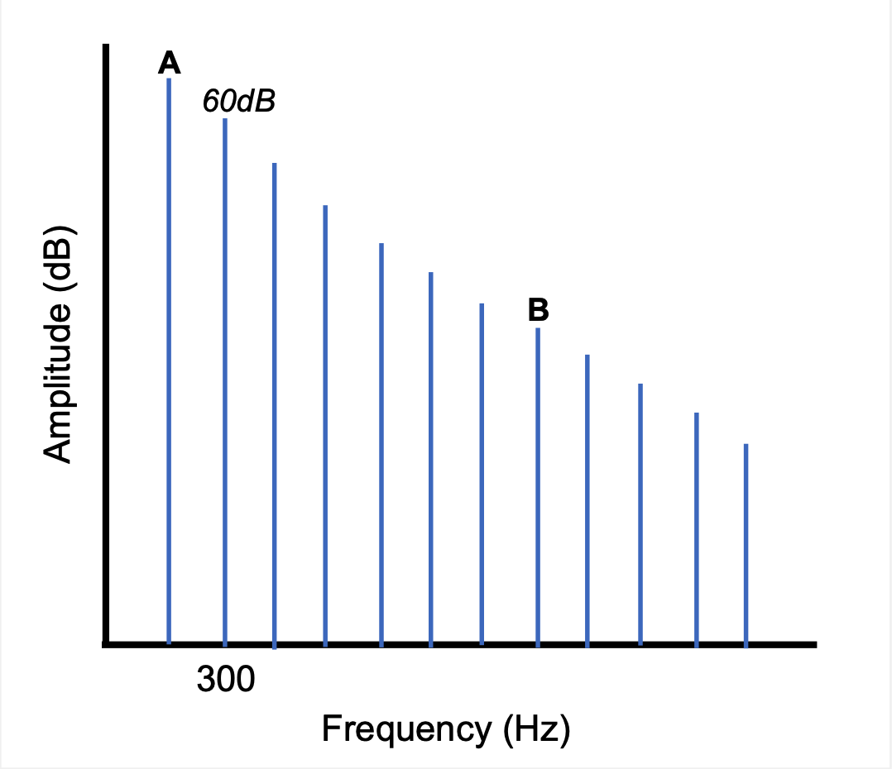
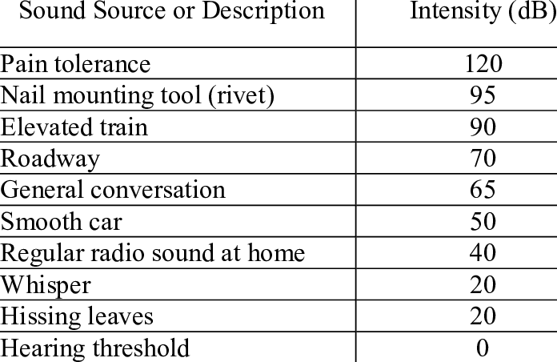
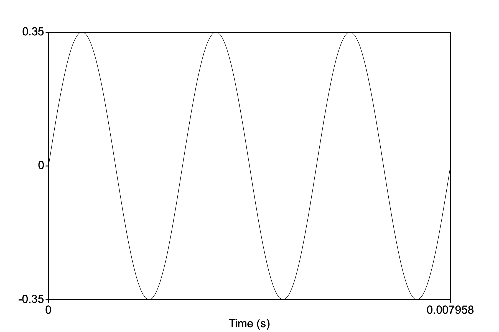
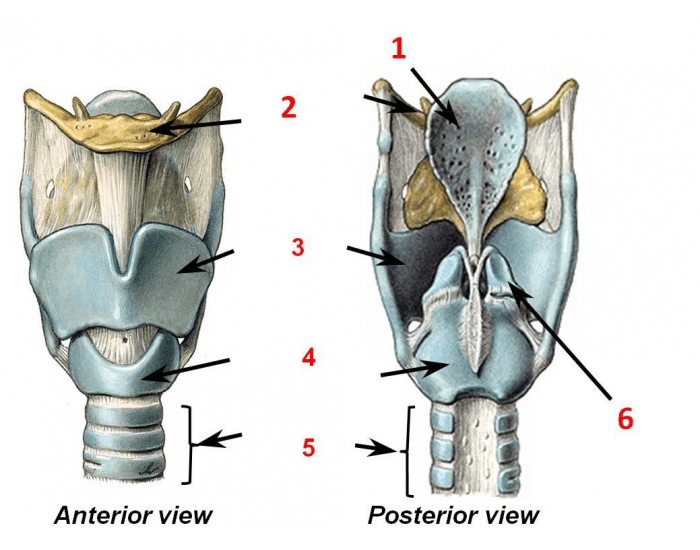

```{r setup, include=FALSE}
knitr::opts_chunk$set(echo = TRUE)
```

# Name: 
# Student number:


You have the entire class period to complete this test. Please make all answers on this exam booklet. For multiple choice and true/false questions, circle the correct answer. You may use a calculator.

**Please show your work when necessary,** as partial credit will be given based on it. 

\begin{center}
Good luck!
\end{center}
\newpage

### 1. [3pts] Suppose you have a tube that's closed at only one end. The frequency of the 4th resonance is 0.033kHz. Assuming that the speed of sound is 330m/s, what is the length of the tube in cm? 

$$\\[3.5in]$$


### 2. [3pts] A leaf blower has just come out and you're thinking of getting it for your dad, who's obsessed with yard work. It's advertised as being the "quietest leaf blower on the market." You took your intensity meter to Lowe's and measured the floor model as having an intensity of 3.4 X 10 $W/m^2$.

### What is the dB reading of this leaf blower and do you agree with description (consult the table in #12)?

\newpage

### 3. [3pts] If we model the oral cavity as a tube open at both ends, what is the frequency (in kHz) of the 3rd harmonic for an oral cavity that is 9cm long? Assume the speed of sound is 330m/s.

$$\\[3.5in]$$

### 4. [1pt] At higher elevations, atmospheric pressure drops. As a result we would expect what? And why?

a. Longer inhalations than at sea level because chest cavity can expand quickly
b. Shorter inhalations than at sea level because lungs are used to greater atmospheric pressure
c. Longer inhalation than at sea level because atmospheric pressure is equalized more quickly
d. Shorter inhalations than at sea level because atmospheric pressure is equalized more quickly 

\newpage

### 5. [3pts] Assume that the amplitude of harmonics in the complex periodic spectrum decreases by 12dB per octave. In the glottal spectrum below, what are A and B?(Use correct units!)

{#id .class width=50% height=50%}

### A =
### B =

$$\\[0.5in]$$

### 6. [1pt] Compression occurs when

a. Air molecules return to their equilibrium position
b. Air molecules overshoot their equilibrium position
c. Air molecules collide, creating an area of negative pressure
d. Air molecules collide, creating an area of positive pressure

### 7. [3pts] What is the frequency (F) and period (t) of a tuning fork vibrating at half a kilohertz?

### 8. [3pts] The waveform below represents a complex periodic sound with four components. What is the frequency of third harmonic in Hz? Round to two decimals.

{#id .class width=75% height=75%}

$$\\[0.5in]$$

### 9. [3pts] If the pressure of air in a 5L container at 2 atm is increased to 10 atm, what is the resulting volume of the container required in mL?

$$\\[3.5in]$$

### 10. [1pt] Suppose after some twist of fate your cricothyroid joint is fused and hence immobile. What would you not be able to do?

a. Swallow
b. Sing a scale
c. Talk in a breathy way
d. Shout

### 11. [1pt] Phonation threshold pressure is the pressure required to set the vocal folds into oscillation. When arytenoid adduction is weak we would expect phonation threshold pressure to be lower than if the adduction is strong.

### True / False

$$\\[0.5in]$$

### 12. [3pts] Sammy is in the basement watching a cartoon on TV with an intensity level of $1000^{-2}$ W/m2 .

{#id .class width=50% height=50%}

### What is the dB level of the TV and, having consulted the table above, should dad be concerned?

\newpage

### 13.[1pt] What is the frequency range at which humans best hear (i.e., require least amplitude)?

a. 1-5kHz
b. 0.5-10kHz
c. 20-125dB
d. 60-130dB
e. 20-500Hz

### 14. [3pts] What is the wavelength (cm) of the pure tone below? Assume the speed of sound is 330 m/s. Round your answer to two decimal and don't forget units!

{#id .class width=50% height=50%}

$$\\[0.5in]$$

### 15. [1pt] For a cone-shaped resonator, which of these seems to be an appropriate frequency response?

a. Loudest resonance at 500Hz with cutoffs at 600Hz and 900Hz
b. Loudest resonance at 500Hz with cutoffs at 400Hz and 600Hz
c. Loudest resonance at 500Hz with a cutoffs at 100Hz and 900Hz 
d. Loudest resonance at 500Hz with cutoffs at 300Hz and 400Hz

\newpage

### 16. [2pts] What is the RMS amplitude of the pure tone in #14? Round your answer to two decimal places. 

$$\\[1.5in]$$

### 17. [3pts] A patient requires a tracheotomy, with doctors puncturing their neck below the cricoid cartilage and inserting a breathing tube. In your own words, why won't the patient be able to phonate?

$$\\[3.5in]$$

### 18. [2pts] Label four (4) structures in the laryngeal skeleton below. Any more than three will be given extra credit (0.5 pts/label).


