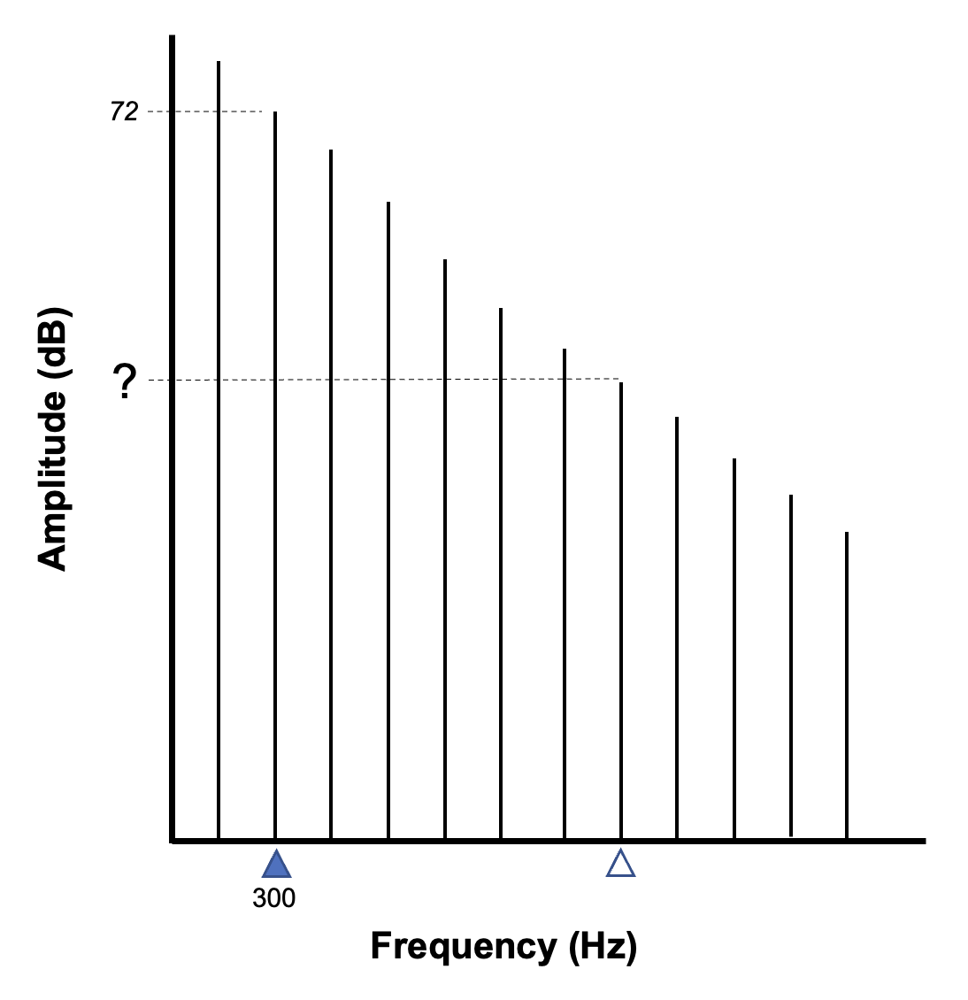
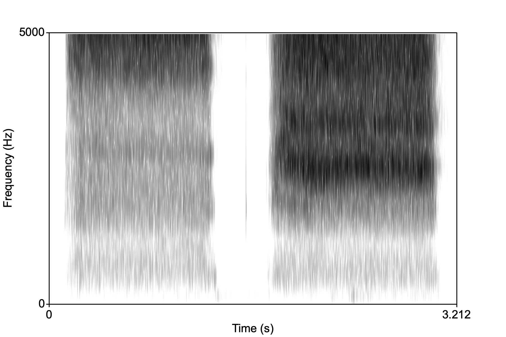
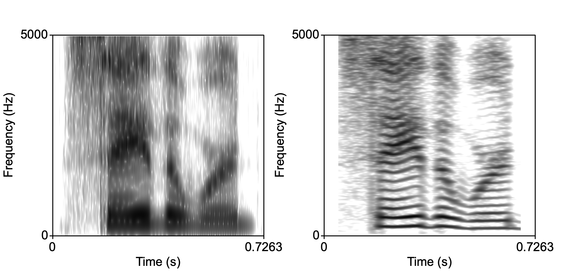

```{r setup, include=FALSE}
knitr::opts_chunk$set(echo = TRUE)
```

# Name: 
# Student number:


You have the entire class period to complete this test. Please make all answers on this exam booklet. For multiple choice and true/false questions, circle the correct answer. You may use a calculator.

**Please show your work when necessary,** as partial credit will be given based on it. 

\begin{center}
Good luck!
\end{center}
\newpage

### 1. A 15 N(ewton) force on an object results in an acceleration of 5 $m/s^2$. What is the mass of the object? Please provide correct units [2pts]

$$\\[2in]$$

### 2. Suppose at elevations below sea level $P_{atm}$ is higher than at sea level. If you're at the beach and you dig a hole 1 mile deep then jump in,  would you expect the VOT of /p/ to be shorter or longer than if you were at sea level? and Why? [2pts]

a. Shorter because high pressure air released from the stop does not equalize the high $P_{atm}$ quickly
b. Shorter because high pressure air released from the stop equalizes the high $P_{atm}$ quickly
c. Longer because high pressure air released from the stop does not equalize the high $P_{atm}$ quickly
d. Longer because high pressure air released from the stop equalizes the high $P_{atm}$ quickly


### 3. A balloon is filled with a gas that has a volume of 5 ml at 3 atm at sea level will have what volume at the top of Mt. Everest, where the pressure drops by 0.3 atm? Give your answer to two decimal places and use the correct units. [2pts]

$$\\[2.5in]$$

### 4. For which type of sound wave would the computation of RMS be most meaningful as a measure of amplitude? [1pt]

a. Aperiodic waves
b. Sine waves
c. Complex periodic waves
d. Noise

### 5. Below are two sine wave equations in Praat:

0.25 * sin(2 * pi * 377 * x)

0.75 * sin(2 * pi * 377 * x) 

What is the RMS amplitude of the resulting wave when the two waves are added? Round your answer to the twp digits. [2pts]

$$\\[1in]$$

### 6. The tines of a tuning fork move back and forth 400 times a second. What is the period (in milliseconds) of the resulting sine wave? Use correct units.[1pt]

$$\\[1in]$$

### 7. Would a 100 Hz tone played outside at the equator in the summer would have a wavelength longer than a 100 Hz tone played outside in Toronto in the winter? Yes or No, and why? [2pts]

$$\\[2in]$$

### 8. Is the following statement true or false: The glottal spectrum of a high-pitched female would have energy missing in more frequencies than a low-pitched male glottal spectrum. [2pts]

TRUE / FALSE

Explain your answer:

$$\\[1in]$$

### 9. Below is a hypotheical glottal spectrum. What is the **frequency** and **amplitude** of the harmonic marked $\triangle$ ? [4pts]
{width=50% height=50%}

## Frequency=

## Amplitude=

\pagebreak

### 10. The basilar membrane is characterized by its *tonotopic* organization, which decomposes the incoming complex periodic wave into its component frequencies. What is tonotopic organization comparable to? [1pt]

a. Categorical perception
b. Fourier analysis
c. Perceptual magnet effect
d. Quarter-wave resonator

### 11. Why does the "k" in "coo" sound different from the "k" in "key, and what phenomenon is it the result of? [2pts]

a. Lips are rounded in "coo" and as a result the oral cavity is lengthened, raising F1; segmentation
b. Lips are rounded in "coo" and as a result the pharyngeal cavity is widened, raising F2; coarticulation
c. Lips are rounded in "coo" and as a result the oral cavity is lengthened, lowering F2; coarticulation
d. The tongue is further back in "coo" and as a result the oral cavity is lengthened, lowering F2; coarticulation

### 12. Suppose you have a hole at the roof of your mouth (cleft palate). 1) Why can't you make a stop consonant? [2pts]

$$\\[2in]$$

BONUS:How do you propose you can make a stop consonant sound and why would this work? [1pt] Write your answer below.

$$\\[1.5in]$$

### 13. What is the dB value for a sound with an absolute intensity of 0.0053 $W/m^2$? Round your answer to two decimal places.[3pts]

$$\\[3.5in]$$

### 14. Suppose you have a tube that's closed at one end. The frequency of the 3rd resonance is 0.054kHz. Assuming that the speed of sound is 330m/s, what is the length of the tube in cm? Use correct units.[3pts]

$$\\[3.5in]$$

### 15.Below are the F1 and F2 values for the **same vowel** spoken by a Man, Woman, and Child. What is the F1 value that we should expect the child to have given the measurements of the two adults? Use correct units. Show your work. [2pts]

Man: F1 = 570Hz; F2 = 1995Hz\
Woman: F1 = 689Hz; F2 = 2411Hz\
Child: F1 = ?; F2 = 2450Hz

## F1 (child) = 

$$\\[1.5in]$$

### 16. Which is the more broadly tuned filter? [1pt]

a. Straight open-closed tube
b. Vocal tract

### 17. Why is the high front vowel usually produced with lip-spreading? [2pts]

$$\\[1in]$$

### 18. Which of the following is **not** an indication of phonological voicing in initial stop consonants before a vowel? [1pt]

a. Onset timing and frequency of the second formant
b. VOT
c. Onset timing and frequency of the first formant
d. Fundamental frequency of the vowel

\pagebreak

### 19. Below are two spectra of sibilant fricatives. One is [s] and the other is [sh]. Which is which, and how can you tell? [2pts]

## Left = 
## Right =

{width=50% height=50%}

Explain:
$$\\[1in]$$

### 20. Is the following statement true or false: The intraoral pressure of short (or zero) VOT consonants is lower than positive VOT consonants. [1pt]

TRUE / FALSE

BONUS: Explain your answer.[2pts]

$$\\[2in]$$

### 21. Match the two window lengths to the spectrograms below (label the spectrograms as "a" or "b") [1pt]:

a. 0.005s
b. 0.05s



Explain your answer [2pts]:

$$\\[1.5in]$$

### 22. The fact that Japanese Quail can perceive speeech sounds categorically was a problem for the Motor Theory. Why? [3pts]

$$\\[2in]$$

