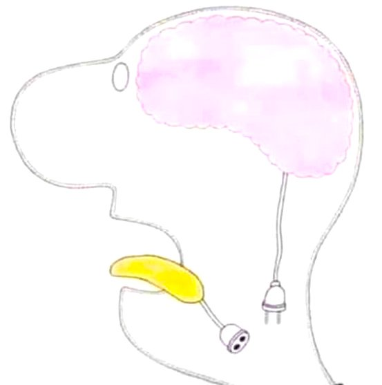

# **Language and the Brain**

Mondays, 2:30-5:30pm\
Health, Nursing, and Environmental Studies (HNE) Building, Rm. 104\
Instructor: [Chandan Narayan](https://ch-narayan.github.io)\
Contact: [chandann@yorku.ca](mailto:chandann@yorku.ca)\
[Course outline and schedule](LING4230syllabus.html)

### About

This course is a rigorous introduction to key aspects of speech sciences, including acoustic phonetics, speech perception, speech production and audition, the brain and language, as well as fundamental concepts in speech-language development and disorders. The relationship between speech and abstract levels of language, such as syntax and phonology, is also considered though it is not the focus of the course. Specific topics include speech anatomy and aerodynamics, the speech chain, source-filter theory, auditory transduction, and theories of speech production and perception. The course also provides an overview of research methodologies for the analysis of speech, including instrumental techniques such as acoustic analysis with PRAAT.

### How to use this site

This site is meant to serve as a supplement to the delivered lectures and associated slides posted on [eClass](https://eclass.yorku.ca). The notes will give a bit more detail than the slides, as well as some practice problems of the type you might encounter on quizzes and exams. 

</a>

