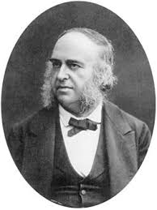
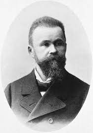

<style type="text/css">
  body{
  font-size: 12pt;
}
</style>

```{r setup, include=FALSE}
knitr::opts_chunk$set(message=FALSE,warning=FALSE, cache=TRUE)
options(repos = list(CRAN="http://cran.rstudio.com/"))
```

The first two weeks of class we dive into our subject matter by introducing some basic concepts underlying the study of language as manifested in neural processes. 

***

# Introduction

* For the most part, what sets humans apart from other mammals (and really all other animals in general) is the ability to produce and comprehend language--the confluence of a lot of cognitive abilities that may or may not have a centralized control mechanism in the brain. In this class we'll see evidence for the the former, though some people believe the latter!

* Humans **do** language, while other animals do other sorts of communicative systems (like the stuff you learned in LING1000...birdsong, barks, meows, vervet monkey calls, etc.)

* How are we different from those animals that do not have language (as expressed in humans)? Well, we have human brains--brains that are structurally and (we'll see) functionally different from the brains of other animals. This results in our ability to manipulate abstract representations in the service of communicating ideas through some sort of expressive channel (i.e., mouths/ears, hands/eyes).

* OK, then what is it about human brains that allow us to *do* language? Linguists, psychologists, and neuroscientists are interested in this question (though historically Linguists with a capital-L haven't spent too much brain power in this pursuit...we can discuss why).

* We can say a lot about the relationship between language and the brain by observing how we behave given linguistic tasks and whether or not the behaviour is correlated with neural activity. This allows us to generate theories about how specific components of the linguistic system operate and how they might connect to serve Language as a whole. This is ultimately the goal of neurolinguistics.

# Levels of description

* I think the distinction between the *types* of answers to the questions we might ask is an important one. Brennan calls these "levels of description"

| Level of description |Definition|
|--|--|
|Computational | The "problem" meant to be solved by the brain. The sensory input and the interpretation/output|
|Algorithmic| How the brain solves the problem; basically the function that takes input to output|
|Implementational|How the brain (neurons) and the external language-related organs carry out the algorithm|

* Linguists and psychologists work at different levels of description. For example, I study speech perception, which asks how speech sounds are interpreted by humans and assigned to categories based on their experience with language. What level of description would I be working in? I would say it's computational, because I don't deal with fine-grained algorithmic (the math behind the category assignment) or the implementational (what the neural activity may be) that carries out the category assignment. 

# Examples of levels of description

* The books provides two examples of varying levels of description:

1) Echolocation in owls: Owls are able to home in on their prey using the timing differential of sounds arriving at their ears. The computational level of description here would be the fact that owls are able to catch their prey at varying distances based on the sounds that the prey makes. The algorithmic description would be the model presented in the book-two parallel channels (delay lines) with divergent coincidence detectors. Based on where along the coincidence detectors there is activation the owl knows to which side and how far away the prey is. The implementational description would be the location of neuronal activity in a particular region of the owl brain that behaves like the algorithmic model.

2) Sentence comprehension in humans: The books gives the example of "Ada loves Winston." How do English speakers arrive at the meaning of this sentence? Well, we can examine the time structure of how they might get the meaning. A behavioural experiment might get at the computational description of the processing of the sentence. Does the subject assign abstract sentence structure from the get-go (when they first hear "Ada") or do they have to hear the whole sentence to build the structure? These would be different algorithms (the output is exactly the same). Finally the implementational description would examine brain activity during the processing of the sentence in order to confirm (or refute) one algorithmic description in favor of the other.

# Enterprise of neuro/psycho-linguistics

* So what do we do when we say that we study language and the brain? We do all of these levels od description--but, mostly at the computational level. As linguists we generally don't have the resources available to undertake implementational studies unless we partner with people in other disciplines like psychology or neuroscience.

# Classical localization models

* There are two brain regions that have received **a lot** of attention in both the literature as well as popular discourse surrounding language and the brain. Maybe you've heard of them: Broca's area and Wernicke's area.

* These are two regions in the left hemisphere of the brain (we'll be talking about how to physically describe the brain next lecture) that more or less correspond to certain language-related deficits when damaged.

* We calls these areas "Broca" and "Wernicke" because of the physicians who first noticed the relationship between brain damage in those areas and associated language problems. 


