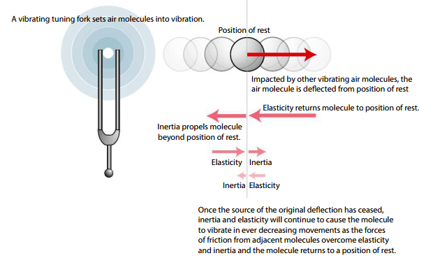
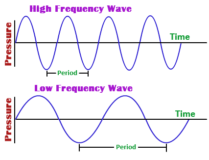

<style type="text/css">
  body{
  font-size: 12pt;
}
</style>

```{r setup, include=FALSE}
knitr::opts_chunk$set(message=FALSE,warning=FALSE, cache=TRUE)
options(repos = list(CRAN="http://cran.rstudio.com/"))
```

The first week of class we dive into our subject matter by introducing some basic concepts underlying the acoustics of speech. In order to get to there, however, we need to begin with some definitions of concepts from physics, which we will rely on for the rest of the course.

***

# The Speech Chain
The speech chain represents the nature of communicating a linguistic message via the vocal-audition apparatus.

<p align="center">
  
</p>


In this course, we will be examining, in detail, the nature of:

* **Acoustics**: the physical properties of sound
* **Audition**: the process of sound transduction in the ear
* **Production**: the physical process of producing sounds
* **Perception**: the psychological process of speech reception

The course will not be immediately concerned with linguistic representations and abstractions, topics which will be covered by other courses offered in the program like Phonetics (LING 2110), Acoustic Phonetics (LING 4220) and Phonology (LING 2120 and 3120).

# Basic definitions

In order for us to begin understanding the nature of speech sounds, we must familiarize ourselves with the science behind what makes sounds, in general. Speech is a **physical phenomenon** and as such, we must understand basic concepts of physics as it provides a bedrock of foundational elements for any sort of description and analysis of speech.

>**Mass (m)**: the amount of matter in an object, *measured in grams (g) or kilograms (kg)*\
>**Force (F)**: an influence on an object that causes a change in speed, direction, or shape. *Measured in newtons*\
>**Weight**: the force of gravity on an object\
>**Volume**: the quantity of space occupied by a liquid, gas, or solid object. *Units are
liters (l) or cubic centimeters (cc)*\
>**Density**: mass/volume. *Units are g/cm^3^, kg/m^3^, g/ml\
>**Speed**: distance travelled in a given time. Units are m/s \
>**Velocity**: same as speed but a direction of movement is also specified\
>**Inertia**: the resistance of an object to change in its motion or rest. Units are grams(g)\
>**Acceleration (a)**: when velocity changes as a function of time. Acceleration is directly proportional to force and inversely proportional to mass $$ F=ma $$ $$ a=F/m $$ \

The physical concept of **pressure** is particularly important for our understanding of speech processes. We will rely on our undersatnding of pressure to explain both audition as well as the production of speech sounds.\

>**Pressure**: force acting perpendicularly on an area. Unit is pascals (Pa), cm of H~2~0 (amount of pressure to displace column of water one cm). Pressure can also be described as the ratio of Force to Area.\

<p align="center">
  
</p>

>P~atm~ is atmospheric pressure and is generally measured at sea level = 101.325 kPa ~ 14.7 psi (pounds per square inch). The atmosphere (right now) is exerting 14.7 lbs of pressure per square inch of your body right now! Pressures above and below P~atm~ are called *positive* and *negative* pressure, respectively.

Pressure **differentials**, or the change in pressure over time across some area, will play a very important role in our understanding of how we hear and produce sounds.

# Sound

Sound is essentially changes in air pressure that results from some sort of disturbance, like the smacking of a table top or the vibrating of vocal folds. For speech sounds, tiny changes in pressure are a result of air molecules beign set in motion by the movement of the vocal folds. These changes in air pressure between air molecules end up at the listener's ear. This animated gif schematizes the general idea of some movement (the hand moving up) setting in to motion the rope. The change in air pressure is represented by the wave in the rope, which moves and ultimately reaches a target (or the listener's ear).


Molecules of air move in a random pattern, called [Brownian motion](https://en.wikipedia.org/wiki/Brownian_motion) and collide with each other and other objects at a relatively constant pressure.

<p align="center">
  
</p>

# Airflow

Air moves from an area high pressure to an area of low pressure in order to equalize → driving pressure. Air only moves when there is a pressure differential between the areas. If there is no difference in pressure between the two areas, there is no airflow.

What is flow?→ the movement of air, measured in volume/time (e.g., *l/s*). The rate of flow is called **volume velocity**. There are two types of air flow

1. **Laminar flow**, where there is no obstruction of molecules (this is really not relevant for speech purposes)
2. **Turbulent flow**, where something obstructs the flow (think, ridges in the mouth, your lips, teeth, etc.). Turbulent flow results in small pressure changes around the obstruction. 

<p align="center">
<video width="420" height="340" controls>
  <source src="images/laminar.mp4" type="video/mp4">
</video>
</p>

# Pressure
## Boyle's Law

Another important concept for our understanding of speech processes is that formulated by the English polymath, [Robert Boyle](https://en.wikipedia.org/wiki/Robert_Boyle). Boyle's law characterized the relationship between the pressure of a gas and the volume of its container.

> Boyle's Law says that that pressure and volume are inversely related. The bigger the container, the lower the pressure; the smaller the container, the higher the pressure of the gas within. 

<p align="center">
  
</p>

For our purposes, it's useful to imagine the relationship between two containers, or the same container at different points in time. In the equation below, imagine a fixed mass of gas (ok, air). The relationship between the pressure of that gas and the volume of the container is constant. So increasing the volume would mean a decrease in pressure (so long as the mass of the gas is the same and the temperature doesn't change).

> $$ P_1 V_1~ = P_2 V_2 $$ 

<p align="center">
  
</p>


We know that there are air molecule pressure changes, cumulatively, involved when the volume of the container shrinks or expands, but what exactly happens between individual air molecules?

## Compression/Rarefaction

> When air molecules collide there is a moment of high pressure. This is called **compression**. The idea here is simple and can be roughly analogized to the Boyle's law examples above. Imagine the plunger and bottom wall of the piston are air molecules. As they approach each other (or are compressed), pressure between them increases.

M~1~&rarr;&rarr;&rarr;&rarr;M~1~ M~2~\
As M~1~ approaches M~2~ there is increasing pressure (compression)

<p align="center">
  
</p>

> When the molecule “bounces” back and overshoots its original position, it causes an area of low air density, resulting in low pressure → rarefaction

M~1~ &larr; M~1~ &larr;&larr;&larr; M~2~\
As M~1~ moves away from M~2~ there is decreasing pressure (rarefaction)

Here is a nice [video demonstration](https://www.youtube.com/watch?v=bYoTRx6gGX0) and explanation of compression and rarefaction of air molecules.

## Molucule movement?

Once molecules have been set into motion, three forces keep them moving back and forth before they eventually stop (remember Newton's Laws?)

1. **Elasticity**: the restoring force that allows an object to return to its original size, form, location, and shape having been displaced, stretched, pulled, etc.&rarr; think a stretched rubber band, when released returns to it's natural size and shape
    a. **Hooke's Law** captures the basic principle behind elasticity. It says that the restoring force is proportional to the displacement and acts in the opposite direction. So imagine a rubber band. If you stretch it out very far, the "snap back" is fast and hard. If you don't stretch it very much, the snap back is minimal. This is a good schematic for understanding restoring force. The further the molecule is displaced, the greater the elastic force to bring it back to its starting location and beyond due to $\downarrow$
2. **Inertia**: the resistance of an object to change in state of motion or rest
3. **Friction** : the force that opposes motion

<p align="center">
  
</p>

# Simple harmonic motion
Simple harmonic motion (SHM) results when the restoring force on an object is proportional to the displacement from equilibrium in the opposite direction. SHM is a special type of periodic motion (we'll discuss periodicity below) that refers to the a back and forth motion that repeats itself at regular intervals.

With SHM, there is acceleration of an object through the "zero point" or equilibrium and deceleration at the endpoints of the movement. In the animation below, the weight's equilibrium point (or the spring's natural length) would be represented by y=0.

<p align="center">
  
</p>

## Frequency
One back and forth movement through the equilibriam point constitutes one *cycle* of vibration.When describing sound, these cycles refer to the movement of air molecules moving back and forth. When the molecule is set into motion (from some disturbance, like the movement of the vocal folds or the slamming of a door), it is propelled, reaches some maximum, travels back through its original starting point (equilibrium) and proceeds again in the direction opposite the one it initially travelled, then back again to equilibrium (one complete cycle). 

This movement results in pressure changes. A cycle when describing sound is:

> One cycle = increase in P from P~atm~ (compression), a decrease in P below to P~atm~ (rarefaction), then increase back to equilibrium
> The number of cycles completed in one second is called the **frequency** and is measured in Hertz (Hz)

For speech, we very often encounter frequencies in the thousands, so instead of writing, say, 5600 Hz, we might change the units to kilohertz (1000 Hz) giving us 5.6kHz.

[Here](https://youtu.be/pANIvSh2r2A) is a strobe video of a tuning fork. The tines (or arms) of the fork vibrate in unison, moving away from equilibrium, reaching a maximum displacement, then back toward the center and beyond, then back again. 

## Period

> The **period** of a waveform is the time it takes for one cycle to occur

Period is inversly proportional to frequency. So:
$$F = 1/t ; t = 1/F$$
If the frequency is 100Hz (or 100 cycles per second), then the period is 1/100 or 0.01 seconds. Period is symbolized as *t*.

Here's a little practice question:
If *t* = 0.003, then what is the frequency?
<!-- Answer options go here -->
<div class="radio">
  <label>
    <input type="radio" name="question01" id="opt1" value="33kHz" onchange="check_answer()">
    33kHz 
  </label>
</div>
<div class="radio">
  <label>
    <input type="radio" name="question01" id="opt2" value="300Hz" onclick="check_answer()">
    300Hz
  </label>
</div>
<div class="radio">
  <label>
    <input type="radio" name="question01" id="opt3" value="333kHz" onclick="check_answer()">
    333kHz 
  </label>
</div>
<div class="radio">
  <label>
    <input type="radio" name="question01" id="opt3" value="333Hz" onclick="check_answer()">
    333Hz 
  </label>
</div>
<!-- Check answer button -->
<div>
<button class="btn btn-primary" type="button" onclick="check_answer()" data-toggle="collapse" data-target="#collapseExample" aria-expanded="false" aria-controls="collapseExample">Show / Hide result</button>
</div>
<div class="collapse" id="collapseExample">
  <div class="card card-body" id="answerFeedback">
    The answer selected was ...
  </div>
</div>

<!-- Code to update answer feedback -->
<script type="text/javascript">
function check_answer()
{
    var radioButtons = document.getElementsByName("question01");
    document.getElementById("answerFeedback").innerHTML = "Try selecting an answer!!";
    for(var i = 0; i < radioButtons.length; i++)
    {
        if(radioButtons[i].checked == true)
        {
            var selectedAnswer = "Your selected answer was " + radioButtons[i].value;
            <!-- feedback for correct / incorrect response -->
            var feedback = "Not quite! Have another go." 
            if(radioButtons[i].value == "333Hz") {
              feedback = "Yup, good job! 1/0.003 = 333"
            }
            document.getElementById("answerFeedback").innerHTML = selectedAnswer + "<br>" + feedback;
            return true;
        }
    }
}
</script>
\

## Wavelength
The distance completed by one complete cycle of the sound wave is called its **wavelength (λ)**. Wavelength is given in *m* or *cm*. The higher the F, the shorter the period (remember F=1/t) and wavelength. Conversely, the lower the F, the longer the period and wavelength.

<p align="center">
  
</p>

## Velocity

Just how fast a sound wave moves (or its **velocity**) depends upon the nature of the medium, the substance in which the wave is moving (e.g., air, water, concrete). Denser media allow sounds to travel faster, so sound travels faster in water (than air), and even faster in steel or concrete.

Temperature also affects the velocity of sound, though not so much in liquids and solids. As temperature increases so too does the velocity of the sound wave. So, in warmer air, the velocity of sound increases at a rate of 0.6m/s /deg C.

The "speed of sound" (v) is roughly 330 m/s. (Be **very careful** with the units of v as some questions will require you to convert!) There is a **very important** relationship between frequency and wavelength, which relies on v: 
$$F = v/λ$$

## Amplitude

In our description of period, frequency, and wavelength we have (till now) ignored a very important component of our sound wave, namely the displacement of the wave from equilibrium. Remember we referred to "maximum displacement" above? 

This maximum *height* of the wave, above and below the equilibrium point, is called **amplitude**. For practical purposes (which we'll spend some time discussing later in the course), the amplitude corresponds to the loudness of a sound. Amplitude is measured in bels or decibels (bel/10).