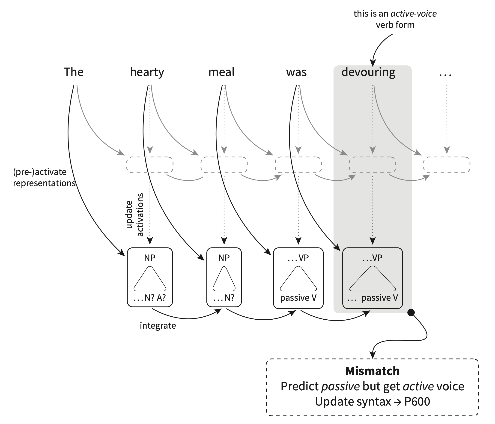
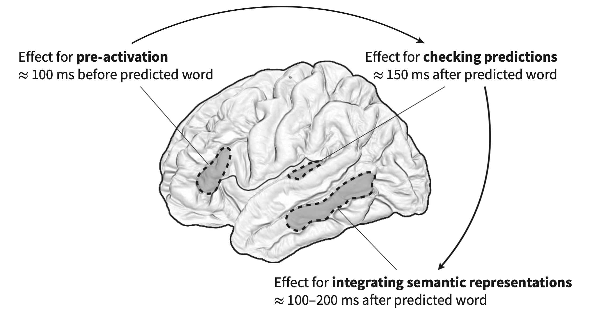

<style type="text/css">
  body{
  font-size: 12pt;
}
</style>

```{r setup, include=FALSE}
knitr::opts_chunk$set(message=FALSE,warning=FALSE, cache=TRUE)
options(repos = list(CRAN="http://cran.rstudio.com/"))
```


# Who says what

Continuing on our discussion of the sorts of information we use to guide our predictions (news flash: we use everything), we'll now discuss how the nature of who is talking might affect what we expect them to be saying. Not only does the voice tell us who the individual is that is talking, but it also affects word predictions, and this is also indexed by the N400 ERP. Van Berkum et al (2008) prompted listeners with sentences like: "If I only looked like *Brittney Spears* in her last video"[spoken by either a male or female voice]; "Every evening I drink some *wine* before I go to sleep"[spoken by a child or adult voice]. When the voice did not match the (socially determined) expectation for the lexical content, the researchers observed an N400 after the onset of the target word (in *italics*). It's interesting to note that the N400 amplitude is less than if the mismatch was determined by discourse or syntactic constraints.

There is a rich literature on this sort of socially determined expectation in comprehension (both behavioural and neurological).

# How important is constituency to interpretation?

The psycholinguistics literature has long debated the importance of constituency to online comprehension of sentences. That is, how dependent are we on the syntactic structure (and its complicated features like c-command, movement, etc.) to our processing of the meaning of the sentence? The idea here is that perhaps we compute meaning in a word-by-word fashion. This prediction makes some sense given how easily we're taken down garden paths, for example. Brennan and Hale (2019) tested this directly in an EEG study where subjects listened to passages from *Alice in Wonderland*. N400s were recorded when words were unpredictable based on the syntactic structure of the sentence, rather than the word-to-word probabilities. That story famously has nonsensical sentences in it (Jabborwocky) so words are often unpredictable, but the N400 was apparent only when the syntax predicted one thing which did not match with the next word.

But syntax is obviously important in our computation of what comes next. So how do we best uncover this? The literature points to semantic roles of words as affecting processing. Chow et al.(2016) examined verb prediction using semantic role reversal. They found that our processing depends not only on the meaning of the word but on the word's semantic role. When agents and patients are related to a particular verb the reversal of the two does not elicit the N400. It's only when there is a mismatch between agent and patient in their relationship to the very do we find the N400. So in Chow et al., *customer* and *waitress* are related to "serve" so when the two are reversed there is no N400. When *customer* and *restaurant owner* are reversed there is an N400. 

# P600

The best evidence that listeners make predictions about syntactic representations comes from the P600, which, like the N400 is an ERP but it reflects a positive going component around 600ms after then target anomaly. While the N400 indexes semantic mismatches, the P600 indexes syntactic mismatches given a context. 

The early demonstrations of the P600 had stimuli that *really* were out of whack with the grammar. For example, Neville et al.'s (1991) paper showed it with sentences like: The scientist criticized Lucy's **of proof the** theorem. Later the P600 literature began to address more nuanced effects of syntactic structure on processing. Gouvea et al. (2010) showed participants grammatical and ungrammatical sentences like: The patient met the doctor while the nurse with the white dress *showed*/*show* the chart during the meeting. There is P600 effect when the target word doesn't have correct verb agreement. 

An interesting phenomenon is when the P600 is observed when there is nothing grammatically (i.e., structurally) wrong with the sentence, but the clausal structure is rather unusual. So in "The singer allowed to record the song" we're not used to seeing this structure (we'd expect some sort of object if "allowed" is ditransitive), so there is a larger P600 than in a sentence like "The singer decided to perform the song." 

## P600 as reflecting syntactic reanalysis

There are scenarios where we would expect that the prediction fails and there to be an N400 (like in "she ate her spaghetti with a *shoe*") but what we actually find is a P600. So in "The hearty meal was **devoured**" there is no N400, but a P600 at "devouring". The book suggests that the N400 does not necessarily reflect the mismatch, but what the brain does after the mismatch like activating other lexical items to make the sentence comprehensible. But in "the hearty meal..." the P600 reflects something like a syntactic reanalysis. "Hearty meal" preactivates *eat, devour, enjoy, etc* and also appropriate syntactic representations like *passive voice* as meals are generally the object/patient and not the agent. So the idea here is that with the P600 the brain is changing the syntactic analysis in order to accommodate the words that are already activated. When "devouring" is seen there is a mismatch between the syntactic features of the word (encompassing a *active* sentence) and the passive syntactic features that had been preactivated. 

<p align="center">
  
</p>

# Prediction happens at multiple levels (more or less) at the same time

The book calls this the dynamic back-and-forth between high and low level information and presents an interesting study by Lopopolo et al. (2017). Using fMRI they tracked the timecourse of activation in various brain regions and correlated them with the [conditional probabilities](https://www.investopedia.com/terms/c/conditional_probability.asp) of phonemes, words, and syntactic categories. They found that areas of the temporal lobe are sensitive to the predictability of each of these different representations. Unexpected syntactic categories activate posterior and anterior left temporal lobe, unexpected lexical items the middle temporal lobe posterior the auditory cortex. 

The back-and-forth evidence comes from Klimovich-Gray (and a big name in this field, Marslen-Wilson) et al. (2019) using MEG, where participants listened to simple phrases of adj-noun like "red apple." Some stimuli were highly predictive, like "peeled banana." They were looking primarily at three stages in processing: preactivation, prediction checking, and updating activation. "Peeled" would preactivate nouns like "onion" or "banana." Checking the prediction occurs at the first phoneme of the noun. The final stage is the *semantic value* which is the average of all the words that make up the phrase. Here's what's activated when:

<p align="center">
  
</p>