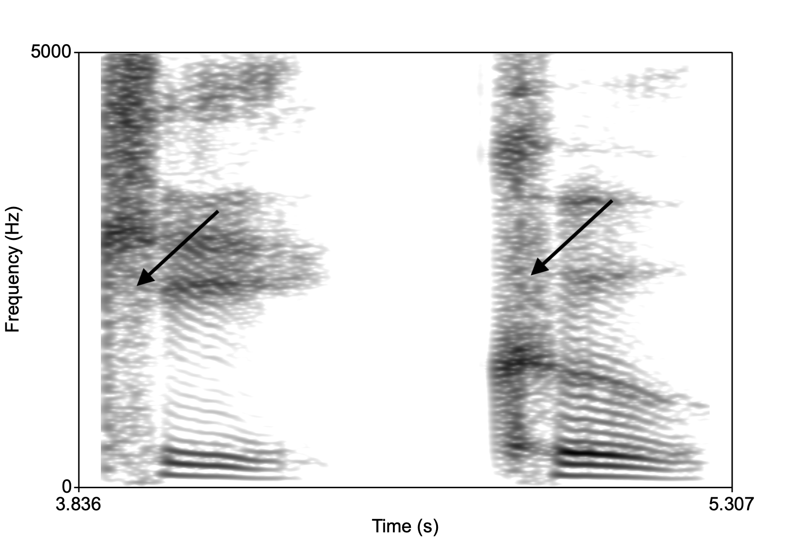
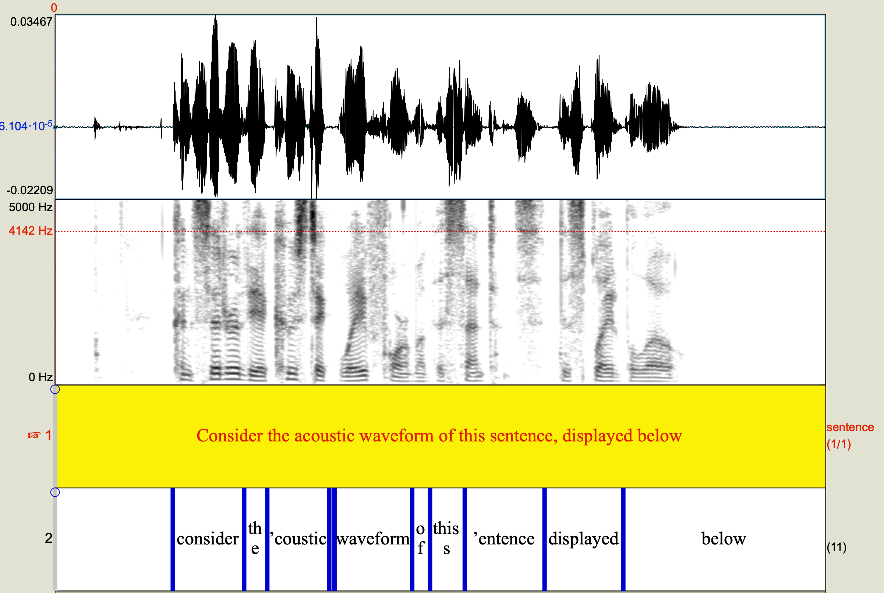
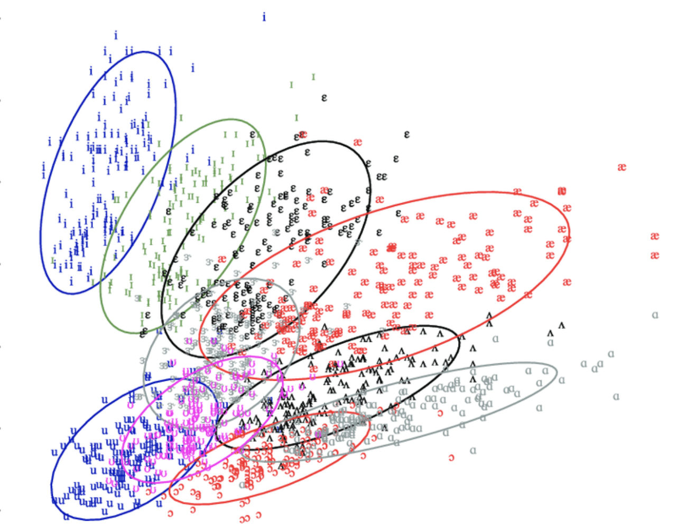
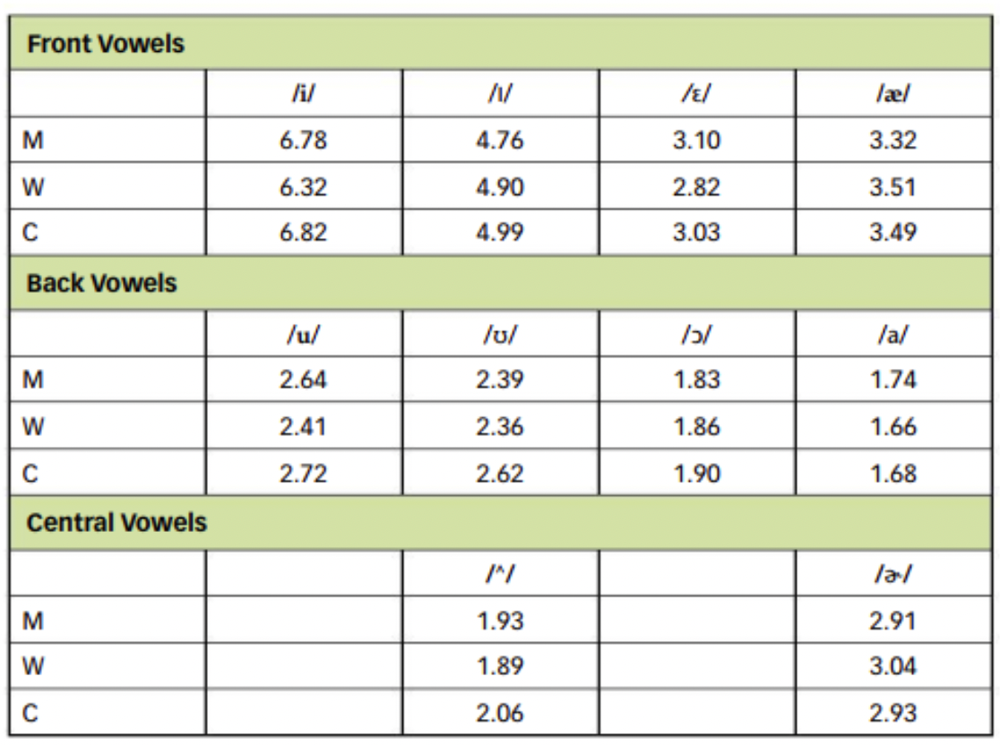
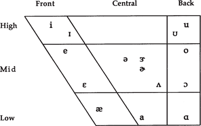

<style type="text/css">
  body{
  font-size: 12pt;
}
</style>

```{r setup, include=FALSE}
knitr::opts_chunk$set(message=FALSE,warning=FALSE, cache=TRUE)
```

----
So far we've been discussing *physical* phenomena associated with speech and hearing: acoustics, anatomy, respiration, and audition. What happens after the hair cells embedded in the Organ of Corti are fired at different frequencies and the electrical impulse is sent to the brain via the auditory nerve?
----

# Problems of speech perception

The previous lectures described the physical aspects of speech *hearing*. Once the brain is involved, it becomes difficult to separate the low-level hearing from higher-level *perception*. (Low-level $\rightarrow$ relates to the translation of physical features of the sound; High-level $\rightarrow$ affected by factors including, and beyond the physical features of the sound, like the nature of your own language.)

The brain takes the various physical features of speech (like the duration, the formant structure, etc.) and *processes* the sound more or less holistically (i.e., as a whole), thereby assigning values such as "phoneme", or "syllable", or "word" to the sound. Speech perception suffers from two fundamental problems that have animated the field for about 70 years.

## Lack of invariance

The first problem of speech perception, the "lack of invariance", reveals that there is no one-to-one correspondence between the speech signal and the percept. Here's an example, examine the two spectrograms below. The spectrogram on the left is the word "key" and on the left "coo," both of which begin with the sound /k/, [left sound](sounds/ki.wav) and [right sound](sounds/ku.wav). 

<p align="center">
  
</p>

The arrows point to the broad band noise associates with the aspiration in a stop consonant at the beginning of a syllable. This is essentially what we hear when we hear a /k/, but if you examine the spretrograms, where is the /k/? It looks different in both the images, yet we perceive them both as a /k/. This is the lack of invariance problem, or put another way, speech sounds are characterized by variance. 

## Segmentation problem

The second problem of speech perception is broadly related to the first, and relates to the fact that the speech stream does not come chunked into smaller units like words, syllables, phonemes. Despite the lack of separation, we can recover the chunks effortlessly. Consider the acoustic waveform of this sentence, displayed below. 

<p align="center">
  
</p>

The words run into each other and a casual examination of the resulting waveform reveals that it's very difficult to determine where one sound or word ends and the other ends. How do we nonetheless perceive different words and different syllables and phonemes? **Coarticulation** is inherent in the signal as speakers optimize their speech to provide the listener as much information as possible in a given time while minimizing how much their articulators have to move. 

## Solutions?

Some theorists suggst that we're not looking hard enough when we say there is a lack of invariance or that speech is highly coarticulated and therefore no "essential" features of the phoneme can be recovered. For example, in our "key coo" example above, the structure of the vowel formants *after* the "k" tell us about the consonant. They show up in a pattern such that F2 and F3 are close together. The structure of the formants immediately after the release of the consonant tell us about its place of articulation. Linguists have recovered something called ["locus equations"](https://link.springer.com/article/10.3758/BF03205495) that pin point the placement and direction of vowel formant movements that capture various consonants. 

Others look to the dynamic variability itself, combined with contextual information (like the surrounding sounds, the nature of the word, the speed at which it's uttered, etc.) is essentially what we decode when we perceive speech. In reality, it's likely that listeners use any and all available strategies to recover the lingusitic message encoded in speech. 

# Vowel perception

We hinted earlier as to the role of *formants* in communicating the quality of a vowel, essentially revealing the sizes of the oral and pharyngeal cavities, which affect F1 and F2. Listeners can categorize a vowel sound with basically these two formants. Vowels are generally more intense than consonants $\rightarrow$ it's really what we end up hearing when we listen to speech. The consonants are chaped by the vowels. 

But there is a problem: formant values overlap, considerably, so two different vowels might have very similar formants (F1 and F2). Consider the image below, which shows the formant values for various vowels from English as spoken by men, women, and children (the data are from the famous vowel survey of Peterson and Barney (1952)). ** Practice your vowels here: [https://web.uvic.ca/ling/resources/ipa/charts/IPAlab/IPAlab.htm](https://web.uvic.ca/ling/resources/ipa/charts/IPAlab/IPAlab.htm) **

<p align="center">
  
</p>

Given the situation in the picture above, how would a listener perceive a vowel whose F1 and F2 overlaps with other vowels? One solution to the this problem suggests that absolute F1 and F2 measures don't matter too much, but rather what's important is the relationship between F1 and F2 (and F3). So each production of /i/ generally has a low F1 and a very high F2 and F3, regardless of who's speaking. A somewhat similar theory suggests that the ratio of F2:F1 is what is important for vowel perception. 

<p align="center">
  
</p>

In the vowel ratio table above, each vowel has very similar F2:F1 ratios regardless of who is saying it, men (M), women (W), or children (C). Perhaps this number is recovered by the perceptual system in the brain when identifying vowels.

## Target undershoot

Related to the segmentation problem is the problem of **target undershoot**. The acoustic contrasts between vowels is reduced as a result of coarticulation. When speech gestures overlap, the result is that articulatory "targets" or ideal positions of the tongue, etc., may not be reached. Formant frequencies not reaching their targets results in the vowel becoming more "centralized" or more like schwa.

<p align="center">
  
</p>

Some speakers have more undershoot than others. It may not really matter, however, because it turns out that listeners are really good at recovering vowel information even if there's no information there! In a series of experiments with "silent centers", or syllables with the middle portion of thevowel removed, listeners were able to identify the syllable solely by hearing the onsets and the offsets of the syllable. Listen to these two sounds:[1](sounds/deed.wav), [2](sounds/dude.wav). One is "dude", the other is "deed". Which is which?