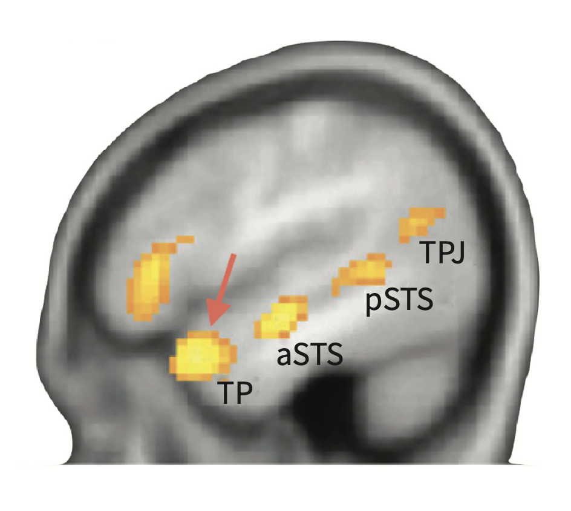
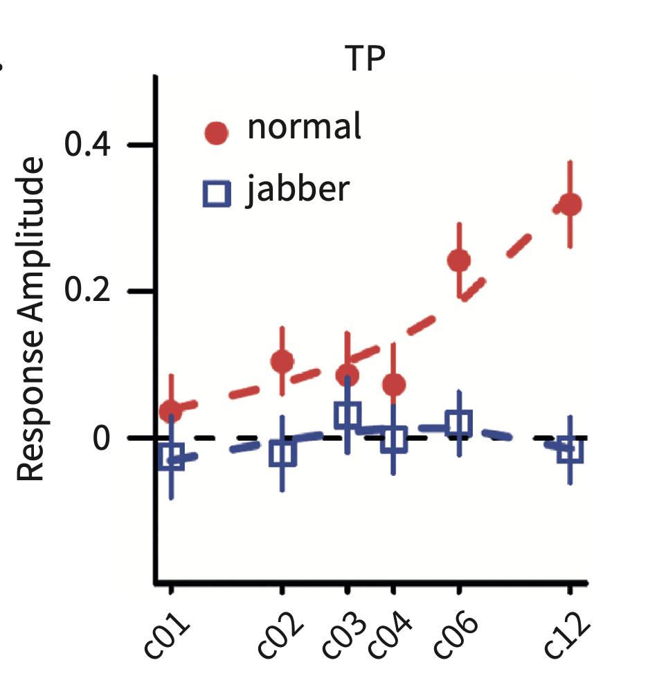
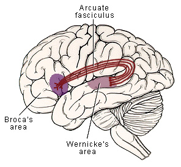

<style type="text/css">
  body{
  font-size: 12pt;
}
</style>

```{r setup, include=FALSE}
knitr::opts_chunk$set(message=FALSE,warning=FALSE, cache=TRUE)
options(repos = list(CRAN="http://cran.rstudio.com/"))
```

# Sentences are not lists of words

What distinguishes "ball-John-the-into-kicks-net-the" from "John-kicks-the-ball-into-the-net"? The most obvious difference (given our previous two lectures) is that the words in the second example are much more predictable than the words in the first example. It turns out that stimuli in the second example (ok, the sentence) actually engage a wider range of neural areas than the first "word list." Pallier et al. (2011) recorded fMRI activation when subjects heard more or less structured sentences. The more predictable the structures (i.e., more phrases), the more activation in the temporal and frontal lobes. 

<p align="center">
  
</p>

# The combinatoric network

The book calls the temporal and frontal lobe areas (specifically the STG and IFG) calls this the *combinatoric network*--which serves ar the areas of the brain responsible for understanding sentences. But what functions do these areas *actually* serve? Pallier et al. also included pseudowords in their sentence stimuli, which retain grammatical words so there is phrase structure (*Jabberwocky*). The brain responds differently to sentences with real words versus pseudowords. Activity in the left anterior temporal lobe increases only when stimuli contain real words.

<p align="center">
  
</p>


The combinatoric network has been substantiated in other studies as well. In particular, the left inferior frontal gyrus (LIFG) plays a critical role in sentence understanding. Also the *arcuate fasciculus*, the bundles of axons, connecting the temporal lobe to the inferior frontal lobe connects "hot spots" of neural activity during sentence comprehension. 

<p align="center">
  
</p>

The problem with this rather larger scale (at the level of the sentence) approach to understanding the neural activity involved in assembling sentences is that the connection between the stimulus and the and response in the brain is broadly specified, that is, we really don't know what parts of the brain are responsible for the details of syntactic interpretation. The relationship between the stimulus, task, and brain activity is called the *linking hypothesis*. We can pare down the stimuli to better focus on specific aspects of the syntactic assembly in the combinatoric network.

# Simple phrases

Instead of focusing on the sentence level the next set of literature has simpler linking hypotheses with fewer variables allowing researchers to make more specific claims about the combinatoric network. The idea here is to manipulate one- and two-word phrases such that they represent varying levels of syntactic or thematic complexity that are matched to images in the test, and measure the corresponding neural response. In one-word "list" conditions, there is no combinatorial processing that occurs, so the researchers look for brain avtivity that increases when composing to words together.

MEG during picture-matching tasks like this show a neural pattern that indicates a difference between composed or combined words with lists of words. In particular, the *left anterior temporal lobe* (LATL) is active 250ms after the start of the second word. The *ventro-medial prefrontal cortex* (VMPFC) is engaged around 400ms after the start of the second word. The temporal separation between these two activations (very short!!) played into the model that the researchers (Pylkkänen) put forward--LATL reflects putting together the words, VMPFC reflects semantic evaluation. It turns out that the LATL and VMPFC are active not only in comprehension but also in the production of phrases (evidence from both spoken English and ASL).

## LATL for composition or semantic combination?

While results like Pylkkänen suggest that LATL is simply putting words together, there is evidence that that same regioin is involved in semantic computation in sentence comprehension as well. Remmeber the "semantic hub" from a few lectures ago in the context of semantic dementia? Well the semantic hub in that literature was the LATL! Pylkkänen investigated whether LATL is engaged in just composition or a *specified* conceptual meaning, so not just building phrases but building specificity: would "tomato soup" engage LATL more than "vegetable dish"? The results are more complicated that that (sadly) and the factors of structure building and conceptual specificity interact. See book p.147 for the details. 

But the takeaway is clear: The LATL is involved in a process that combines the conceptual features of words--> when the phrase does not alter conceptual features, then LATL is not engaged. So, "two boats" engages LATL while "the boat" doesn't seem to. 