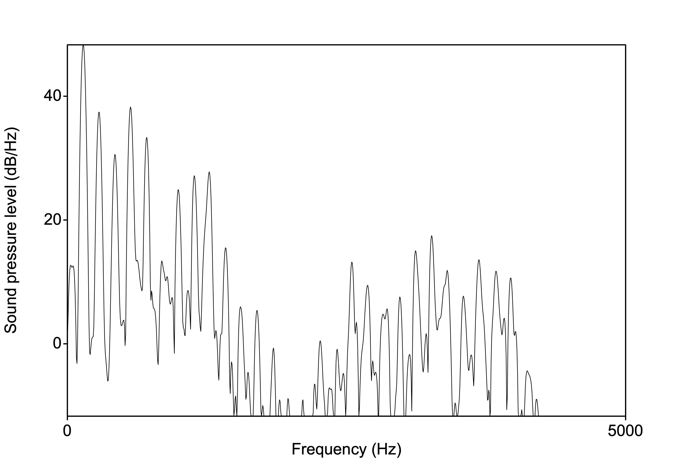
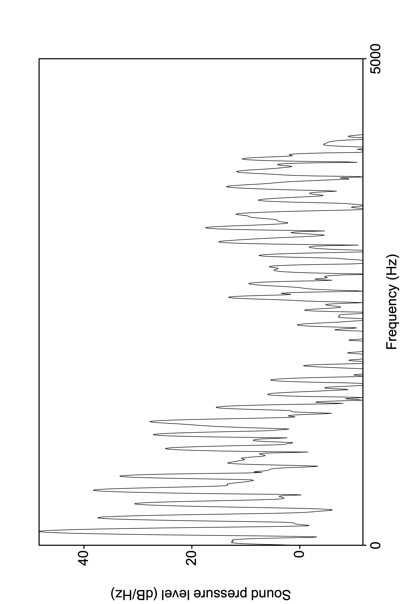
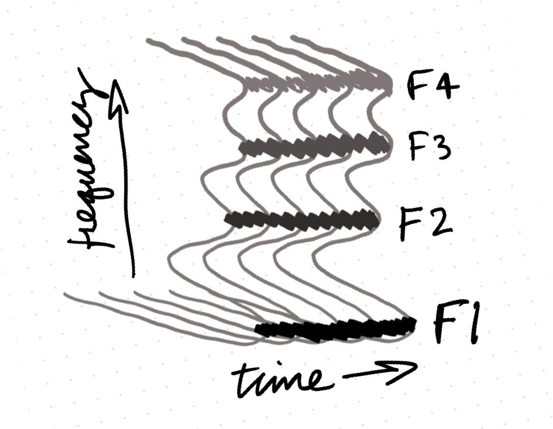
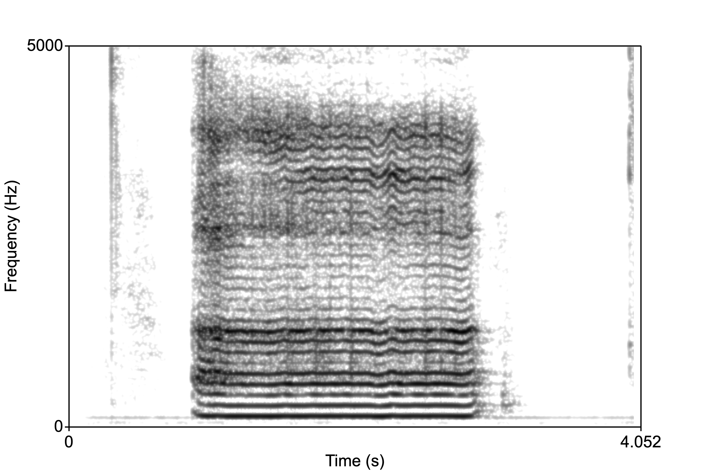
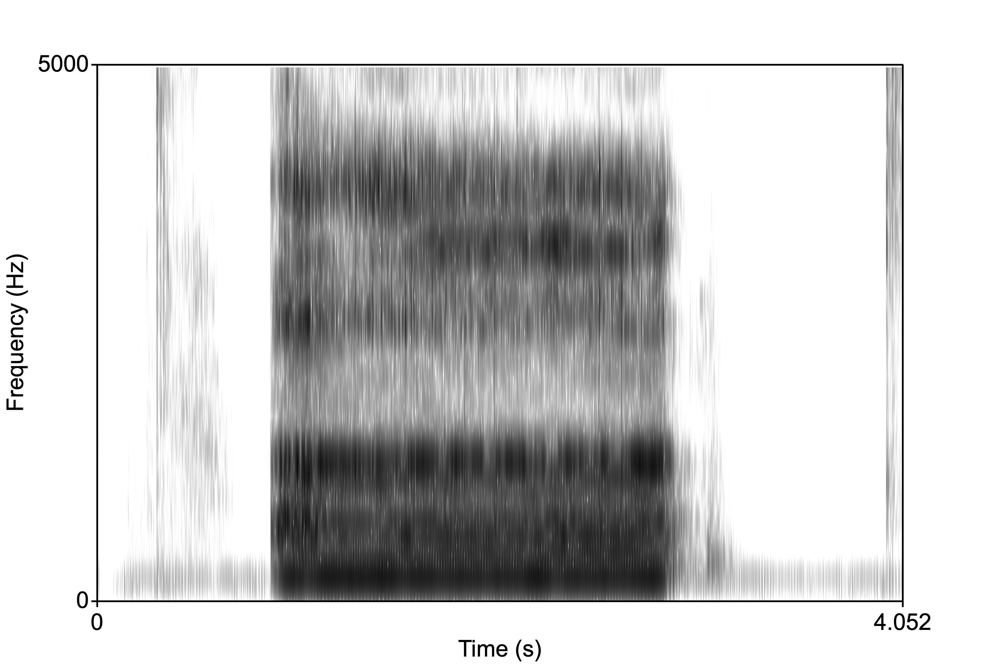
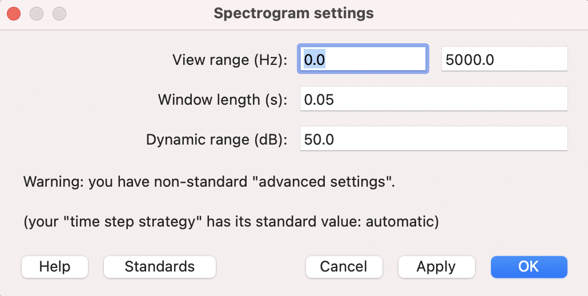
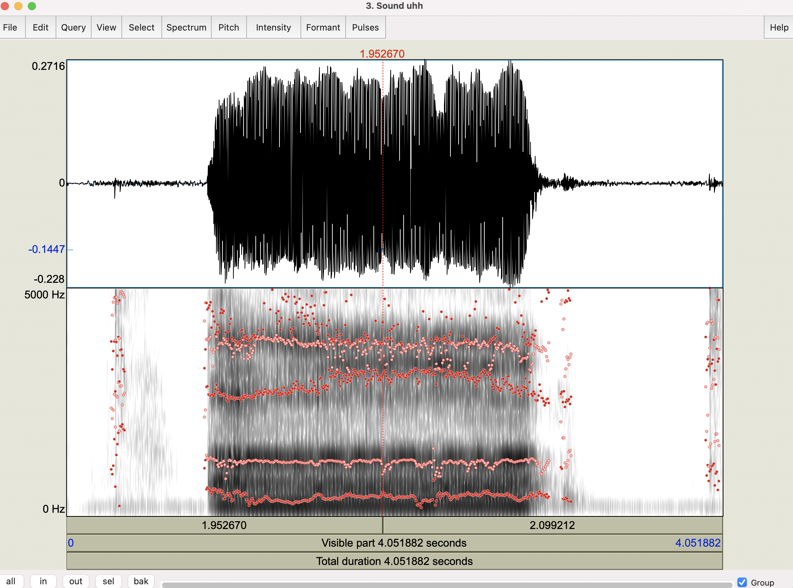
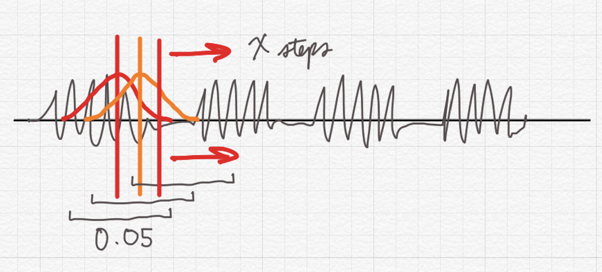
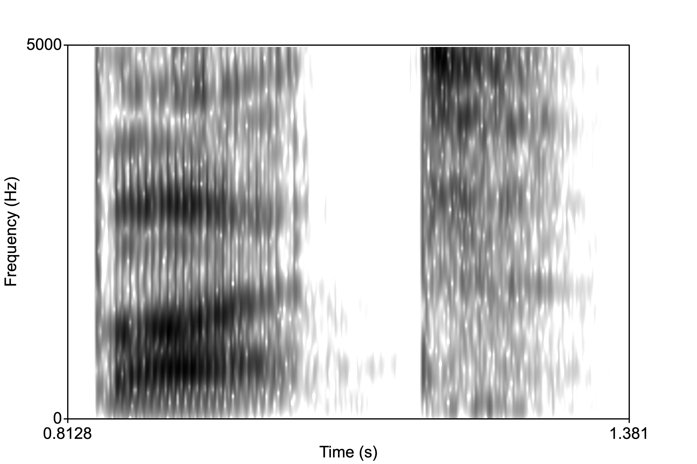
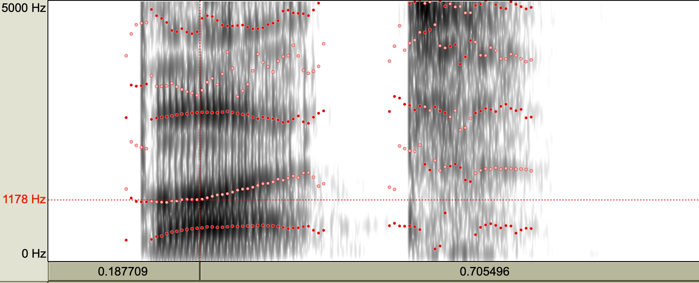

<style type="text/css">
  body{
  font-size: 12pt;
}
</style>

```{r setup, include=FALSE}
knitr::opts_chunk$set(message=FALSE,warning=FALSE, cache=TRUE)
```

----

In today's lab we get back to Praat and explore the *spectrogram*, which is a key analysis display for speech. Recall that we have been working with waveforms, which is a representation of speech as a fluctuation of air pressure across time. We also introduced the *spectrum* representation, which was a frequency x amplitude slice in time. We now build on these two representations with the **spectrogram**.

# The spectrogram

The spectrogram is essentially as spectrum representation with the addition of time. If you were to take the typical spectrum, like the one below, rotate it counterclockwise 90&deg; then 90&deg; towards you, then did that for ever spectral slice over time, you would have a spectrogram. 

<p align="center">
  
</p>

Here is the same spectrum rotated 90&deg;:

<p align="center">
  
</p>

And now a few of them over time. But we're essentially having to display a 3 dimensional representation (freq, time, amplitude) in 2D. How do we do this? The spectrogram uses the weight of the shading to represent the amplitude. The darker the color, the higher the amplitude. 

<p align="center">
  
</p>

Now examine the two spectrograms below. The one on the left is called a "narrow-band" spectrogram, and the on the right a "wide-band" spectrogram."

<p align="center">
  
</p>

In order to generate a narrow-band spectrogram, we need to sample across a large window. For the image above, the window setting was 0.05s. This means that the program analyzes 0.05s of the signal as it samples it in X number of time steps. Let's examine how we can do this. 

1. First download this wave file of me saying [uhhhh.](sounds/uhh.wav)
2. Open the sound file into the Praat objects window, then click "View and Edit".$\rightarrow$ this should give you a window with a waveform on top and some spectrogram representation below.
3. From the View and Edit window, click Spectrum > Spectrogram settings...

<p align="center">
  
</p>

Here we can play around with the specifications to change the resolution of the spectrogram. Direct your attention to the "Window length" setting. In this example, it's 0.05s. Change it to 0.005s. This means the window of analysis is very small, so the program doesn't have too much information to base it's estimation of the frequency components of the sound. This would result in a "wide-band" spectrogram:

<p align="center">
  
</p>

Notice how the "bands" are wide. The dark bands here are the formants. We estimate the numerical value of the formant by centering the cursor in the formant. We can have the program estimate the formants as well. Click Formant > Show formants.

<p align="center">
  
</p>

But what exactly is the difference between these two window sizes? Look at the picture below and it will give you a sense of what the program is doing. We can set the number of time steps the program takes across the signal (or the number of samples). One convenient way to remember the difference between wide- and narrow-band is that the smaller the window, the wider the band. The bigger the window, the better the approximation of the harmonics, and so the more stripey look of the spectrogram.

<p align="center">
  
</p>

# Steady state

I want to introduce here the concept of **steady state** of the vowel. Notice in the spectrograms above the formants are relatively unchanging throughout the vowel. This is called the steady state portion of the vowel. This is possible because there is no consonant before and only a /h/ after (which is basically a vowel without vocal fold ocscillation). Vowels in real speech/words will have more or less of a steady state. 

Below is the word "but". Notice that F1 and F2 start low (reflecting the bilabial closure) then F2 increases (reflecting the "t"). 

<p align="center">
  
</p>

Now, the question is, what is the F1/F2 of the vowel "uh" in "but"? Where do we measure it? It's moments like this that we consider phonetics an "art." If we look at the formant track, we notice there is a small region where the vowel is steady. This is the portion that is unaffected by the flanking consonants on either end of the vowel. It's from here that we will take out formant measurements.

<p align="center">
  
</p>

# Vowel measuring

Many students working in phonetics labs end up measuring lots of vowels. What do we look for when measuring a vowel? We look for a steady state that's unperturbed by consonants, as shown above. We generally report F1 and F2, but how do we get those? We can either inspect spectra (place your cursor in the steady state portion then generate a spectrum like you did in the previous lab/HW), or you can trust Praat's algorithm to find F1 and F2 for you. Let's go with the latter. 

1. Open the uhh.wav file. In this case we have a steady state. It might be convenient to get the "average" formant values in this case.
2. Select a portion of the middle of the vowel.
3. Formants > Show formants, then Formants > Get first formant. This will open a dialog box with the formant value in Hz.

What if we wanted a measurement of the formant values at vowel onset and offset? Let's do this with ["cut"](sounds/cut.wav).

Here are more sounds to work with: [dat](sounds/dat.wav), [dit](sounds/dit.wav), [duht](sounds/duht.wav), [dut](sounds/dut.wav)

## Note on determining vowel onset and offset

There is really now hard and fast rule for determining the onset and offset of the vowel. What do we know about vowels? They're complex period ic sounds, so one rule of thumb is that when the waveform starts to look periodic, we know we're at the beginning of the vowel. Similarly for offset, when the waveform starts to look aperiodic or noisy or without much structure, then you're likely at the offset. Your ears also tell you a lot about these landmarks. Trust them! In general you will want to measure the vowel at the zero crossing, but depending on your window size (if it's small or large), you will want to take the measurement at either the first or second zero crossing. 

# Audio samples for Assignment 2

[Hide, Heidi, Heidelberg](sounds/hide_heidi_heidel.wav)
