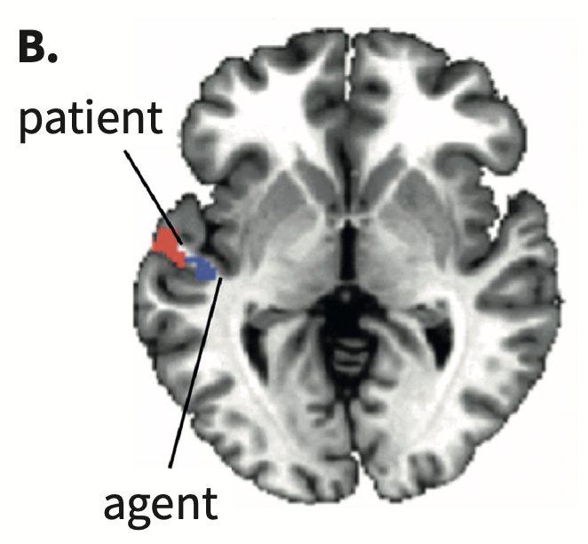

<style type="text/css">
  body{
  font-size: 12pt;
}
</style>

```{r setup, include=FALSE}
knitr::opts_chunk$set(message=FALSE,warning=FALSE, cache=TRUE)
options(repos = list(CRAN="http://cran.rstudio.com/"))
```

# Temporal lobe

For much of our discussion in this class a few regions of the brain have been implicated in language processes. For low level phonetic processing there's necessarily engagement with the auditory and motor cortecies (and the belt surrounding the motor cortex). Once linguistic processing occurs (above the level of pure audition) we see engagement of the temporal lobe, sortof the first stop in language. For higher-level tasks like we see in the prediction and syntactic combination chapters, many studies implicate the temporal lobe as active. But what exactly is the temporal lobe doing?

The posterior portion of the temporal lobe is involved in sentence understanding. Frankland and Greene (2015) were interersted in whether the brain processed *grammatical* versus *thematic* roles in syntax. Look at the role of "ball" in the following:

1. The truck hit the **ball**. [object, patient]
2. The **ball** was hit by the truck.[subject, patient]
3. The **ball** hit the truck. [subject, agent]
4. The truck was hit by the **ball**. [object, agent]

Using MVPA the researchers found distinct parts of the left-posterior temporal lobe. 

<p align="center">
  
</p>

The book mentions that brain regions *register* certain kinds of information, that is there is dedicated space in the brain for themes and grammatical relations in syntax. This information changes over time but the brain region which registers the content does not change. 

# Building sentences versus phrases

An interesting study by Matchin et al. (2019) shows that the LPTL is more active when it expects a phrase to be part of a sentence. Stimuli were presented in blocks of either simple NPs or sentences. In the example "the poet..." would be a sentence stimuli and "the fencer," "the baby,"...were NP stimuli. When the subject hears "the poet," because it is presented in a block of only sentences, the LPTL becomes more engaged because it recognizes that a more complex sentence will follow. The same activation does not occur when "the fencer" is presented. The authors clasim that the LPTL is responsible for the building process of syntax. 

# Complexity

The last study I'd like to mention is one by the book's author, Brennan and his colleagues (2016). They were interested in whether the brain becomes more or less engaged when presented with more and more complex argument structure. They used naturalistic stimuli, in this case listening to an audiobook chapter from *Alice in Wonderland* during an fMRI session. Recall the sentence "The red apple that I cut is on the table." The authors coded sentences for phrase boundaries, so in this example, at the word *table* four complete phrases have been heard, at the word *cut* three phrases, and so on. They tested whether fMRI signals matched the phrase complexity of the stimulus with more activity for more complex phrases, and decreased activity for simpler phrase structures. This is exactly what they found in LPTL, LATL, and LIFG. 

Take away: The LPTL is involved in processing phrase and argument structure, and anterior regions (based on previous lectures) is involved in semantic representations. 