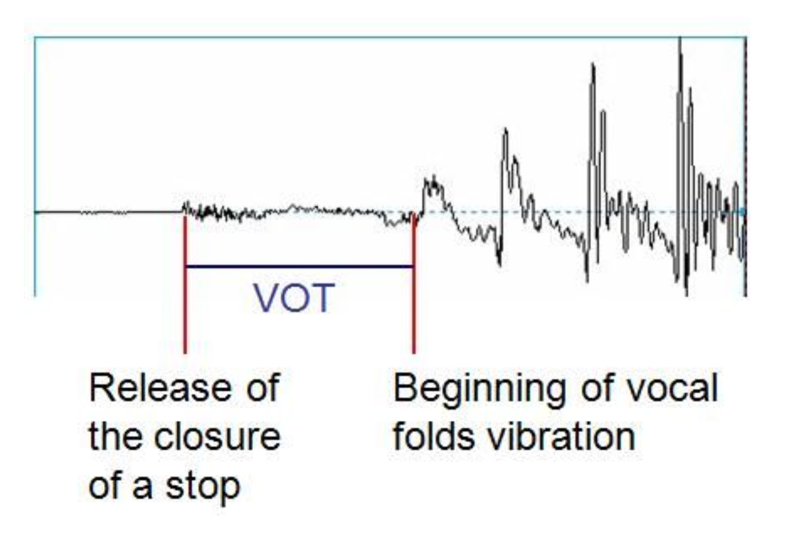
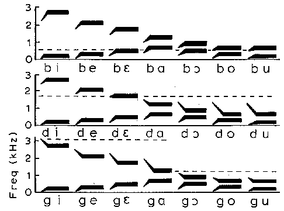
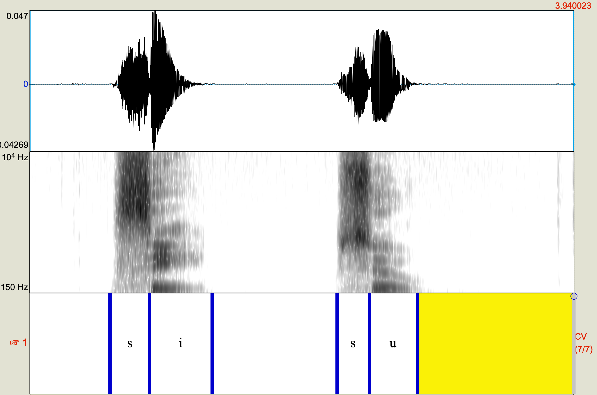
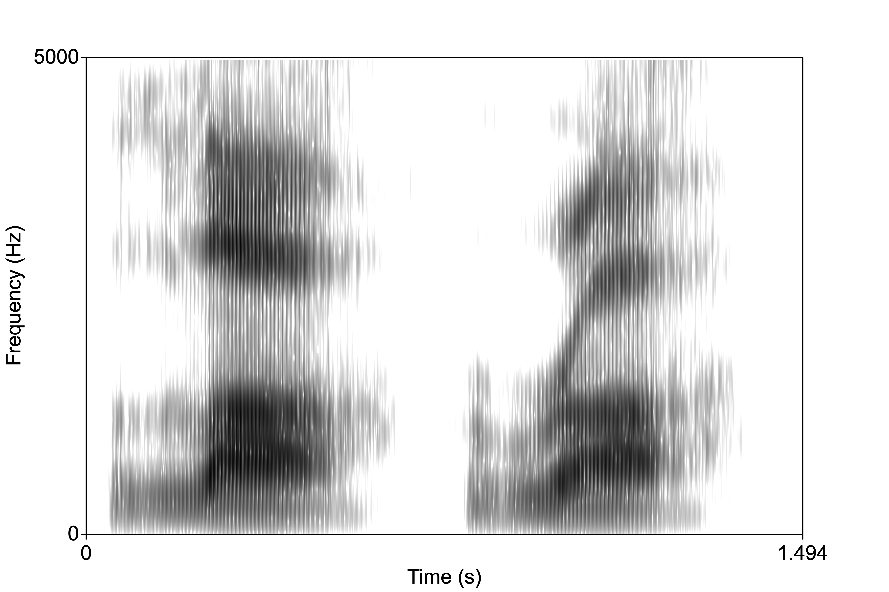
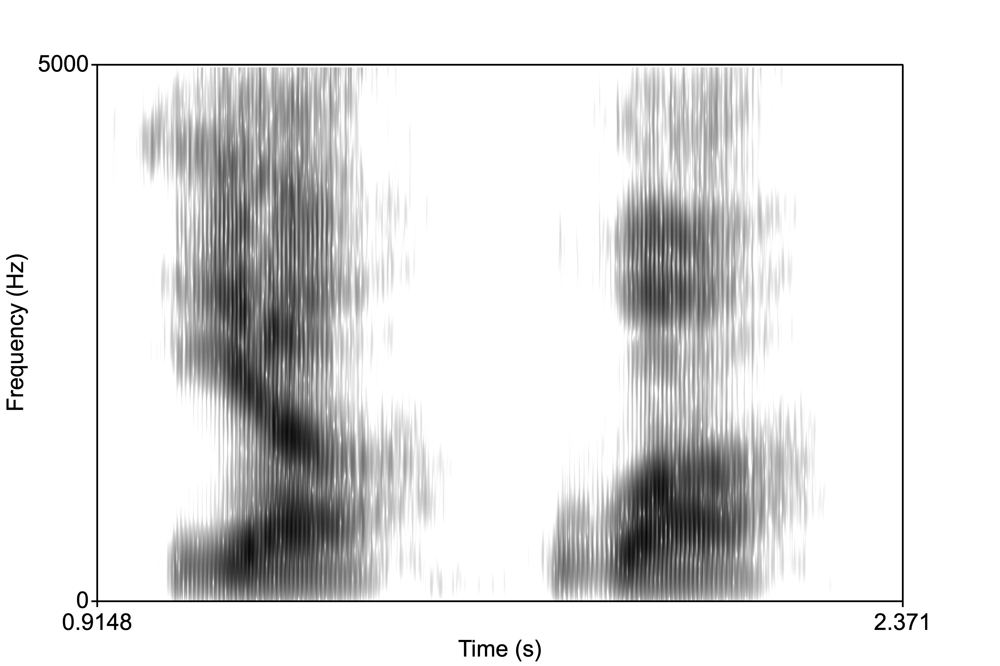
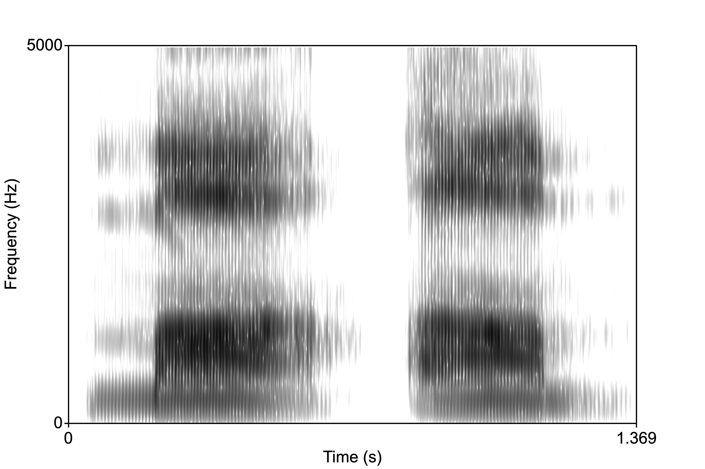
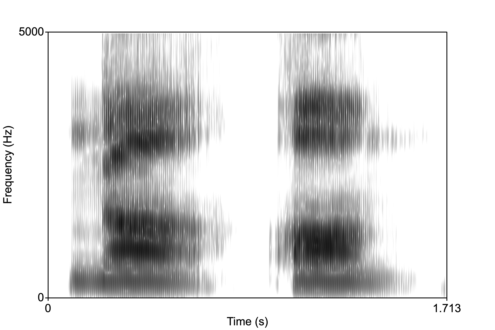

<style type="text/css">
  body{
  font-size: 12pt;
}
</style>

```{r setup, include=FALSE}
knitr::opts_chunk$set(echo = TRUE)
knitr::opts_chunk$set(dev = "png",
                      dpi = 600,
                      echo = FALSE,
                      cache = FALSE)
options(repos = list(CRAN="http://cran.rstudio.com/"))
install.packages('tidyverse') 
library(tidyverse)
```

----

We've spent some time discussing phonation and filtering which results in vowel (or vocalic) sounds. We've also briefly discussed the idea that perception is not a one-to-one mapping of acoustics to a representation in your brain. Today we switch gears, slightly, and introduce consonant perception. For the most part, consonants are produced with some sort of occlusion in the vocal tract, a constricting of the walls of the mouth or the contact of the tongue with the superior surface of the oral cavity. 

----

# Categorical perception

Categorical perception refers to a general phenomenon whereby humans (and other animals) categorize objects with similar features--but for our purposes it really is the study of how our built-up categories can be imposed on external features. Our notion of "chair" is such that any object with four-legs and is "sittable" might fit into that category. Crucially, my category of chair might be different from yours. We can extend this general phenomenon to the speech domain. 

In general, the vowel space is thought to be perceived more or less *continuously*. There is some intuitive sense to this, as I can seamlessly transition a production of "aah" to "ooo" and you would be hard pressed to identify when it changes category. That is, there is no clear boundary between the productions, but rather the acoustic shape shifting gives rise to a continuous perception. 

Contrast that with consonants. If a series of consonants are presented to a listener, with each consonant differing only slightly from the other in one small respect along some acoustic dimension, there would be a point in the presentation where the listener’s perception goes from one phoneme to another. On either sides of this crossover consonants are perceived as being the same.

<p align="center">
  
</p>


The image above is called a **identification function**. A stimulus (from the x-axis) is played to the listener and the listener is asked to identify the sound. The x-axis consists of a series of sound stimuli, at the left end is definitively a /ba/ and at the right end definitively a /da/. In between are 8 stimuli that are more or less /ba/ or /da/ like. If you were to hear all 10 stimuli they would slowly change from "ba" to "da". It's important to note that each stimulus in the continuum differs by exactly the same "amount." When the stimuli are played to listeners, however, they treat the left 4 stimuli as /ba/ 100% of the time(!) even though each one is actually slightly different. So the listener's brain collapses the differences and treats them all as "ba". BUT, when they get stimuli 5 and 6, they are 50% in their identification. 

The image above is an *idealized* identification curve and we don't really know what the acoustic dimension being varied along the x-axis is. A typical categorical perception task with consonants exploits a timing relationship between the release of the oral occlusion and the onset of vocal fold oscillation of the following vowel.

# Voice onset time

To begin with, the *sound* of a consonant is extremely brief. It's the release of the occlusion in the vocal tract, giving rise to a noisy burst of energy, typically called a **burst**. We can understand a lot about the consonant (whether it is a /t/ or a /d/; /p/ or /b/, etc.) from the how the burst is timed with respect to the beginning of the following vowel. This aspect of consonant acoustics, especially for consonants that are followed by a vowel, is called **voice onset time** or VOT. 

Imagine the articulatory and aerodynamic processes involved in the production of an oral consonant follow by a vowel, like "pa":

1. The articulator makes contact with the place of articulation, creating a tight seal
2. Air pressure builds up behind the constriction
3. Constriction is released
4. Voicing of the vowel begins

The synchronization of 3. and 4. characterizes VOT. 

<p align="center">
    
</p>

In the schematic image on the left, there are three different "types" of VOTs shown. 

1. Zero VOT: the release of the constriction is timed perfectly with the onset of vocal fold oscillation (similar to "voiced" consonants in North American English, "ba", "da", "ga")
2. Positive VOT: there is a brief silence or time gap between the release of the constriction and the onset of phonation (like syllable-initial "voiceless" consonants in English, "pa","ta", "ka")
3. Negative VOT: where phonation begins before the release of the consonants. We do this in connected English speech usually for voiced stop consonants, but it also happens in place of zero VOT for some speakers of English. 

Here is a continuum of [VOT](sounds/chain.wav) doing from "da" to "ta". The individual sounds from the continuum are found [here](vot_continuum.html).

Below are the waveforms for the synthetic VOT continuum. Though it's hard to see here, notice that the initial noise burst slowly disappears as you move from left to right. Remember, the vowel-consonant (of the CVC sequence) remain the same in every token, just the VOT changes.

<p align="center">
    
</p>

When we did this identification exercise in class we got a pretty good approximation to the idealized categorical perception curve above. What this means is that listeners cannot distinguish between tokens on either side of a *crossover*, generally in the middle area of the continuum. That is, on either side of the crossover is a "category", in this case, either a "d" or a "t."

# F2 transition

Categorical perception in speech occurs with acoustic cues other than VOT too. For example, the place of articulation of a consonant is cued by the frequency of F2 at the beginning of a vowel in a CV sequence. This "F2 transition" tells us whether we're hearing a bilabial, alveolar, or velar stop. 

Below is an image of synthetic CV stimuli that show the relationship between the onset of F2 in the vowel and percept. Notice how the F2 transition is modulated by the identity of the vowel. In general, for bilabials the F2 onset "points" down, while for velars, it points up. For alveolars it's more tightly linked to the vowel identity. 

<p align="center">
    
</p>

You'll also notice that it's not only the onset frequency of F2 that varies, but also the duration of the transition before the vowel's steady state. 

# Trading relationships

Consonants (and to some extent vowels) are not defined (perceptually) purely by singular acoustic cues. For example, something like voicing is not *just* VOT. Rather, there are multiple acoustic cues that contribute to the perception of some phonological feature or characteristic. Continuuing with the voicing feature (distinguishing p/b, t/d, k/g) there are other cues that trigger voicing for the listener. 

## F1 cutback, Pitch perturbation

1. F1 cutback: When a stop is released there is a (sometimes) brief moment before the onset of the following vowel (in a CV sequence). This moment (called VOT) is characterized by the coupling of the trachea with the oro-pharyngeal cavities. When these tubes are coupled there is a low-frequency *anti-resonance* (as well as the more typical frication associated with VOT) such that there is no energy in the F1 region. This is called **F1 cutback**, and can extend into the vowel. That is, the higher formants of the vowel can start before we see energy in F1. When F1 does appear, it is higher in voiceless consonants than it is in voiced consonants. 

So when F1 is delayed it is naturally high $\rightarrow$ voiceless percept; F1 is not delayed, it is low $\rightarrow$ voiced percept. 

2. Pitch perturbation: It's called "pitch" perturbation but it refers to the physical phenomenon of the F0 being lower in voiced CVs than in voiceless CVs. It is a very subtle, but reliable difference that reflects the fact that when there is a voiceless stop, after release of the consonant there is enough time for intraoral pressure to rapidly decrease, thereby allowing air to more rapidly across the vocal folds resulting in momentary high F0; whereas with voiced stops the pressue in the oral cavity is relatively high so air flow across the vocal folds is momentarily low, resulting in low F0. 

Listeners are sensitive to the relationship between High F0/Voiceless consonant, Low F0/Voiced consonant. 

Together with VOT, F1 cutback and Pitch Perturbation form a trading relationship for the perception of voicing in CVs. The listener doesn't treat all of these cues equally, however. There's evidence that listners *weight* VOT greater than F1 cutback or Pitch Perturbation, that is, it a more *salient* cue. 

So, in the absence of the more heavily weighted cue, the other cue(s) may allow the listener to recover the percept.

# Coarticulation

We've talked about coarticulation before. It is the phenomenon whereby adjacent sounds influence each other when articulations are initiated before the preceding articulation is complete. The reasons for this might include efficiency while maximizing information transmission. Perceptually, the listener must unpack coarticulated utteracnces to recover the intended phonemes. It turns out that listeners are very good at this, that is, they know what the accoustic consequences of coarticulation are. 

Acoustic elements of preceding and following sounds are incorporated into target sounds as a result of coarticulation. For example, in the word "soo", lip rounding from /u/ is present during the production of /s/. In "see", however, the lips are spreading during /s/ in anticipation of /i/. The resulting acoustics are such that the high frequency bandwidth of /s/ in "soo" is wider than the /s/ in "see."

<p align="center">
    
</p>

There are continuously shifting acoustic features that interact with and affect adjacent features. Listeners integrate acoustic information that is spread over many phonetic segments in order to make a judgement about a particular phone's identity. 

# Perception of consonants

## Liquids

Liquids (/l/ and /r/) are similar to diphthongs (consisting of a movement to two positions) and recognized on the basis of their formant transition or movement. Unlike diphthongs, the transitions for liquids are much faster. F3 is also important for differentiating liquids, being lower in /r/ than /l/. Below is "la" followed by "ra". Notice in the liquid initial portion that F3 is basically overlapping with F2 in "ra".

<p align="center">
    
</p>

## Glides

The glides /j/ and /w/ are characterized by transitions that are shorter than in diphthongs. When the transition duration is shorter than 40-60ms, listeners hear a stop, but when it is between 60-150ms, they judge the sound to be a a glide. The image below is /ja/ followed by /wa/.

<p align="center">
    
</p>

## Nasals

Nasality occurs when the nasal cavities (the sinuses) resonate as a result of the velum being lowered allowing air to escape out of the nose. When there is an occlusion in the oral cavity then the resulting sound is called a **nasal murmur**. The murmur is basically a very low frequency formant, the *nasal formant*. But what about place of articulation? Well, the acoustic features (namely F2 onset and transition) that distinguish place in oral stops are likewise important for nasal place perception. In the spectrograms below (/ma/-/am/, /na/-/an/, /nga/-/ang/), for the NVs notice the initial nasal murmur, then the transition into the vowel; and for the VNs notice the low amplitude nasal murmurs. 

<p align="center">
    
</p>

The F2 onset in NV sequences begins low for bilabials, high for velars, and inbetween for alveolars.

## Fricatives

Fricatives are characterized by high-frequency noise. The duration of the noise cues the presence of a fricative (versus an affricate, which has much shorter duration frication). The place of articulation is cued by where in the spectrum the noise is centered. Sibilants (/s/, /ʃ/) have steep high-frequency noise peaks, while non-sibilants have more flatter spectra. /s/ has a higher centered peak (around 4kHz) than /ʃ/ and its voiced counterpart. The two dental fricatives, /f/ and /θ/ have very similar spectra, and as a result sound very similar. 

## Affricates

Affricates are essentially a stop which is released into a fricative. The duration of the fricative portion is shorter than a true fricative, but there is frication nonetheless. The stop portion is characterized by "silence", which is followed by a quick (~30ms) rise time for the amplitude of the frication. 
