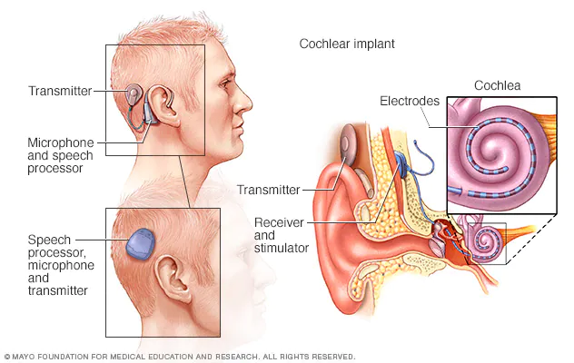

<style type="text/css">
  body{
  font-size: 12pt;
}
</style>

```{r setup, include=FALSE}
knitr::opts_chunk$set(message=FALSE,warning=FALSE, cache=TRUE)
```

----

Before we start today's lecture, let's look at your vowel space from Assignment 2.

```{r echo=TRUE}
library(ggplot2)
data <- read.csv("LING2200_vowels_2022.csv", header=TRUE)
vowel_space <- ggplot(data, aes(x=F2, y=F1, label=Vowel)) + geom_text() + scale_x_reverse() + scale_y_reverse()
vowel_space
```

----

# Hearing loss, speech perception

A typically developing human will acquire the fundamental aspects of their language by the age of 2-4 years old, with the phonetic system taking shape by the end of their first year. For this to happen, the auditory system (and consequently perception) must be relatively normal or uninterrupted. But what are the consequences for speech perception and language when audition is somehow impaired?

There are many types of hearing loss, that either center around conduction of sound energy (where something is amiss in the outer or middle ear, like wax buildup or ear infection) or sensorineural deficits (where there is a pathology in the inner ear or auditory nerve, think extreme amplitude exposure causing damage to hair cells). Sometimes both conductive and sensorineural deficits might contribute to the hearing impairment. Hearing loss is characterized on a scale from mild to profound based on the amplitude loss relative to a normally functioning ear. A mild loss might mean a decrease in amplitude from 25 to 40dB, with a profound loss being a decrease upwards of 90-100dB. Different types of hearing loss might be further characterized by the envelope of frequency bands affected (looking a lot like the filters we discussed earlier in the course).

## Diagnosis

There are three instrumental techniques that clinicians might employ to diagnose hearing loss:

1. Immittance audiometry: Used to diagnose middle ear problems. **Immittance** is a measure of how easily can be set into vibration by a driving force $\rightarrow$ made up of "impedance" and "admittance." Impedance describes a system's opposing a flow of energy and is measured in *ohms*. Admittance is the opposite, and measures how easily energy is transmitted through a system (measured in *mhos*, get it? the reverse of "ohms"). Admittance is tested using **tympanometry**, which measures how air pressure in the EAM is admitted to the middle ear through the TM. 

2. Otoacoustic emmisions (OAE) testing: OAEs are very very low-intensity sounds that *originate* in the cochlea as a result of outer hair cells shearing the tectorial membrane from an incoming sound. The outgoing "sound" resulting from the moving outer hair cells are transmitted backwards through the stapes to the TM and out through the EAM! There are two types of OAEs, spontaneous and evoked. 

3. Auditory brain stem response (ABR): ABR measures the electrical activity in the brain that occurs within 10ms following the presentation of an auditory stimulus. The ABR is used to measure latencies between stimulation presentation and auditory nerve activity and amplitude of the signal. 

## Speech perception

### Articulation index

It's important to understand the practical ramificaitons of hearing loss in the individual, that is, how is the recognition and perception of speech affected by patholgies of the ear. The most basic techniques to assess speech perception in cases of hearing loss involve presenting the subject with speech in various types of noise. Clinicians might use an **Articulation Index** (AI), which divides the speech spectrum into 20 adjacent bands of frequencies, each of which contributes 5% to the overall intelligibility of the speech signal. Presenting noise in various bands of speech give the researcher a measure of the subject's speech recognition. Listeners are scored based onn how much noise can be tolerated in the signal before it becomes unrecognizable. Typically isolated words are more susceptible to noise, while words in sentences are less affected, suggesting that context matters→ so a low recognition score for individual words may still have a high score for sentences. Why?

### Phonetic transcription

A very simple way to assess the language effects of hearing loss is by transcribing the phones subjects recognize. For example, clinicians can assess whether certain consonants are more accurately perceived in particular word positions or whether certain acoustically similar sounds are misperceived or exchanged for one another. While the technique is simple to administer, it is quite naive and misses a lot of underlying generalizations for why someone might not be hearing certain sounds or features; though this can be overcome by using synthetic speech to examine particular features that cause problems for the listener.

### Phoneme recognition 

Hearing loss can affect both the **audibility** of a speech sound, that is the ability to detect whether or not a signal is present, and the discrminability of a speech sound or whether or not a speech sound is discriminated The *suprathreshold* of audibility or recognition need not imply that the sound is accurately discriminated by the subject. For example, suppose the subject has high-frequency hearing loss, affecting noisy consonants like fricatives, they might be able to recognize that a fricative sound is present, but not able to tell whether it is a /s/ or a /f/.

The acoustic structure of vowels and consonants provide the listener with many sources of information about the identity of the speech segment. These sources of information, or acoustic *cues*, are oftentimes redundant. For example, phonological voicing can be conveyed using [voice-onset time](lecture13.html) or fundamental frequency or the onset of F1. People use varying strategies in identifying consonants (or vowels) based on their acoustic cues, relfecting individual *cue weighting* strategies. These cue weightings might change over time or be adjusted depending upon competing information in the signal (like noise). Not all speech sounds are the same with respect to their perception by individuals with hearing impairment. Vowels are often discriminated by individuals with hearing loss due to redundancies in the signal, though children with high-frequency loss may show poor discrimination. With respect to consonants, listeners with hearing loss may be more challenged. Fricatives (as mentioned earlier) are characterized by high-frequency energy, and are often difficult to discriminate by hearing impaired individuals. Place-of-articulation cues are also difficult to perceive because the distinguishing spectral characteristics, generally the F2 transition into the vowel, is *very* short, on the order of 20-30ms.In order to compensate for hearing loss, individuals might compensate by reweighting acoustic characteristics. For example, normal hearing individuals might weight F2 transitions more than hearing impaired people, who might give more weight to duration cues.

## Cochlear implantation

Over the past 30 years, radical new technologies have given hearing impaired individuals more access to the auditory world. **Cochlear Implantation** is a ([sometimes controversial](https://youtu.be/O_O0HIHU6L4)) procedure that directly stimulates the auditory nerve and bypasses a person's damaged ear (often cochlea). The device (receiver) is implanted into the cochlea (thereby stimulating the auditory nerve) and an external device (microphone, speech processor, transmitter and battery) is worn behind the ear. The receiver codes the incoming auditory signal and sends electrical impulses to electrodes stimulating the auditory nerve fibers. 




