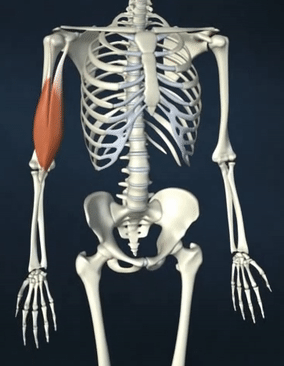

<style type="text/css">
  body{
  font-size: 12pt;
}
</style>

```{r setup, include=FALSE}
knitr::opts_chunk$set(message=FALSE,warning=FALSE, cache=TRUE)
```

----

# Models of production
 
 When we say "model" what do we mean? A model is a simplification of what we think is actually happening. Much like a model of a train, a model of of some behaviour is approximates many complexities, which are put into a perspective that is tractable, yet captures the major features of the *actual thing*. It allows us to better understand complex systems and behaviours.

Because speech production involves the coordination of lots of different physiological systems (e.g., respiration, phonation, articulation), we can attempt to model individual processes as well as larger systems to get a better sense of the relative timing and contribution of function to the speech process.

# Theories of production

A theory is a statement about one's understanding of how a particular phenomenon happens. Crucially, theories are falsifiable, that is, someone could do an experiment showing that a particular theory is wrong. But the way science progresses is that we don't just throw away the theory, we make changes to it and in this way we get closer and closer to the truth. Experiments don't *prove* theories, but rather they *support* theories, because there may be no real way to know the exact truth. 

# Issues in modeling speech production

Any model of how we produce speech has to account for three "problems" (much like the problems of speech perception):

1. The serial-order problem
2. The degrees-of-freedom problem
3. The context sensitivity problem

## Serial order

Speech necessarily unfolds over time and therefore the relative timing of things is important in communicating the message. This is necessary at every level of analysis, from the phone and phoneme, to word and sentence. For example, in English "John walks the dog" is very different from "The dog walks John." What about the initiation and execution of speech gestures? How are they organized in the brain and executed in the form of muscular movements in the mouth?

Speech elements are serialized, that is, there is sequence of events that must occur in proper order and according to a specific timing schedule. But which elements are serialized? At what level does the ordering take place? What if we didn't have a notion of *phoneme* or *morpheme* or *word*? What is being initiated when you start the motor command for speech?

We know that the organization of speech is serialized at a level "above" the articulatory gesture because of speech errors, which are ordered and not random in terms of where they occur. Mistakes of serial order are also called "Spoonerisms", named after [William Spooner](https://en.wikipedia.org/wiki/William_Archibald_Spooner), who was famous for making these mistakes. 

## Degrees of freedom

When we speak we have to control a large number of moving variables, including the msucles involved in respiration and phonation, and ultimately those involved in moving the tongue, jaw, pharynx, lips, etc. Each of these muscles can move in different ways. Compare to the movement of your forearm at the elbow:

<p align="center">
  
</p>

The elbow joint allows movement in one direction, so it has one degree-of-freedom. The structures involved in the production of speech can move in many different ways. These structures can also move in conjunction with other structures, either in-phase (or together with) or out of phase (at different times). How do we control these structures given the myriad ways the muscles involved in speech move? There are three general classes of theories that expalin how we achieve this control: some suggesting that each muscle contraction is programmed into separate neuromuscular signals, while others suggest that there is a hierarchy of control, with upper levels of the system controlling lower levels. Another class of theories suggest that we reduce the degrees-of-freedom problem by organizing muscles into functional groups that work in a coordinated fashion to achieve the articulatory goal. 

## Context sensitivity

The final last problem that theories of speech production need to address is, in a way, related to the serial order issue, namely context sensitivity. 