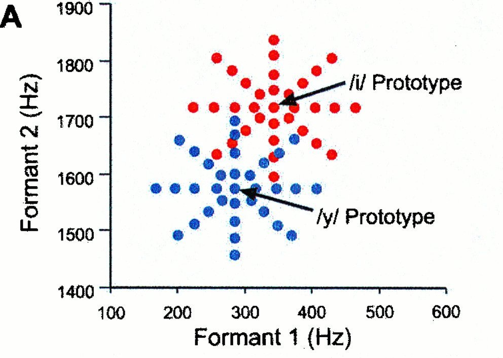
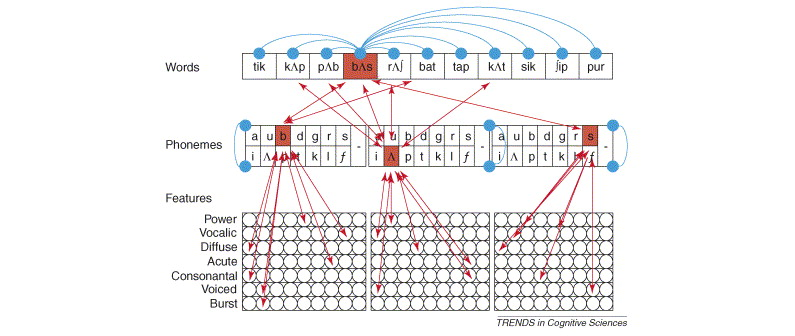
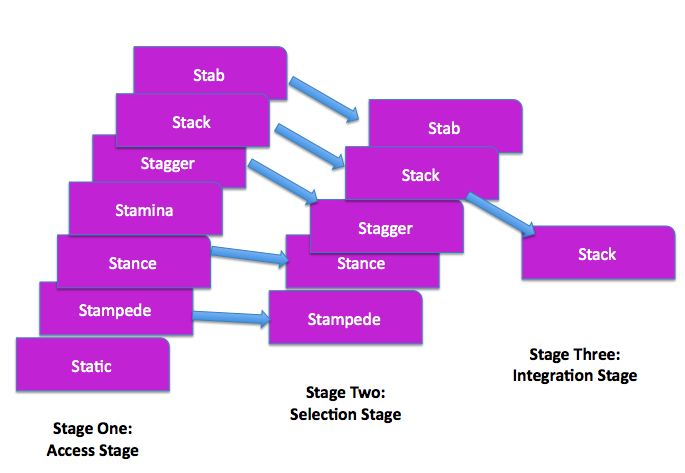

<style type="text/css">
  body{
  font-size: 12pt;
}
</style>

```{r setup, include=FALSE}
knitr::opts_chunk$set(message=FALSE,warning=FALSE, cache=TRUE)
```

----

# Speech perception

Speech perception refers to the ability to receive and interpret (as linguistically relevant) incoming speech. The ability is allows us to decompose speech into component parts, combining them, classifying them, and ultimately utilizing them in order to inform a decision like "is this a "pa" or not?" or "what is this word?".

At its core, speech perception depends on our ability to recognize speech sounds (phones, syllables, words, etc.) and translate them into linguistic knowledge $\rightarrow$ phonology, syntax, semantics. That is, listeners take a continuously changing signal and transform it into meaningful units. How do listeners do this? They use any and all information available in the speech signal, capitalizing on redundant acoustic cues, as well as the knowledge they have gained through experience. Experience with language ultimately shapes how the listener hears speech information. Our experience as English speakers shapes the way we hear speech, allowing us to focus on those aspects of the signal that are important for English, while ignoring irrelevant information. 

## Categorical speech perception

We have discussed categorical speech perception in previous lectures but haven't discussed the mechanisms that underly the phenomenon. The data reduction involved in speech perception is a function of the nature of the acoustic signal as well as the listener's experience (or native language). It's a very good thing that we perceive speech categorically otherwise we would be flooded with unnecessary information (e.g., the differences between multiple talkers saying the same thing, or even within an individual saying the same thing but with physically different utterances). 

### Native language magnet 

But *how* does categorical speech perception happen? One proposal, the **Perceptual Magnet effect**, suggests that with experience with the speech world, we create *prototypes* of sounds against which we assess incoming speech. The prototype serves as a magnet, attracting nearby sounds towards it, thereby making discrimination between the prototype and the non-prototype very poor (i.e., essentially no difference between the two). In the image below we see two prototypes, one for /i/ (as in "heat") and /y/, or the high-frount rounded vowel (as in the French word "tu", meaning *you*). 

<p align="center">
  
</p>

Speech tokens that are close to the prototypes are essentially not different from the prototype itself. Notice how good instances of /y/ are bad instances of /i/. In this way, the mechanism behind categorical perception is rooted in the establishment of a prototype. The theory that encapsulates the perceptual magnet effect is called the **Native Language Magnet** theory. 

But how do we get the prototype? In the studies by [Pat Kuhl](https://www.pnas.org/doi/10.1073/pnas.97.22.11850), who developed the theory behind the perceptual magnet effect, prototypes were identified by surveying people on what they thought were "good" and "less good" examples of a particular vowel. Importantly, these prototypes need not reflect actual instances of real productions, but rather idealized versions of the sound. 

### Acoustic invariance theories

Recall the [*problems of speech perception*](lecture11.html) discussed a few weeks ago, one of which was the *lack of invariance*, which suggested that the reason why understanding the process of speech perception is so hard is because there isn't a one-to-one correspondence between the an acoustic signature and a phonetic percept. That is, there is no one defining acoustic feature of a phone (because of things like contextual effects like coarticulation). **Acoustic invariance** theories (it's really a class of theories and not a singular theory) appeal to this underlying concern but argue that *there is* invariance in the acoustic signal! There may be some evidence for this as we decompose the speech signal into finer and finer components. The reason why variance in the signal was such a problem was because we weren't looking hard enough to find the invariance. Some examples of this invariance: burst spectra for place of articulation in stop consonants $\rightarrow$ bilabials having diffuse/falling spectrum; alveolars a rising spectrum; velars a compact spectrum.

### Motor Theory

The **Motor Theory** of speech perception is perhaps the most famous of the invariance theories. It centers the "object" of speech perception as the production mechanism that implements the speech motor command. The theory follows from an idea that perception and production are intimately linked. When the listener hears a sound, she recovers (via the acoustic image) the articulatory gesture involved in producing the gesture. She does this because she has an intimate understanding (as a user of language) what articulatory configurations result in which acoustics. The motor theory relies on the philosophy that "speech is special" and that "humans are wired for speech" and therefore have this unique ability to perceive these objects of speech. In the late 1970s, it was demonstrated that some animals too (like Japanese quail for example) can also perceive speech categorically. The original motor theorists adjusted their theory to suggest that it wasn't the gestures themselves that individuals were perceiving, but rather the neuromuscular commands. 

There is some evidence for the link between perception and production in the discovery of a class of neurons in the brain called [**mirror neurons**](https://www.pbslearningmedia.org/resource/hew06.sci.life.reg.mirrorneurons/mirror-neurons/#.XcxFlChKg2w), which fire when engaged in an activity as well as when observing an activity. It turns out that the motor cortex, including portions of Broca’s area, show mirror system properties. Areas involved in planning and execution of gestures and areas involved in proprioception related to mouth movements (i.e., somatosensory cortex) are activated during auditory and visual speech perception. In fact, recent studies have shown that when regions in the brain responsible for certain motor movements (e.g., lip movements) are stimulated, recognition of labial sounds is faster.


### Direct Realism

Direct realism builds upon a theory of perception from the visual domain, and suggests we perceive objects and events directly (as a result of experience) rather than reconstructing or interpreting them from the sensory input to the brain. The events in the case of speech perception would be the acoustic signal, rather than the gestures that result in the acoustic signal. This is analogized in the visual domain $\rightarrow$ one sees a candy bar in its wrapper and knows exactly what it is, its weight, its texture, etc., even if occluded by another object, because they have experienced that candy bar before. This would be a different perception than for someone who has never encountered this candy bar before, as the same visual structure will be *seen* but perceived in a different way. 

### TRACE

Connectionist models of production and perception are rooted in an understanding of the neural implementation of the processing and execution of behaviours. This is a fancy way of saying that the models resemble how researchers believe networks of neurons in the brain operate, that is, in a parallel but hierarchical way. Lower layers are stimulated by an incoming signal, activating features in that level, which in turn activate features in higher levels until a sound (or word) is recognized. The **TRACE** models is a connectionist model. 

The layers or networks of units are the different levels of abstraction. The image below shows a basic TRACE model:

<p align="center">
  
</p>

The Features layer analyzes the incoming speech signal and activates nodes across itme according to various acoustic characteristics. When a node is sufficiently activated (these will have thresholds such that a certain amount of evidence must be present for the node to feed higher-level information), it activates a node above it in a higher layer. Likewise, as nodes in the Phoneme layer become active and past some threshold, nodes in the Word layer becomes active until ultimately a word is recognized.

### Fuzzy logic

Fuzzy logic theories of perception (in general) appeal to the probabilistic nature of categorization. So any item has a probability that it is something or not. For example, in the image below the animal on the right is a bear. What about the animal on the left? You likely assign a probability that the animal on the left is a bear, like 30%, while some features of the animal nudge you to thinking it's a dog (70%). 

<p align="center">
  
</p>

In this way, a fuzzy logic approach to speech perception suggests that speech categories are probabilistic, with phoneme identification following from three stages:

1. Features are evaluated in order to detect a chunk or unit of sound, which is then assigned probabilities for category membership
2. Prototype matching: features that are present in stage 1 are compared with prototypes of phonemes stored in memory
3. Pattern classification: best match of phoneme is selected for recognition

## Word Recognition Theories

There is some overlap between theories of speech percepiton and high-level word recognition (we call it "high level" because the word level is an abstraction above the level of the sound). For example, TRACE and other PDP models very much encompass both speech and word recognition. But there are two historically important theories of word recognition that you should be familiar with: Logogen, and Cohort theory.

### Logogens

A **logogen** is a neural processing device associated with each word in an individual’s lexicon. The logogen contains all info about the word (phonetic, orthographic, semantic, syntactic, etc.). The logogen monitors production to detect any overlapping information. The logogen becomes more or less active as more and more information confirms a word. Whereas other models (from what we've learned) rely solely the acoustic signal to achieve recognition, the logogen uses all information available, including contextual and syntactic information.

### Cohort theory

The **cohort theory** works in ways similar to PDP models, in that when a word is heard, unfolding in time,the various acoustic aspects of the signal initiate activation of word word forms. The initial sound of the incoming signal generates a "cohort" of phonological "neighbours", or words that begin with that initial sound. In the image below, the incoming "st-" sound activates all the words in the listener's lexicon beginning with that sequence. This is called the *Autonomous stage*, when the cohort is activated. 

<p align="center">
  
</p>

As more and more information is gathered, the *Interactive stage* begins to whittle down the options based on the bottom-up (acoustic) information arriving over time, but also semantic/contextual information. 