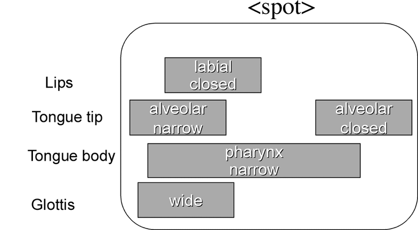
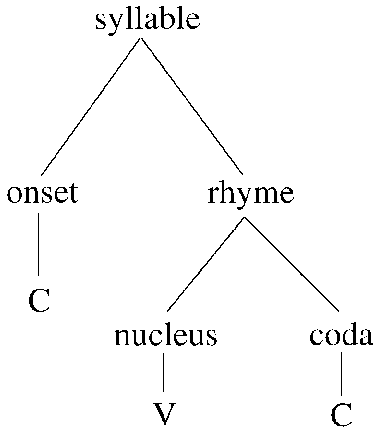
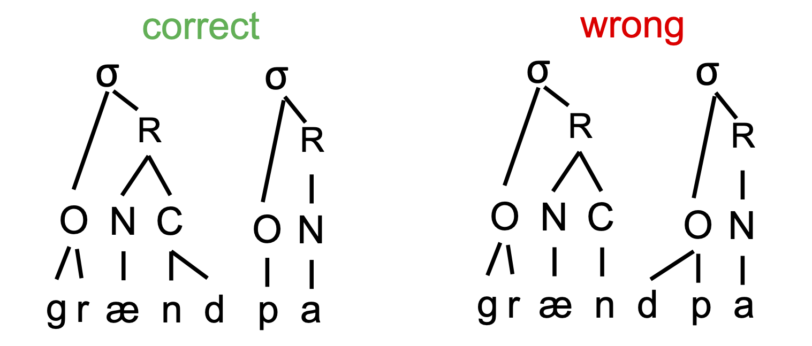

<style type="text/css">
  body{
  font-size: 12pt;
}
</style>

```{r setup, include=FALSE}
knitr::opts_chunk$set(message=FALSE,warning=FALSE, cache=TRUE)
```

----

# Building blocks

What are the basic units of speech. In LING1000 you were introduced to the notion of the "phoneme", or the smallest unit of sound in a language which is ultimately *meaningful* in the sense that it can mark contrast. Phonological contrast is then used to distinguish meaningful utterances as words. If we were to dig deeper into the units of organization within the phoneme, we might consider the notion of a "feature" or "gesture" (articulatory movements).

## Gestural score

If we conceptualize our phonological knowledge in terms of gestures then we can devise models of the implementation of articulatory plans over time $\rightarrow$ gestural score.

<p align="center">
  
</p>

In the image above is a hypothetical (and very basic) gestural score for the word "spot" in English. Each gesture is conceptualized as a dimmer switch (rather than an on/off switch), that unfolds over time. The articulatory features of the score are language universal (determined by the anatomy of the vocal tract), but utilized in language-specific ways. 

## Features

The more common way to conceptualize the building blocks of phonemes (as you've learned in LING1000) is by positing **features**. Features have some articulatory or acoustic or phonetic reality, but are really abstract units of speech that when combined with each other give use the contrastive phoneme. Below are some examples of phonological features:

[labial] -- Involving the lips\
[coronal] -- Involving the tongue tip or blade\
[dorsal] -- Involving the tongue body/rear\
[nasal] -- Involving velum lowering\
[continuant] -- Not full closure\
[consonantal] -- Not a vowel\
[voice] -- Vocal fold vibration for normal voicing\
[high] -- Low F1\
[back] -- Small distance between F1 and F2\

# Evidence for features

How do we know that features are real and have a pyshchological reality for the speaker and ultimately encoded in languages? One way we can see how features function in languages is by looking at universal (or near-universal) tendencies in language patterns. For example, co-occurrence restrictions in English there is a restriction on words of the shape sCVC such that both Cs cannot involve the same constriction.

So we have words like “snip”, but not *snim, *snom, *smung, etc. or it has “spot,” but not *spob, *smaf (But what about “spiffy”?)
English has “Scott,” but not *scock, *skong, etc. [But what about “skunk”].

Phonological processes like *assimilation* also reveal the necessity of featural units for explanation. Assimiliation patterns in languages result in phonemes becoming more similar to neighboring sounds in terms of some phonetic property. Often the assimilation at the speaker level is so prevalent that it becomes encoded in the lexicon (and consequently spelling). For example, the Latinate prefix, *in-* (meaning "not") in English changes according to the place of articulation of the following consonant:\
*in-*possible $\rightarrow$ impossible\
*in-*perfect $\rightarrow$ imperfect, etc.\
*in-*congruent $\rightarrow$ i[ŋ]congruent\
In order to describe this sort of variation we must appeal to a feature that takes on the characteristics of the initial sound of the adjective, in this case, a place-of-articulation feature, like [labial] or [velar].

# Syllables

A larger unit of linguistic structure composed of organized gestures and segments (collections of features) is the syllable, which is generally at its bare minimum a vowel. The structure of the syllable can be filled out by one or more consonants either before or after the vowel. We can think of the syllable as giving the rhythm of a word, an organizational timing structure $\rightarrow$ it’s the “clapping” unit around which we time our utterance.
*Every word* in a language consists of at least one syllable, or one unit of time. 
People almost always agree on how many syllables a word contains, but linguists and phoneticians have a hard time really defining its acoustic properties. What is the phonetic value of the syllable? We know that the mandatory ingredient, the vowel, is loud and made up of periodic acoustic energy. A good approximation of what the acoustic properties of the syllable are would be a rise in energy (from the consonant) into the vowel, and it turns out that when we look at real speech, if we look for loud parts in the signal they correspond with vowels and thereby the psychological perception of the syllable. 

What evidence do we have for syllables? Well, we can look at common processes that are found across the world's languages that rely on some notion of the syllable. A common phonological process that takes advantage of the syllable is reduplication, which refers to the repetition of a whole word or some part of a word in the formation of a related word.
Unfortunately English does not exhibit a very productive application of reduplication, when it does so, it’s either as a clarification or as an intensifier:\
In your coffee do you want soy-milk or *milk-milk*?\
Do you like her or do you *like-like* her?\\

## Syllable structure

Now that we can agree that syllables are *real* at some level, what are they composed of? We mentioned that syllables minimally are a vowel, which is loud and periodic, but what else? We can organize the syllable into one obligatory part (the **nucleus** which is generally a vowel, but can also be a consonant), and two optional parts, the **coda** and the **onset**, which are consonants. 

**Nucleus**: usually the vowel in the syllable, though there are some consonants that can fulfill this role (which ever consonant has the most open vocal tract configuration if no vowel present)\
**Onset**: consonants before the nucleus\ 
**Coda**: consonants after the vowel/nucleus\ 
**Rhyme**: nucleus + coda

<p align="center">
  
</p>

## Assigning syllable structure

Across the world’s languages there is a preference for how consonants pattern syllabically. Consonants prefer to syllabify with the later syllable as onsets $\rightarrow$ so long as **the language permits words to begin with those particular segments**

So in a word like "grandpa", which we know consists of two syllables, the first syllable is structured such that its coda is complex with -nd. 

<p align="center">
  
</p>

In order to state that languages of all different sorts have these patterns or preferences, then a subsyllabic unit like onsets and codas must be relevant to the language’s structure.

### The stress foot

The practical/speech consequence of of syllabification can be seen in the designation of *foot* structure in multi-syllable words. The foot allows syllables to cohere together, as a result, we exhibit *stress* on different syllables within the word. Stress is a rather nebulous term that refers to the “beat” within a word $\rightarrow$ rhythmically strong syllable. It's realized as having higher fundamental frequency and/or intensity.

Stress seems to be one way the brain manages the problem of segmentation, but how does it function in the structuring of a word?
Stress is primary, secondary, and tertiary. **Unstressed syllables are generally phonetically reduced to schwa.**