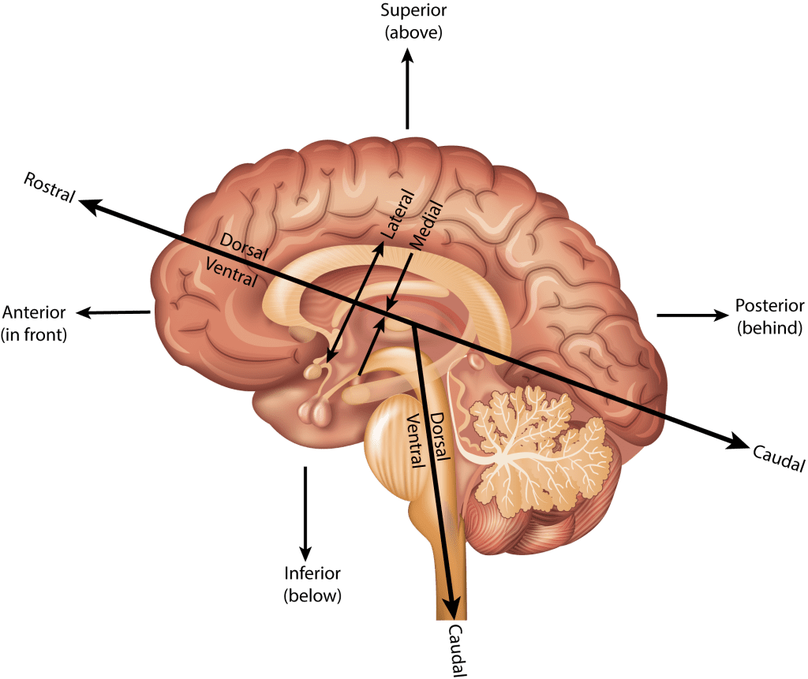

<style type="text/css">
  body{
  font-size: 12pt;
}
</style>

```{r setup, include=FALSE}
knitr::opts_chunk$set(message=FALSE,warning=FALSE, cache=TRUE)
options(repos = list(CRAN="http://cran.rstudio.com/"))
```

Today's discussion will focus on the brain "geography." There's no "geo-" but the brain is our world.

***

## Points of view 

People who work in neuroscience (and anatomy in general) need to refer to anatomical structures from certain points of view. For example, head on, from behind, from above, from below, etc. But like all things scientific (from western perspective), these terms have been assigned latinate names. 

When referring to structures *relative* to others we refer to them using the terms:

1) **Superior**--above
2) **Inferior**--below
3) **Anterior**--in front
4) **Posterior**--behind

So you might say that structure X is ANTERIOR to structure Y, etc. These terms also have less common terms that are also latinate:

1) Superior = Dorsal
2) Inferior = Ventral
3) Anterior = Rostral
4) Posterior = Caudal (you don't see these last two being used very often)

{width=75%}

The left and right sides of the brain are called **Lateral** relative to the middle or **Medial** region of the brain.

## Major landmarks

The brain is divided up into three major parts:

1) **Brain stem**, which is itself divided into three parts (but we wont get into that)
2) **Cerebellum**
3) **Cerebrum**--this is where the vast majority of *action* happens with respect to cognition, perception, and motor control. 

## Cerebrum

The cerbrum is divided into two *hemispheres*, the left and right. The brain is much like a walnut, crack it open and it neatly divides into two halves. The outer layer of the cerebrum is called the **cortex** (the adjuctive from cortex is **cortical**, a term you'll see a lot in our readings).