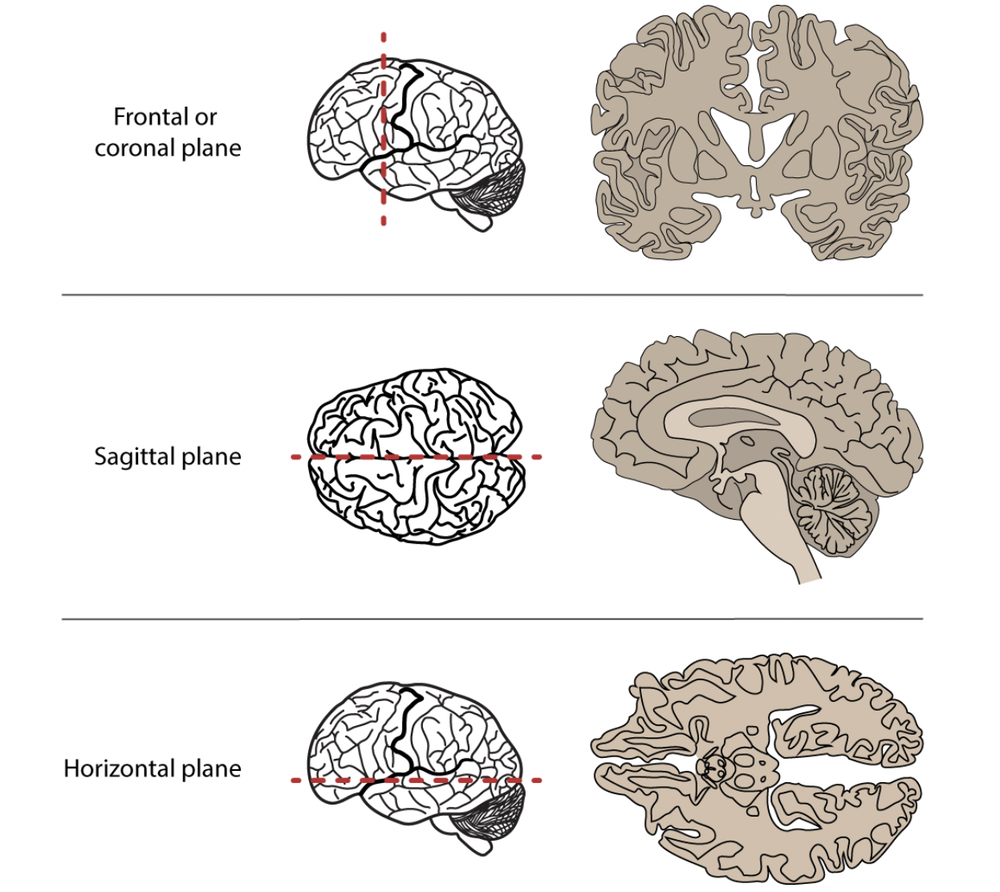
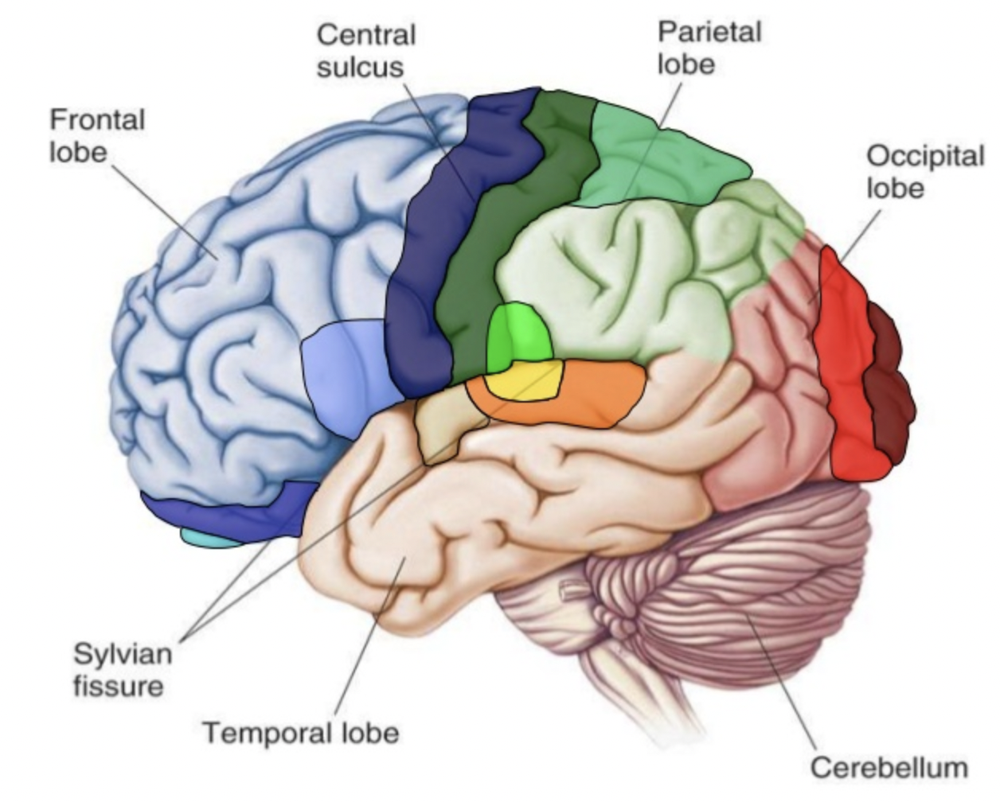
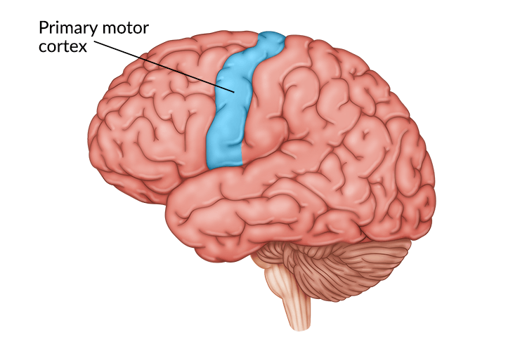
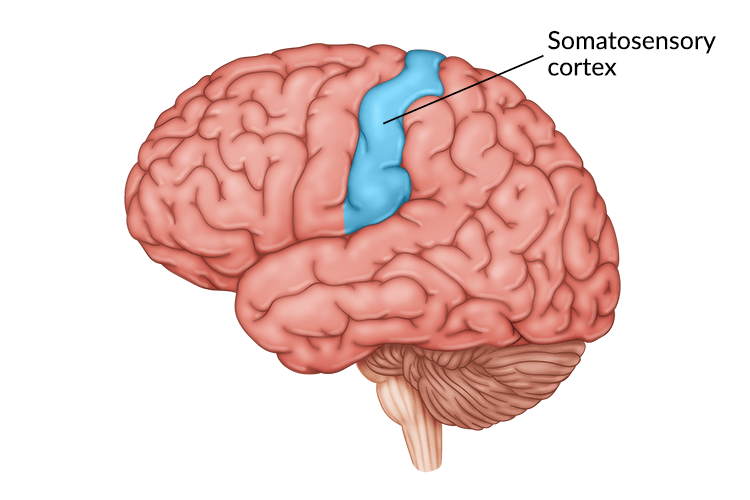
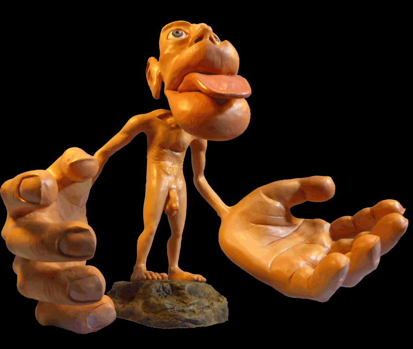

<style type="text/css">
  body{
  font-size: 12pt;
}
</style>

```{r setup, include=FALSE}
knitr::opts_chunk$set(message=FALSE,warning=FALSE, cache=TRUE)
options(repos = list(CRAN="http://cran.rstudio.com/"))
```

Today's discussion will focus on the brain "geography." There's no "geo-" but the brain is our world.

***

## Points of view 

People who work in neuroscience (and anatomy in general) need to refer to anatomical structures from certain points of view. For example, head on, from behind, from above, from below, etc. But like all things scientific (from western perspective), these terms have been assigned latinate names. 

When referring to structures *relative* to others we refer to them using the terms:

1) **Superior**--above
2) **Inferior**--below
3) **Anterior**--in front
4) **Posterior**--behind

So you might say that structure X is ANTERIOR to structure Y, etc. These terms also have less common terms that are also latinate:

1) Superior = Dorsal
2) Inferior = Ventral
3) Anterior = Rostral
4) Posterior = Caudal (you don't see these last two being used very often)

{width=75%}

The left and right sides of the brain are called **Lateral** relative to the middle or **Medial** region of the brain.

## Major landmarks

The brain is divided up into three major parts:

1) **Brain stem**, which is itself divided into three parts (but we wont get into that)
2) **Cerebellum**
3) **Cerebrum**--this is where the vast majority of *action* happens with respect to cognition, perception, and motor control. 

## Cerebrum

The cerbrum is divided into two *hemispheres*, the left and right. The brain is much like a walnut, crack it open and it neatly divides into two halves. The outer layer of the cerebrum is called the **cortex** (the adjuctive from cortex is **cortical**, a term you'll see a lot in our readings).

Beneath the cortex lie numerous *sub-cortical* structures. We can see these various structures by examining different "sections" or views of the brain. The **sagittal** section is one where the brain is presented from a side view (imagine one half of your face/head peeled away from the other half). The **axial** or *horizonatal* section is one where slices are taken from the top (imagine removing layers of a cake). And finally the **coronal** section is examining slices taken front to back but lengthwise (imagine peeling a banana but underneath the peel are successive layers of skin).



The cerebrum is characterized by **convolutions** which are folds. Why would the brain be crumpled like this? Imagine a crumpled wad of paper. Why is the brain shaped like this and not a smooth ball?

The peaks these convolutions are called **gyri** ([d͡ʒajɹaj]) and the valleys are called **sulci** [sʌlkaj] (sing. "sulcus"). The gyri and suci will be important for us because many language-related phenomena are associated with activation along various gyri and sulci. 

### Lobes

Gyri and sulci delineate the four *lobes* of the brain:

1) Frontal lobe--bordered by the Central sulcus and the Lateral sulcus (Sylvian fissure)
2) Temporal lobe--bordered by the Lateral sulcus 
4) Parietal lobe--bordered by the Central sulcus and the Lateral sulcus
5) Occipital lobe--bordered by the Parieto-occipital sulcus 

{width=75%}


> At this point it might be useful to explore the gross structure of the hemispheric and lobe organization using the online tool like [Neurotorium](https://neurotorium.org/tool/brain-atlas/). This brain "atlas" lets you interactively explore the cortex and subcortical structure. Check it out!

Sulci divide the lobes, e.g., the *lateral sulcus* or *sylvian fissure* lies at the inferior portion of the both the frontal and parietal lobes and marks the superior boundary of the temporal lobe.

### Special gyri

There are two gyri that will be important for us because they are implicated in a lot of language processing:

1) **Primary motor cortex**
2) **Somatosensory cortex**

These are gyri that straddle the central sulcus. The primary motor cortex (don't know why it's not called "motor gyri") sends signals to the peripheral nervous system (down the spinal cord and out to your limbs and such) in order to control muscles. The somatosensory cortex *receives* signals from touch.

{width=40%} {width=40%} 

Interstingly the neurons (cells which we will describe in a bit) in these two gyri are arranged in clusters that correspond to specific locations/functions in the body. For example, there are clusters associated with the hands, another cluster associated with the feet, or the tongue. 

#### Homunculous man

The distribution of neurons for each part of the boy in the motor and somatosensory cortecies is not equal, with certain appendages reciving more innervation (more nerves) and area on the cortex than others. Homunculus man is a 3D representation of this skewed distribution. Notice that the hands and tongue and lips are distorted by their large size, suggesting that those parts of the body get more real estate in the motor and somatosensory cortex.

{width=75%}


### Terminology

Don't be suprised when primary research articles abbreviate the names of these cerebral areas. For example, we will often see **STG** and **IFG**, which refer to superior tempral gyrus and inferior frontal gyrus respectively. STG is the superior most gyrus of the temporal lobe, while IFG is the inferior most gyrus of the frontal lobe. Don't balk at looking up these terms!

### Micro-anatomy

The cerebral structures we've described are general areas that might be active during any cerebral activity, but what exactly is happening when any part of the brain is active, or "lights up"?