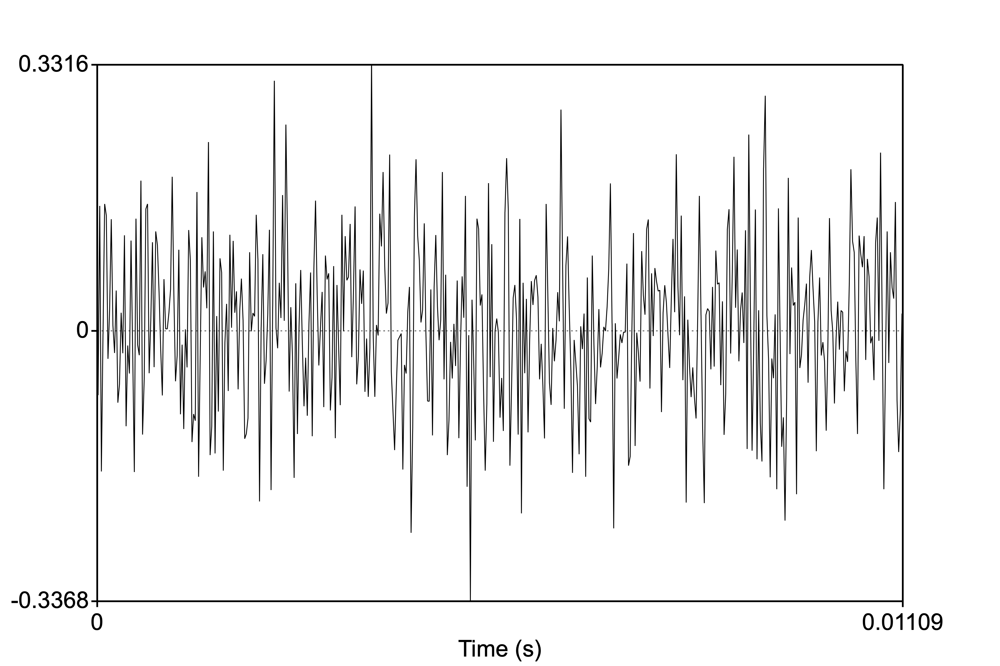

<style type="text/css">
  body{
  font-size: 12pt;
}
</style>

```{r setup, include=FALSE}
knitr::opts_chunk$set(message=FALSE,warning=FALSE, cache=TRUE)
options(repos = list(CRAN="http://cran.rstudio.com/"))
```

In this lecture we begin to  dive deeper into the *shape* of sound--how it looks if we were to plot the movement of air molecules, and how it starts to look different in different conditions.

***

# Praat installation

It's very important that you install Praat [www.praat.org](https://www.praat.org) on your computer. Praat is a speech analysis tool which has become a default program on every linguist's computer. I want you to get exposed to a bit about how it works and what you can do with it. It will soon become imperative that you familiarize yourself with this powerful tool as it will be critically important for your future careers in linguistics and speech science.

Follow the instructions to install Praat on your computer (Mac or PC). For your homework, I'd like you to follow along with the first two videos in this [series](https://www.youtube.com/channel/UCqU1JprLislAb-lV8Fw_FqA): [Tutorial 1](https://youtu.be/fjlFNOzfdPo) and [Tutorial 2](https://youtu.be/xl-6k4FFd6U)

I would like you to practice:

1) Recording a small audio file (of your voice) into the Praat objects window
2) Download this sound file [praat_prac1.wav](sounds/praat_prac1.wav), save it to your computer, open it in Praat, and measure the duration of the speech\
  Have the answer for next class.
  
# Some practice

1. Examine the waveform below. What is the frequency?

<p align="center">
  
</p>

<style>
div.blue { background-color:#e6f0ff; border-radius: 5px; padding: 20px;}
</style>
<div class = "blue">

Remember what frequency is! It is the number of cycles per second. In this example, the entire duration of the sound is 0.0127s. How many cycles do you see?


<p align="center">
  
</p>

Answer: There are three cycles in 0.0127s. So the number of cycles in 1s is 3/0.0127 = 236.22 or roughly 236Hz.
</div>
<br>
2. Suppose you have a 10ml container that has a pressurized gas at 50kPa. If you compress the container so that it is now 5ml, what is the pressure of the gas?

<style>
div.blue { background-color:#e6f0ff; border-radius: 5px; padding: 20px;}
</style>
<div class = "blue">
Boyle's Law: P1V1=P2V2; P1=50kPa, V1=10ml; V2=5ml, P2=?
Answer=100kPa
</div>

***
# Pure and complex sounds

A sound can be composed of one or more frequencies $\rightarrow$ remember that these frequencies represent the movement of the sound wave (itself made up of the movement of air molecules)

## Pure tones

If a sound consists of a single frequency it is called a **pure tone**. A pure tone can be described by **simple harmonic motion**, which is depicted as a sine wave, with a frequency, period, wavelength, etc. Here is an example of a [pure tone](sounds/440Hz.wav), one where one complete cycle of the wave repeats itself 440 times per second (or with a frequency of 440 Hz). Below is an image of the waveform depicting the 440 (I did this in Praat...can you?):

<p align="center">
  
</p>

Musicians among you may know this tone as the note "A" in a Western traditional 12-tone scale system. If you have a piano or keyboard nearby, play this tone, then the "A" key. Are they the same note? How does your piano (or any other in-tune instrument) sound different from the tone?

Listen to the two sounds one after the other:

<audio controls>
    <source src="sounds/a-piano.mp3" type="audio/wav"/>
</audio>
<audio controls>
  <source src="sounds/440Hz.wav" type="audio/wav"/>
</audio>
\

## Complex sounds

A note struck on the piano *does* sound different from the pure tone above. The reason it sounds different is because the vibrating metal string in the piano, when struck, produces the 440Hz tone *as well* as other tones (called "overtones") resulting in a **complex sound**. The complexity of the sound contributes to the overall *voice* of the instrument (or "timbre"). Complex sounds can be either **periodic** or **aperiodic**. 

### Periodic sounds

A complex periodic sound would be like notes playes from an instrument or even vowel sounds coming out of your mouth!

<figure align="center">
  
  <figcaption>Periodic complex sound--Vowel.</figcaption>
</figure>
\
Here is a ["middle C"](sounds/middle_C.mp3) from a piano (also a complex periodic wave). Can you identify one complete cycle (or period)?\
<figure align="center">
  
  <figcaption>Periodic complex sound--Piano, Middle C</figcaption>
</figure>
\

Here's a little practice question testing your understanding of frequency in periodic sounds.

#### Practice----
What is the frequency of the Middle C piano note above? You can calculate it from the waveform given.
<!-- Answer options go here -->
<div class="radio">
  <label>
    <input type="radio" name="question01" id="opt1" value="440Hz" onchange="check_answer()">
    440Hz 
  </label>
</div>
<div class="radio">
  <label>
    <input type="radio" name="question01" id="opt2" value="260kHz" onclick="check_answer()">
    260kHz
  </label>
</div>
<div class="radio">
  <label>
    <input type="radio" name="question01" id="opt3" value="262.23kHz" onclick="check_answer()">
    262Hz 
  </label>
</div>
<div class="radio">
  <label>
    <input type="radio" name="question01" id="opt3" value="262.24Hz" onclick="check_answer()">
    262.24Hz 
  </label>
</div>
<!-- Check answer button -->
<div>
<button class="btn btn-primary" type="button" onclick="check_answer()" data-toggle="collapse" data-target="#collapseExample" aria-expanded="false" aria-controls="collapseExample">Show / Hide result</button>
</div>
<div class="collapse" id="collapseExample">
  <div class="card card-body" id="answerFeedback">
    The answer selected was ...
  </div>
</div>

<!-- Code to update answer feedback -->
<script type="text/javascript">
function check_answer()
{
    var radioButtons = document.getElementsByName("question01");
    document.getElementById("answerFeedback").innerHTML = "Try selecting an answer!!";
    for(var i = 0; i < radioButtons.length; i++)
    {
        if(radioButtons[i].checked == true)
        {
            var selectedAnswer = "Your selected answer was " + radioButtons[i].value;
            <!-- feedback for correct / incorrect response -->
            var feedback = "Not quite! Have another go." 
            if(radioButtons[i].value == "262.24Hz") {
              feedback = "Yup, good job! 3 cycles / 0.01144 seconds = 262.24Hz"
            }
            document.getElementById("answerFeedback").innerHTML = selectedAnswer + "<br>" + feedback;
            return true;
        }
    }
}
</script>

----
### Aperiodic sounds

Aperiodic sounds are not periodic (or quasi-periodic); the waveform does not show any repeating quality (or periodicity). There are two types of aperiodic sounds: 

* Aperiodic sounds are sounds that do not repeat
* Aperiodic sounds are of two types: a **transient** sound or a sound that occurs just once, for a very short time (e.g., a hand clap, a balloon pop, or even one cycle of a sine wave!); a **noise** sound where the pressure at each moment is random and does not depend on the previous moment (e.g., a tire leaking air or [static](sounds/noise.wav) on the radio)

<figure align="center">
  
  <figcaption>Aperiodic noise--radio static from above</figcaption>
</figure>

\

## Complex periodic sounds

Periodic complex sounds are made up of frequencies of sound that are *systematically* related to each other:

* The lowest frequency is called the **Fundamental Frequency**. The fundamental frequency is abbreviated ***F~0~***. The fundamental frequency is based on the periodicity of the entire complex sound. The fundamental frequency is just the frequency of the **lowest component of the complex sound**.

* Frequencies above ***F~0~*** are called **harmonics**. For a complex periodic sounds, harmonics are the whole number integer (or a number that can be written down without a fraction part, e.g., 35, 5, 28374) multiples of the fundamental frequency.  

For most **naturally** generated complex periodic sounds (like guitar strings, tuning forks, etc.), the source generating the sound vibrates at the fundamental frequency AND at each integer multiple of the F~0~. So, for example, if the F~0~ of a tuning fork is 350Hz (ie., the tines of the fork vibrate back and forth 350 times every sec), it also vibrates at 2 x 350Hz, 3 x 350Hz, 4 x 350Hz, 5 x 350Hz, etc. $\rightarrow$ harmonics. The amplitude (we'll get to this later) of each harmonic decreases. So the loudest harmonic is the first one, the F~0~.

<figure align="center">
  
  <figcaption>Fundamental (50Hz) and harmonics</figcaption>
</figure>
\

### Fourier analysis

The complex periodic sound is the sum of many simple periodic tones. So in the picture above, the resulting sound of the tone complex is literally computed by adding each sine wave together. The discovery that a complex periodic sound is the sum of multiple simple tones is called *Fourier Analysis*, named after the person who discovered it, [Joseph Fourier](https://en.wikipedia.org/wiki/Joseph_Fourier).

<figure align="center">
  
  <figcaption>The addition of harmonics results in the complex waveform.</figcaption>
</figure>
\

## Spectrum

Waveforms can be displayed in many ways. We've seen how this looks above $\rightarrow$ conveys information about frequency, period, and amplitude but NO information about the components (harmonics in periodic sounds). 

A **spectrum** (or more technically the **line spectrum** in this case) view, however, provides information about the amplitude of the the individual frequencies making up the complex periodic sound.

<figure align="center">
  
  <figcaption>Basic line spectrum of 100Hz complex periodic sound. Notice the harmonics at whole integer multiples of the fundamental frequency.</figcaption>
</figure>
\

* Line spectra represent a "slice" of the sound in the frequency domain. The x-axis represents frequency and the y-axis represents how much energy is in that frequency, or **amplitude**. Wait, but sound happens over time! What happened to the time dimension, like in a waveform? $\rightarrow$ the frequencies themselves must have time built in, so the line spectrum must occur over some interval of time.

In the line spectrum above, the F~0~ is 100Hz (represented by the first vertical line). The line is at 100 on the x-axis, and the height of the line represents the amplitude of that component. In this case, the F~0~ is the loudest component. The next component is at 2 x 100Hz or 200Hz, with a component at 300, 400, 500Hz, etc. Notice that each harmonic is lower in amplitude relative to the next lower harmonic $\rightarrow$ this is a feature of naturally vibrating sources. 

* In a spectrum representation of of sound, there must be some time "chunk" over which the spectrum is computed. We'll learn how to do this in Praat.

* Line spectra are NOT used for complex *aperiodic* sounds, which are characterized by energy across broad bands of frequencies. 

* Aperiodic spectra would have closely spaced lines with no systematic relationship with each other. The sound is best represented by something called a *spectral envelope* which shows the general shape of the amplitudes of the collective frequencies in the sound.

<figure align="center">
  
  <figcaption>Spectrum of aperiodic random noise</figcaption>
</figure>
\

# Sounds and barriers

Sounds interact with their environment. Sounds combine with other sounds as well as bounce and get absorbed by barriers. Sometimes sound is not transmitted through barriers or obstacles in its path. The initiation of the sound is called the ***incident wave***, and only a small portion of it may be transmitted through barriers and depends upon the properties of both the sound and barrier. 

## Absroption

Sounds may be **absorbed** or may be reflected. Softer and more porous materials absorb sounds more than do harder, denser materials. This is important to consider when we think about speech sounds and the structure and composition of our mouths.
\

<figure align="center">
  
  <!-- <figcaption>Spectrum of aperiodic random noise</figcaption> -->
</figure>
\

## Reflection

Hard, smooth objects tend to **reflect** sounds (similar to how a mirror works). The amount of reflection depends on just how similar the object is to the medium within which the sound is traveling (in our case, air). If the object is hard and smooth like a concrete wall, then we expect the sound to bounce off, creating an echo or a reverberation. Echoes occur when the reflected sound wave takes more than 100 miliseconds to reach your ear. Reflected sounds that are received by your ears in less time are essentially processed by your brain as prolonged sounds. This occurs mostly when sound is reflected off of mutliple walls or barriers. Here is a neat little animation from physicsclassroom.com showing the difference between echo and reverberation as a result of distance and time travelled by the source sound back to the listener's ear.

<figure align="center">
  
  <!-- <figcaption>Spectrum of aperiodic random noise</figcaption> -->
</figure>
\

## Refraction and Diffraction

* **Refraction** is another phenomenon where sound changes direction, either as a result of a change in medium (say from air to water) or a change in temperature. A typical example of refracting sound is when it passes over a body of water. The air above water tends to be cooler than when it is not above water. Sound waves tend to *refract* or bend towards cooler air, which slows down the wave relative to warmer air much higher above.  

* **Diffraction** is when the sound waves past an object or through an opening. Imagine a wall separating two rooms with a doorway between. If you're standing in one room and your friend in the other, the reason why you're able to hear each other is because sound waves travel around the edge of the wall and through the opening. Ultimately this depends on the wavelength (see Lecture 1) of the sound. If the wavelength of the sound is of similar size to the obstacle (in this example, the wall), then the sound will easily bend around it. Similarly, we can hear distant thunder (low frequency) because of its long wavelength, allowing the sound to diffract around obstacles like trees and houses.

## Interference

We're not going to get too deep into the precise physics of a sound wave's interaction with obstacles or changes in mediums, but we *can* describe in some detail how sound waves interact with other sound waves. The interaction can be broadly described as **interference**, and specifically *constructive* or *destructive* interference. The concepts are fairly easy to understand as additive.  

<figure align="center">
  
  <!-- <figcaption>Spectrum of aperiodic random noise</figcaption> -->
</figure>
\