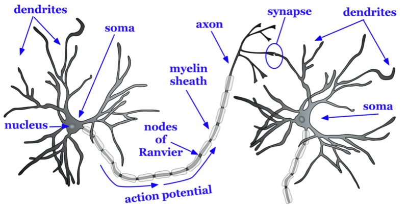

<style type="text/css">
  body{
  font-size: 12pt;
}
</style>

```{r setup, include=FALSE}
knitr::opts_chunk$set(message=FALSE,warning=FALSE, cache=TRUE)
options(repos = list(CRAN="http://cran.rstudio.com/"))
```

Today's discussion will focus on the brain "geography." There's no "geo-" but the brain is our world.

***

## Points of view 

People who work in neuroscience (and anatomy in general) need to refer to anatomical structures from certain points of view. For example, head on, from behind, from above, from below, etc. But like all things scientific (from western perspective), these terms have been assigned latinate names. 

When referring to structures *relative* to others we refer to them using the terms:

1) **Superior**--above
2) **Inferior**--below
3) **Anterior**--in front
4) **Posterior**--behind

So you might say that structure X is ANTERIOR to structure Y, etc. These terms also have less common terms that are also latinate:

1) Superior = Dorsal
2) Inferior = Ventral
3) Anterior = Rostral
4) Posterior = Caudal (you don't see these last two being used very often)

{width=75%}

The left and right sides of the brain are called **Lateral** relative to the middle or **Medial** region of the brain.

## Major landmarks

The brain is divided up into three major parts:

1) **Brain stem**, which is itself divided into three parts (but we wont get into that)
2) **Cerebellum**
3) **Cerebrum**--this is where the vast majority of *action* happens with respect to cognition, perception, and motor control. 

## Cerebrum

The cerbrum is divided into two *hemispheres*, the left and right. The brain is much like a walnut, crack it open and it neatly divides into two halves. The outer layer of the cerebrum is called the **cortex** (the adjective from cortex is **cortical**, a term you'll see a lot in our readings).

Beneath the cortex lie numerous *sub-cortical* structures. We can see these various structures by examining different "sections" or views of the brain. The **sagittal** section is one where the brain is presented from a side view (imagine one half of your face/head peeled away from the other half). The **axial** or *horizonatal* section is one where slices are taken from the top (imagine removing layers of a cake). And finally the **coronal** section is examining slices taken front to back but lengthwise (imagine peeling a banana but underneath the peel are successive layers of skin).


The cerebrum is characterized by **convolutions** which are folds. Why would the brain be crumpled like this? Imagine a crumpled wad of paper. Why is the brain shaped like this and not a smooth ball?

The peaks these convolutions are called **gyri** ([d͡ʒajɹaj]) and the valleys are called **sulci** [sʌlkaj] (sing. "sulcus"). The gyri and suci will be important for us because many language-related phenomena are associated with activation along various gyri and sulci. 

### Lobes

Gyri and sulci delineate the four *lobes* of the brain:

1) Frontal lobe--bordered by the Central sulcus and the Lateral sulcus (Sylvian fissure)
2) Temporal lobe--bordered by the Lateral sulcus 
4) Parietal lobe--bordered by the Central sulcus and the Lateral sulcus
5) Occipital lobe--bordered by the Parieto-occipital sulcus 

{width=75%}


> At this point it might be useful to explore the gross structure of the hemispheric and lobe organization using the online tool like [Neurotorium](https://neurotorium.org/tool/brain-atlas/). This brain "atlas" lets you interactively explore the cortex and subcortical structure. Check it out!

Sulci divide the lobes, e.g., the *lateral sulcus* or *sylvian fissure* lies at the inferior portion of the both the frontal and parietal lobes and marks the superior boundary of the temporal lobe.

### Special gyri

There are two gyri that will be important for us because they are implicated in a lot of language processing:

1) **Primary motor cortex**
2) **Somatosensory cortex**

These are gyri that straddle the central sulcus. The primary motor cortex (don't know why it's not called "motor gyri") sends signals to the peripheral nervous system (down the spinal cord and out to your limbs and such) in order to control muscles. The somatosensory cortex *receives* signals from touch.

{width=40%} {width=40%} 

Interstingly the neurons (cells which we will describe in a bit) in these two gyri are arranged in clusters that correspond to specific locations/functions in the body. For example, there are clusters associated with the hands, another cluster associated with the feet, or the tongue. 

#### Homunculous man

The distribution of neurons for each part of the body in the motor and somatosensory cortecies is not equal, with certain appendages receiving more innervation (more nerves) and area on the cortex than others. Homunculus man is a 3D representation of this skewed distribution. Notice that the hands and tongue and lips are distorted by their large size, suggesting that those parts of the body get more real estate in the motor and somatosensory cortex.

{width=75%}


### Terminology

Don't be suprised when primary research articles abbreviate the names of these cerebral areas. For example, we will often see **STG** and **IFG**, which refer to superior temporal gyrus and inferior frontal gyrus respectively. STG is the superior most gyrus of the temporal lobe, while IFG is the inferior most gyrus of the frontal lobe. Don't balk at looking up these terms!

### Micro-anatomy

The cerebral structures we've described are general areas that might be active during any cerebral activity, but what exactly is happening when any part of the brain is active, or "lights up"?

The *stuff* of the nervous system (of which the cerebrum is a major structure), are **neurons**, of which there are approximately 100 million! The neuron consists of two major parts: the cell body or **soma** and the **axon** which is like a long branch extending out from the soma. **Dendrite** extend from the soma and are shorter than the axon. 

{width=75%}

As can be seen in the image below, one neuron's axon "connects" to another neuron's dendrite. This meeting site is called a **synapse**, the gap between the axon and the dendrite. It's at the synapse that an electrochemical reaction takes place allowing one neuron to activate or passing information to another neuron. Groups of neurons are organized into layers in the cortex. 

### The electric brain

Neurons communicate with other neurons with electrical current. The term used in neuroscientific literature for this electrical current is **action potential**. The action potential sent along the axon of a particular neuron and evokes a chemical interaction at the synapse, ultimately changing the electrical potential (voltage) of the receiving neuron. This electrical activity is as added or summed across many neurons in a particular area and can be measured. 

There are two types of connections between neurons: **excitatory** and **inhibitory**. An excitatory connection increases the probability that the receiving neuron itself fires off an action potential, while an inhibitory connection reduces that probability. Cycles of electrical discharge and rest can occur 1-250Hz.

Cell bodies (the soma) reside on the surface of the cortex, the **grey matter** of the brain, while the axons lie below making up the **white matter**. 

{width=75%}

The white colour of the white matter is a result of the conductive sheath that surrounds the axon called **myelin**, which is a lipid (like fat) cover around the axon. The myelin covering is often likened to the plastic covering around the electrical or speaker wire. 

Cell bodies are not uniformly lined up in the grey matter, but rather span different layers of grey matter (beyond the scope of this class and perhaps not relevant to language processing). Cell bodies are also clumped together in areas across the cortex according to their neuronal organization, resulting smaller regions that carry out particular functions. *Brodmann* mapped out 52 such areas across the cortex. These **Brodmann Areas** are number that refer to specific areas on the cortex. Brodmann Areas are abbreviated "BA" and commonly used in the literature (e.g., BA 45, BA3, etc.)


## Imaging the brain

The next section looks at how we might visualize activation in the brain, which in turn tells us about which areas and structures of the brain are active or not during language processing.

### MRI

MRI stands for **M**agnetic **R**esonance **I**maging and is a fundamental tool used in exploration of structural and functional aspects of the brain. The resulting "image" from an MRI is multidimensional picture showing the structure of the brain. When engaged in some task, the brain can be imaged using "fMRI" (Functional MRI) that shows which parts of the brain are active during that task. 

But how does it work?
MRI relies on the fact that the body (and the brain) is composed of mainly water. The hydrogen atoms of water (H~2~0) contain nuclei whose orientation (their axis) is random. 

1) The magnet of the MRI aligns the nuclear axes of these atoms in a particular direction. 
2) A radio frequency pulse then knocks the atoms out of alignment
3) The pulse is then turned off and the atoms align again with the magnet. The return to alignment releases energy (the **resonance**), which is measured by the machine.
4) 2D images are stacked, resulting a 3D representation

{width=75%}

The spatial unit of the MRI is called the **voxel** or a volumetric pixel. The voxel is about one cubic mm and contains around 50K neurons. Because of how the hydrogen atoms distributed around the brain the resulting image allows us to distinguish the different structures of the brain. 

{width=75%}

### fMRI

With functional MRI, resarchers examine the areas of the brain that are active when performing a task. This method relies on *blood flow*. Active areas of the brain require more oxygenated blood, which is tracked by the MRI. The influx of oxygenated blood to the parts of the brain where is this increased neuronal activity is a *very slow process*.

The change in blood oxygenation creates an MRI signal called the **blood oxygenation-level dependent** signal or BOLD signal. The resulting image have very good spatial resolution, but by virture of the slow moving oxygenated blood, poor temporal resolution. 


#### Block vs. Event-related design

The books mentions two types of methodological designs used in fMRI studies, block and event-related. Both designs account for the fact that the blood flow process in slow. With language-related tasks, processing and production occurs on the order of tens if not hundreds of milliseconds...orders of magnitude faster than the oxygenated blood flow.

In a block design, two (or more) types of stimuli are presented in "blocks", but sequentially. Then the patterns of blood flow are compared with the presentation of the blocks to see if there is a pattern. If different types of stimuli result in different patterns of the BOLD signal, they can be correlated. Likewise, in an event-related design, two types of stimuli are presented not in blocks but one after the other or randomly. Again, the patterns of BOLD signal (which occurs some time later) are correlated. Basically we are looking at the delayed BOLD signal to see if variations in the stimuli show up. 

### EEG

We will read a lot of papers using the method of **EEG** or *electroencephalography*. EEG is a common electrophysiological tool that works by placing electrodes on the scalp. 

{width=50%}

EEG measures the electrical signal (averaged over an area) of the neuronal action potential. Deviation from a baseline neuronal activity is indicative of some response to a stimuli, i.e., the brain is "doing something" as a result of some stimulus. When there is an "event" like this, the EEG signal indicating a deviation is called **ERP** or *event-related potential*. 


The EEG signal associated with the event, e.g., hearing a particular auditory sitmuli or seeing a word, is averaged over a particular electrode. Crucially it is time-locked. The EEG "signature" has a few features:

1) Amplitude--the voltage associated with the event. It is generally in the positive or negative direction relative to baseline. The baseline (non-event signal) is subtracted from the event signal, which will show an amplitude if there is an effect. 
2) Polarity--In most visual descriptions of the EEG signal, positive is down and negative is up (it's dumb and confusing, I know).
3) Latency--how much time has elapsed since the presentation of the event
4) Topography--where on the scalp was the voltage recorded

The main advantage of EEG over MRI is the temporal resolution and cost. The EEG electrodes and amplifier are very responsive to the extremely fast action potential. This is good for language studies where some phenomena, e.g., VOT, occur with differentials on the order of tens of ms. The main disadvantage is the poor spatial resolution. You're just not certain *where* in the brain a particular activation is happening, just a general area. 

### MEG

Magnetoencephalography (**MEG**) is another technique that captures the electrical activity of neurons at the scalp. But instead of measuring the electric potential directly it measures the magnetic fields generated by the electrical activity. 

Magnetic fields are easier to localize relative to electrical currents, so MEG provides both high spatial and temporal resolution. The downside is that it is very expensive (I'm not sure if York even has one, but there are at least one MRI machine and lots of EEG systems).