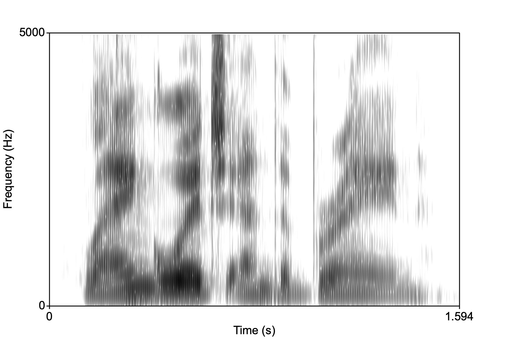
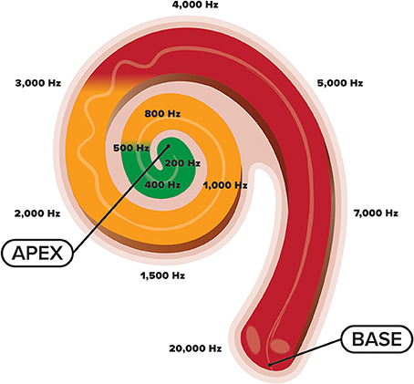
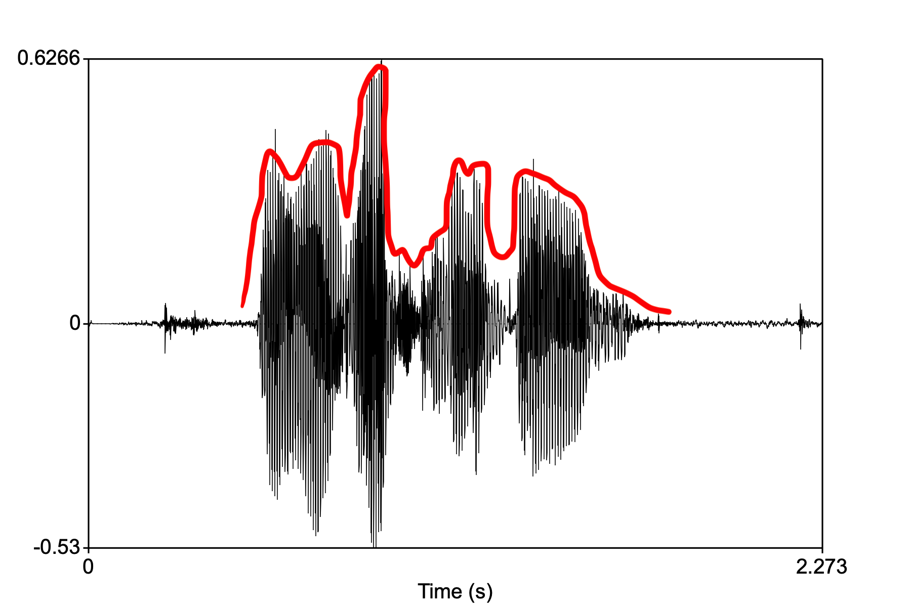

<style type="text/css">
  body{
  font-size: 12pt;
}
</style>

```{r setup, include=FALSE}
knitr::opts_chunk$set(message=FALSE,warning=FALSE, cache=TRUE)
options(repos = list(CRAN="http://cran.rstudio.com/"))
```

# From sound to synapse

Sound is the psychological interpretation of a physical disturbance of air molecules. This disturbance, caused by some incident (like clapping hands, slamming doors, vibrating vocal folds), travels from the source to the listeners ears much like a row of dominoes, but in this case the dominoes are air molecules bumping into each other. 

When the air around the listener's ear drum is disturbed, it pushes against the ear drum, which then physically moves bones (the smallest in your body) called the ossicles. The movement of the ossicles causes fluid in the cochlea (deep in your ear) to be set into motion. This moving fluid then causes a membrane within the cochlea to rub against another membrane that's covered in hairs. These hairs essentially "spark" and send an electrical signal through the auditory nerve to the brain! 

<p align="center">
  
</p>

This process is called **transduction** of sound from a phsyical movement of air to the electrical signal sent along nerves to the brain. 

The book describes three steps of going from sound to meaning:

1) Acoustic signal to neuro-auditory representation (**neurogram**)
2) Neurogram to neuro-phonoloigcal representation (**phonological sketch**)
3) Phonological sketch to **lexical item** or meaning

The neuro-auditory representation is essentially the parameters of the spectrogram (remember what that is?!). They are a representation of frequency, amplitude, and time. Let's briefly review how we get from moving our mouth and pushing air through the vocal folds to the spectro-temporal output.

# Low-level speech representation

The acoustic "image" that represent using a spectrogram is the result of two systems: a **source** system consisting of the vocal folds, which are set into motion because of various physical phenomena (Bernoulli effect). The result is a *complex periodic* sound consisting of a fundamental frequency (pyschological "pitch") and higher harmonics (that are related to the fundamental). In the image below see the "source function" as a line spectrum. 

Above the vocal folds is the oral cavity which is the **filter** system. The filter shapes the source energy in specific ways depending on the shape of the mouth. The mouth configuration either amplifies or dampens various parts of the source spectrum. This results in formant structure, or areas of loud frequencies.

<p align="center">
  
</p>
\

This source-filter interaction results in a complex spectro (energy in frequency bands)-temporal (in time as speech unfolds). Imagine the spectro-temporal representation of speech without any labels, this is what your ear/cochlea/first stop in auditory pathway is receiving:

<p align="center">
  
</p>
\

# Tonotopy in the cochlea

We know that the cochlea "resolves" the incoming speech signal by performing Fourier analysis:

<p align="center">
  
</p>
\

The incoming complex speech waveform is "broken down" into component sine waves:

<p align="center">
  
</p>
\

The resulting representation of in the cochlea is called a **cochleogram** (like spectrogram).

# To the brain

The signal is then sent to the brain via the auditory nerve and arrives at the STG and specifically **Heschl's gyrus** or the **primary auditory cortex**. There is evidence that the auditory cortex is itself **tonotopic** in organization. [But why the redundancy?]

[Talavage et al. (2004)](https://journals.physiology.org/doi/full/10.1152/jn.01125.2002) did an experiment where subjects heard a [tone sweep](sounds/tone-sweep.wav) while in an MRI. The authors looked for peaks in the BOLD signal in the auditory cortex. The peaks moved as the frequency of the tone increased. 

The firing of a neuron in response to a tone is called the neuron's *receptive field*. So we can say that the receptive fields of the neurons in the auditory cortex are tuned to different frequencies. This is the tonotopic organization of the primary auditory cortex. 

# Entrainment

The brian has to capture not only frequency information but time information as well. The time information is basically the waveform of the speech sound. 

<p align="center">
  
</p>
\

The temporal "envelope" is the shape of the time-varying amplitude signal. In the waveform above, for the speech sample saying "language and the brain", the envelope is shown in red.

We will learn (in detail) from a paper by [Kubanek et al. (2013)](https://journals.plos.org/plosone/article?id=10.1371/journal.pone.0053398) that the brain tracks this temporal envelope rather accurately in the auditory cortex as well language areas STG (superior temporal gyrus) and Broca's area (IFG, inferior frontal gyrus). This *tracking* of the temporal signal is called **entrainment**, or the synchronization of neuronal activity to an external stimuli. Entrainment in the brain is found for lots of different external stimuli such as speech, music, and even tactile stimuli.

Entrainment is a more general phsyical concept that is evident when small amounts of energy is transferred between oscillating bodies that are initially out of phase, but soon "lock on" to a particular frequency, as in this [famous metronome experiment](https://www.youtube.com/watch?v=T58lGKREubo&t=1s).

## Cocktail party effect

Entrianment suggests that incoming speech is fully analyzed or represented very early on in the speech decomposition stream in the brain. Kubanek et al. show that the envelope is tracked by the auditory cortex. The question then becomes, does our brain spend all of this neuronal effort in tracking all speech that enters our ears?

No, our brain is selective in what it chooses to decompose or represent for further linguistic analysis. The best example of this is the **cocktail party effect**. This is a common phenomenon whereby the speech signal is selectively attended to despite there being lots of background speech noise. Imagine you're at a party where lots of people are talking. We have the ability to home in on a particular conversation (we "attend" to it) and block out all of the other conversations.There is an amazing [wiki](https://en.wikipedia.org/wiki/Cocktail_party_effect) article about it.

It turns out that we can alter the entrainment of the incoming speech signal, resulting in hearing what we want to hear. Ding and Simon (2013) had subjects listen to an audio book mixed with speech-like noise while in an MEG machine. The noise was adjusted so that the original speech was understandable, but with effort. The MEG tracked the neural activity and were able to match it with the speech envelope.

# Neurograms

Now that we've shown how the brain tracks temporal information, we have to ask what about frequency information that distinguishes phonemes from one another. Barton et al. (2010) did a MRI experiment where subjects heard tone sweeps as well as period sweeps, where noise in speech bands (like formants) were turned off and on with specific periods. It turns out that the BOLD signal responds to both in similar areas of the auditory cortex. All of this to say, the brain represents both frequency and temporal information in the auditory cortex. The "map" of the response to these types of stimuli result in what's called a **neurogram** (like *spectrogram*) 

## From neurogram to phoneme

The whole enterprise of generative phonology is centered on the idea that speech sounds have abstract representations characterized along parameters like voicing, manner, place of articulation, etc., the "features" of the sound, allowing them to be distinguished from other similar sounds. But is there any reality to this abstraction?

We will learn from the work of [Mesgarani et al. (2014)](https://www.ncbi.nlm.nih.gov/pmc/articles/PMC4350233/) that indeed, there is some neural basis for the old descriptions of phonemes using features. Using electrodes implanted on ST lobe and auditory cortex, these researchers found activation to speech sounds according to their (broad) features, mostly manner, showing that populations of neurons in the STG have **phonemic receptive fields**. 