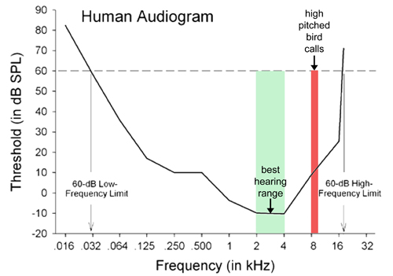
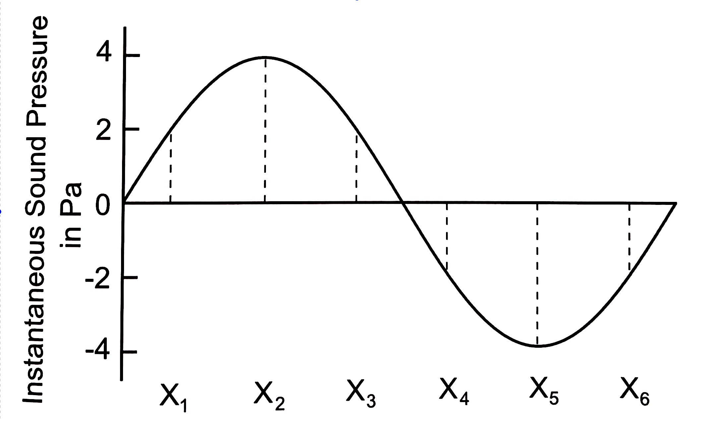

<style type="text/css">
  body{
  font-size: 12pt;
}
</style>

```{r setup, include=FALSE}
knitr::opts_chunk$set(message=FALSE,warning=FALSE, cache=TRUE)
```

Today's lecture continues with a description of sound and in particular its frequency and amplitude characteristics. 

***

# Physical sound, mental percept

There are two ``domains'' in which we describe sound $\rightarrow$ the physical domain and the mental or perceptual domain. It's important to keep these two domains in mind and how they might not necessarily be in a one-to-one relationship. 

The physical properties of speech exist *outside* the realm of perception, that is, sound exists (as oscillating air molecules) even when there is no one to hear it.

<p align="center">
  
</p>
\

So, physically, sound is the fluctuation (compression and rarefaction) of air molecules, but practically we're most often concerned with audible sound, that is, air fluctuations that actually displace your ear drum (make it move), which your brain then processes. The *perception* of sound is a psychological phenomenon, that affected by a lot of factors including the physical structure of the air fluctuations. 

## Frequency and pitch

The clearest examples of the relationship between the physical aspect of sound and its perception might be with respect to frequency and pitch. Recall our discussion last week on the frequency of periodic sounds. Frequency describes the rate at which an object vibrates (or how many times air molecules oscillate in one second).

Listen to this [sound](sounds/100_10000Hz_sweep.wav). The sound is a "tone sweep," starting off at 100Hz and ending at 10kHz, giving you the perception of low to high. For the most part, the higher the frequency, the higher the perception of pitch. 

# Vibrating objects

The frequency at which an object vibrates depends on its physical characteristics. Imagine the tonal characteristics of a metal bowl struck with a rubber mallet versus a glass bowl, or the characteristics of a tightly wound rope that is plucked versus a metal string.

<audio controls>
    <source src="sounds/steel_C.mp3" type="audio/wav"/>
</audio>
<audio controls>
  <source src="sounds/nylon_C.wav" type="audio/wav"/>
</audio>
\

The frequency of any simple harmonic oscillating system (an object that moves back and forth) like a mass at the end of a spring (for example) depends on the **mass** and **stiffness** of the system. This frequency is inversely proportional to the square root of the mass $\rightarrow$ frequency decreases as mass increases; and it is directly proportional to the square root of the stiffness $\rightarrow$ frequency increases as stiffness increases. 

## Tension and thickness

Can you guess which one is the steel string and which one is the nylon string? The notes are the same but their timbre is different as a result of the different properties of nylon (which is a type of plastic) versus metal. Not only are nylon strings physically different, but they are also under different **tensions** than the metal stringed guitar. As a result of being under less tension, nylon strings are more flexible, resulting in a "softer" sound, which ramps up in amplitude (in guitar or sound parlance, it has a slower "attack"). Keeping with the string analogy, the thickness of a string affects the frequency of its vibration. All else being equal (the material and the tension), the thicker string will vibrate more slowly than the thinner string. Thickness can be thought of as the the cross-sectional mass. 

<p align="center">
  
</p>
\
All of this is to impress upon you that the frequency at which an object naturally vibrates is a result of its physical properties. 

## Length

Another physical property (as it relates to strings) is **length**. Shorter strings vibrate more quickly than longer strings. But here is a thought experiment, why does a stretched rubber band vibrate faster (when plucked), resulting in a higher pitch, than the same unstretched (shorter) rubber band?

If we take length (L), tension (t), and cross-sectional mass (m) together, we can derive the natural frequency (f) of the string's vibration:

> $f=\frac{1}{2L}\sqrt{\frac{t}{m}}$\
This is really the fundamental frequency of the string because we know that the string will also vibrate at the harmonics as discussed in [Lecture 2](lecture2.html).

We can see that the frequency of  vibration of the a string increases as length decreases, as tension increases, or as mass decreases. Using the insides of a piano as an example, we can see that the tones of lower frequency are produced by longer and more massive (thicker) wires. To increase the frequency of any of the wires, you can increase the tension.

<p align="center">
  
</p>
\

## Relationships between frequencies

We already know that physical frequencies of sound give rise to a sense of pitch. For example, we've seen in Lecture 2 that the complex periodic sound with a fundamental frequency of 440Hz corresponds to the musical note with a pitch we call "A." That note can be perceived even when the physical frequency is not 440Hz. In fact, you perceive the note A when the physical frequency of the sound is half of or double 440Hz (so 220Hz and 880Hz). These notes are said to be an **octave** lower or higher than the root note A. 

Here is a 440Hz tone again:\
<audio controls>
    <source src="sounds/440Hz.wav" type="audio/wav"/>
</audio> \
And now 220Hz and 880Hz tones:\
<audio controls>
    <source src="sounds/220Hz.wav" type="audio/wav"/>
</audio>
<audio controls>
    <source src="sounds/880Hz.wav" type="audio/wav"/>
</audio>

Clearly all three are the same note (A) but each has a different frequency. Our perception that all three are the note A arises from the halving or doubling relationship to the basic frequency. 

----

#### Practice
What would be the frequency of the next A note in the series?
<!-- Answer options go here -->
<div class="radio">
  <label>
    <input type="radio" name="question01" id="opt1" value="1320Hz" onchange="check_answer()">
    1320Hz 
  </label>
</div>
<div class="radio">
  <label>
    <input type="radio" name="question01" id="opt2" value="1760Hz" onclick="check_answer()">
    1760Hz
  </label>
</div>
<!-- Check answer button -->
<div>
<button class="btn btn-primary" type="button" onclick="check_answer()" data-toggle="collapse" data-target="#collapseExample" aria-expanded="false" aria-controls="collapseExample">Show / Hide result</button>
</div>
<div class="collapse" id="collapseExample">
  <div class="card card-body" id="answerFeedback">
    The answer selected was ...
  </div>
</div>

<!-- Code to update answer feedback -->
<script type="text/javascript">
function check_answer()
{
    var radioButtons = document.getElementsByName("question01");
    document.getElementById("answerFeedback").innerHTML = "Try selecting an answer!!";
    for(var i = 0; i < radioButtons.length; i++)
    {
        if(radioButtons[i].checked == true)
        {
            var selectedAnswer = "Your selected answer was " + radioButtons[i].value;
            <!-- feedback for correct / incorrect response -->
            var feedback = "Not quite! Have another go." 
            if(radioButtons[i].value == "1760Hz") {
              feedback = "Yup, good job! 880Hz * 2 = 1760Hz"
            }
            document.getElementById("answerFeedback").innerHTML = selectedAnswer + "<br>" + feedback;
            return true;
        }
    }
}
</script>

----

# Human range of hearing

Normally functioning human ears are able to detect sounds from around 20Hz (deep bass) to 20kHz. Frequencies below 20Hz are not detectable by humans but might be useful for other animals. For example, elephants make use of these **subsonic** frequencies in order to communicate across long distances. Why? Recall that the lower the frequency the longer the wavelength! Very high frequencies are likewise detectable and exploited by some animals. Bats make high-frequency chirps which reflect off of insects and back to the bat giving them a precise location of their prey. 

<p align="center">
<iframe width="560" height="315" src="https://www.youtube.com/embed/F0Fhrta5-l0" title="YouTube video player" frameborder="0" allow="accelerometer; autoplay; clipboard-write; encrypted-media; gyroscope; picture-in-picture" allowfullscreen></iframe>
</p>

Human ears have evolved to be best at hearing sounds between around 1000Hz-5000Hz, which is precisely where we find the distinguishing acoustic characteristics of a lot of human language sounds!

<p align="center">
  
</p>
\

## Amplitude, intensity, loudness

We mentioned earlier in our discussion of SHM that the maximum displacement of air molecules from equilibrium is called **amplitude**. This term is also used for the change in air pressure from P~atm~ associated with the compression and rarefaction of air molecules. Amplitude is generally measured in Pascals (Pa), which is a unit of pressure. The physical phenomenon of pressure fluctuation has its psychological counterpart in **loudness**. 

The maximum deviation from P~atm~ in either a positive or negative direction is called the wave's **peak amplitude**. The question now arises, is there a way to measure a wave's (let's say a pure tone) average amplitude? Well, you can, but the nature of the wave is such that every point of the curve will be cancelled out by the mirror image of the curve. So the average amplitude isn't a useful measure.

<p align="center">
  
</p>
\

If you were to sample the amplitude measurements at six points (X~1~ to X~6~) (in reality there are an infinite number of points), then take the average, it would be 0 (2+4+2-2-4-2). 

### RMS amplitude

The root-mean-squared (RMS) measure circumvents this problem. The RMS is the *standard deviation* of all the amplitudes in a sine wave. The standard deviation is the square root of the sum of the squared difference of every point and the mean of all points divided by the total number of points. Phew! More simply, for us, the RMS can be expressed as:

> RMS = $\frac{A}{\sqrt{2}}$

where **A** is the maximum amplitude of the sine wave. So in the example above, the RMS amplitude is 2.828. The RMS amplitude will always be less than the maximum amplitude. 

### Intensity

Intensity is related (broadly) to amplitude, but conveys a a different **message**. Intensity is a relative measure, related to power, which is itself a reflection of energy.

**Power** is the amount of energy expanded in one second $\rightarrow$ measured in Watts ($W$). **Intensity** is the power per one unit of area (generally a square meter), or energy per second ($W$) per square meter ($m^2$).

If we say that a sound has an intensity of $10^{-6} W/m^2$ we're actually referring to its *absolute intensity*. We can also refer to the sound's *relative intensity* compared to a reference intensity. **This relative measure is useful for a more practical application of sound intensity** in the form of *decibel*, which we're used to seeing as a measure of loudness. 

### Decibels

The intensities affecting percepts of loudness are very small. Notice in the example above a base of 10 is raised to the -6 power. When we express a sound's intensity as a ratio of absolute intensity a reference, the base 10 becomes redundant. The exponent to which the base 10 is raised is a logarithm, so $log_{10}10^2$ = 2 or $log_{10}10^{-5}$ = -5, etc. So instead of expressing relative intensity as the ratio of two base 10 intensities (the absolute and reference), we can just as well express it as the log~10~ of the ratio of two intensities. 

This log of a ratio of two intensities is called a **Bel**. In the equation below, I~x~ is the absolute intensity ($W/m^2$) of the target sound in question and I~r~ is the absolute intensity of a reference sound ($W/m^2$). The resulting number is expressed in Bels.

> Bels = $log_{10}\frac{I~x~}{I~r~}$

The standard reference intensity is $10^{-12} W/m^2$ because it is the absolute intensity of a 1000Hz tone for humans, which means that a 100Hz tone must at least have an intensity of $10^{-12} W/m^2$ in order to be heard. Let's work through an example:

1. Suppose the sound you're measuring has an absolute intensity of $10^{-10} W/m^2$
2. The reference intensity is $10^{-12} W/m^2$
3. What is the intensity of the sound, expressed in Bels?

> $log_{10}\frac{10^{-10} W/m^2}{10^{-12} W/m^2}$

4. How do you divide exponents that share the same base? $\rightarrow$ subtract the exponents!
5. $log_{10}10^2$ = 2 Bels

In reality, absolute intensities are not conveniently in whole number integers, so the resulting Bels measurement might be fractional. Suppose you end up with 2.3 Bels. The practitioners of acoustic sciences (for some reason or the other) for the use of decimals cumbersome and so introduced the **decibel**, which is $1/10^{th}$ a Bel. As a result, your 2.3 Bels x 10 = 23 decibels (dB). A decibel is 10 x $log_{10}\frac{I~x~}{I~r~}$.

Try the following problems:

> A large orchestra has an absolute intensity of 6.2 x $10^{-3} W/m^2$. What is the intensity of the orchestra, expressed in decibels, given the standard reference intensity of $10^{-12} W/m^2$?

> If your friend is talking to you at an intensity of $10^{-11} W/m^2$, what would the amplitude be in dB IL?

> The power rule says $(x^{m})^{n} = x^{mn}$. If a sound has an intensity of $100^{-6} W/m^2$, what is its amplitude in dB IL?

> What is the value, in dB of a sound that has an absolute intensity of $0.1^{5} W/m^2$?

> What is the difference, in dB, between two sounds, one with an absolute intensity of $10^{3} W/m^2$ and the other with an abolsute intensity of $10^{2} W/m^2$

I've solved these [here](https://yorku.zoom.us/rec/share/jPxJ0BK4Df-KfjJSrDwvcW8zRBr6NtFoXuhkJiAnO9sbWT1ACq-UbAlfcPPppbQC.l_jsQ7HLk3rEyINw)
