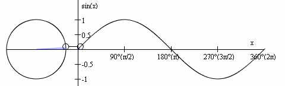
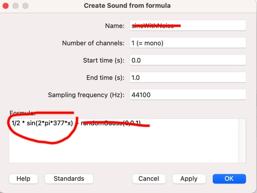
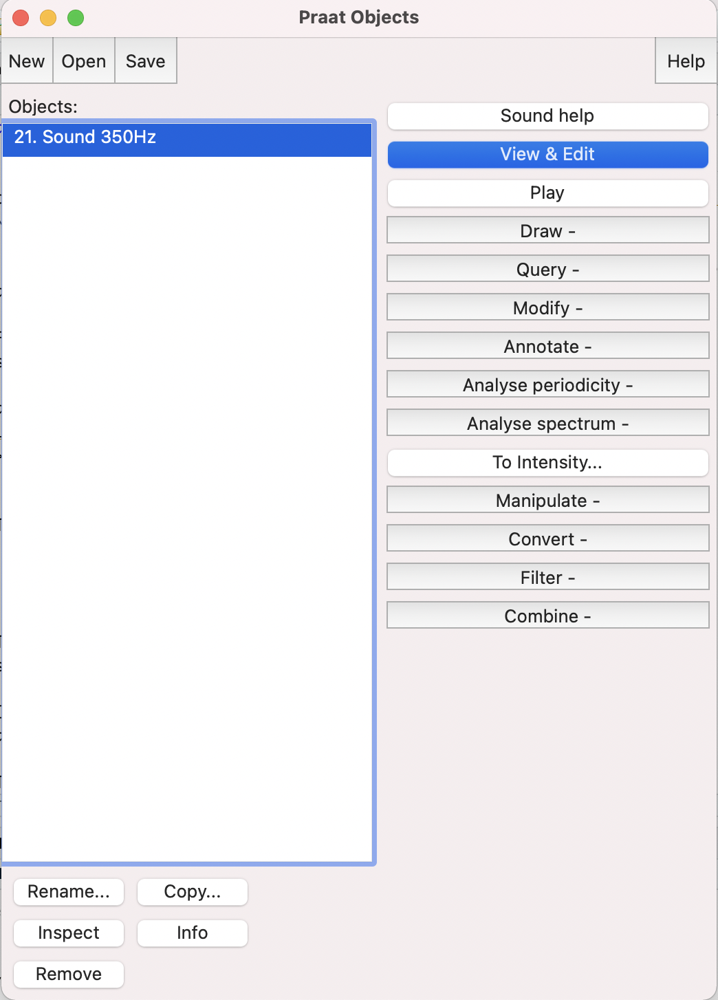
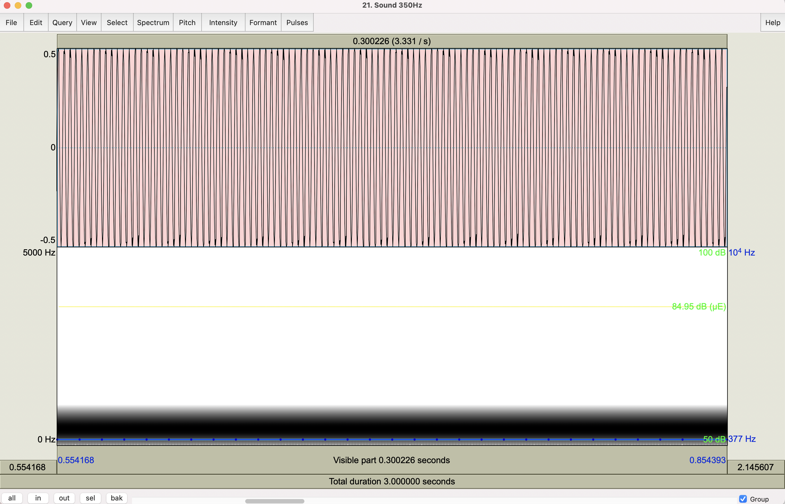
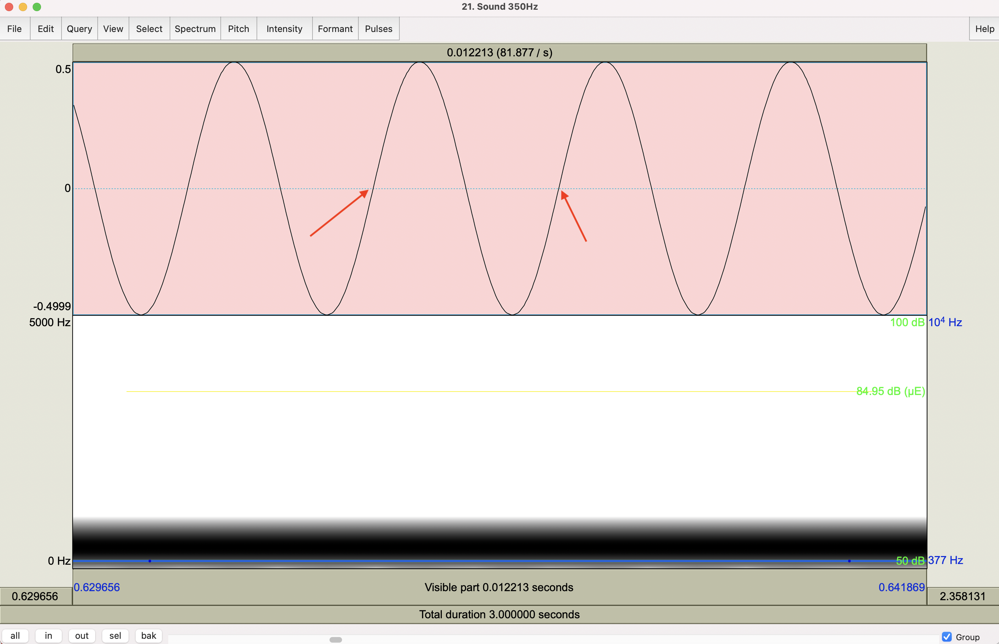
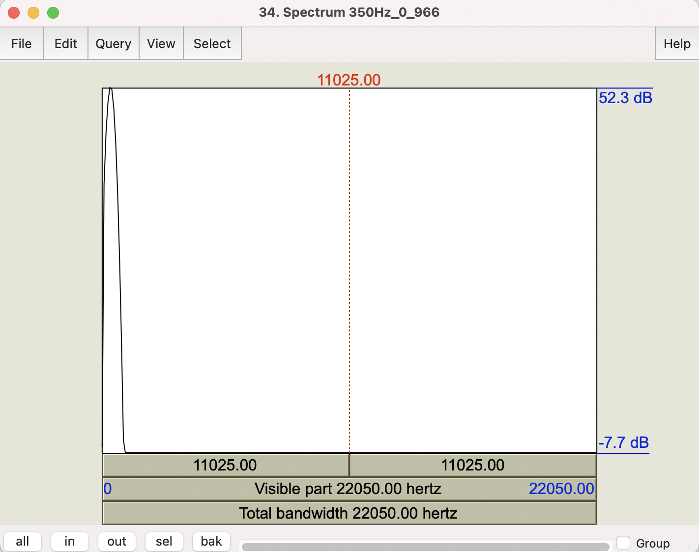
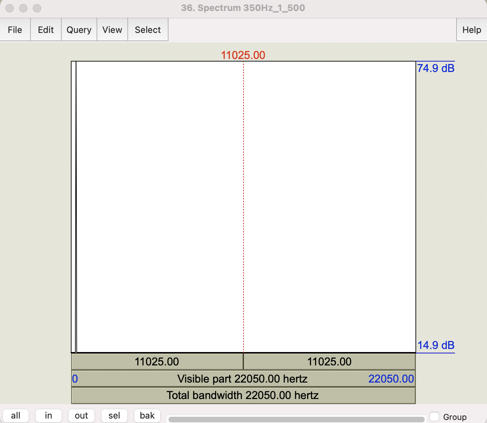
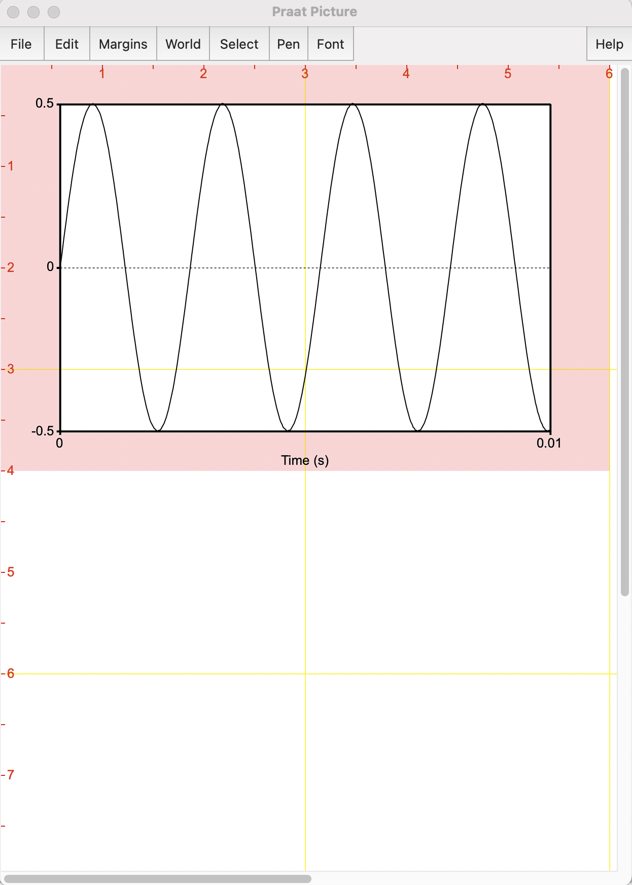
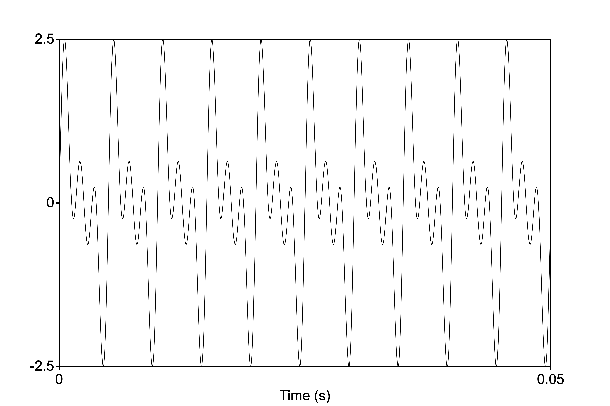
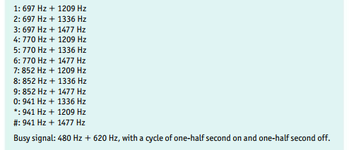

<style type="text/css">
  body{
  font-size: 12pt;
}
</style>

```{r setup, include=FALSE}
knitr::opts_chunk$set(message=FALSE,warning=FALSE, cache=TRUE)
```

Today's Praat lab will introduce you to pure and complex tone synthesizing in Praat. You'll need to know this to complete Assignment 1.

# Creating a pure tone in Praat

By now you should have all downloaded and explored the Praat analysis sfotware. If you haven't done so, please download it ASAP [here](https://www.praat.org). 

The purpose of today's lab is to produce and examine the characteristics of pure and complex tones discussed in lectures 1-3. Recall that we use the term "pure tone" to describe a sound that has the attributes of simple harmonic motion (in this case of an air molecule): period, frequency, wavelength, and amplitude. 

## The sine wave equation

The function that generates a sine wave (or a pure tone, simple harmonic motion, etc.) captures amplitude (A), and the frequency(f):

\begin{equation}
y(x) = A \times sin(2\pi fx)
\end{equation}

Why $2\pi$? The period of the sine function is $2\pi$, which means that the value of the function is the same every $2\pi$ radians, which is a unit of angular measurement. So the curve varies over $2\pi$ radians over the course of one period(t). So because $f=\frac{1}{t}$ the sine formula above can be re-written as $sin(\frac{2\pi}{t}x)$. 

<p align="center">
  
</p>
\

## Synthesizing a pure tone

OK, so let's say we want to create a pure tone in Praat. Praat allows you to do this using a fill-in window were you specify the frequency and hit a button and there you go. *But* we're not going to do it this way. Suppose we want to make a 3 second 377Hz tone:

1. From the Praat Objects window > New > Create sound from formula\
This brings up the a window that looks like this:

<p align="center">
  
</p>
\

2. Things to look at:
    + Name--you should change this to something that describes your sound. In this case, let's change it "377Hz"
    + Start/end times--We want a 3 second tone, so start at 0, end at 3
    + For now ignore the sampling rate
    
3. The most important field is "Formula." Notice it says "1/2 * sin(2 * pi * 377 * x)" by default (the spaces don't matter). It also says "+ randomGauss(0,0.1)", which you can select and delete. What that does is add random noise to the pure tone signal. 

4. Compare the formula to the in the Formula field to the one above. Notice the similarities? The default formula has A = 1/2 and a frequency of 377Hz. You can change the frequency to anything you want, but for now let's just work with the default. Name the object "377Hz."

5. This will put an object called "377Hz" in your Objects window.

<p align="center">
  
</p>
\

6. Click "View and Edit". This should bring up an viewing window that has two views: the top view is the waveform, and the bottom is the spectrogram (we'll get to spectrograms soon)

7. The waveform view doesn't really look like a sine waveform like we're used to seeing. That's because it's repeating itself 377 times per second and the window is showing 3 seconds (or 377 x 3) 1131 cycles. So, let's zoom in to the waveform to see the individual contours of the waveform.

8. Select a chunk of the image (using your mouse, click and drag). Along the top you'll see a number associated with the selection. This number tells you how long the window of your selection is. Make a selection of roughly 300ms (or 0.300s). Then press the button "sel" at the bottom of the pane. You can also press Ctl-N to zoom in to your selection.

<p align="center">
  
</p>
\

9. Notice you can start to see the waveform take shape. Look at the y-axis (amplitude) and notice that it goes from 0 to 0.5 (and -0.5), which was specified in our formula by "1/2". So things are working as specified by the formula.

10. Let's confirm that our waveform is actually 377Hz Now select a smaller chunk of the wave form, something that gives you a few cycles of the sine wave. In the example below I selected about 12ms of the waveform. 

<p align="center">
  
</p>
\

11. Suppose you want to place the beginning of your cursor at the true starting point of a cycle. This would be the so-called "zero crossings" of the wave. The arrows in the example above are pointing the the onset and offset of one cycle of the wave, each at the zero crossing. You can get the cursor exactly at the zero crossing by going to Select > "Move start of selection to nearest zero crossing", and then do the same for the end of the selection. 

12. Can you confirm whether the synthesized tone is actually 377Hz? $\rightarrow$ remember, the frequency is the number of cycles per second.

### The spectrum view

The waveform view is great for looking at the overall shape of a sound, examining the periodicity, etc. It's more useful for complex sounds like speech than it is for pure tones, which are sortof boring and predictable (by definition). Recall the discussion from [Lecture 2](lecture2.html) about the spectrum view, which represents the frequency components in a complex sound (periodic or aperiodic).

1. The software can compute a Fourier analysis of the periodic sound and determine what the component frequencies are and present them in a spectrum view. Put your cursor at a zero crossing at the start of a cycle in your 377Hz wave. In your View and edit window go to Spectrum > View spectral slice. Examine the Spectrum. Notice that it's not a single line, like we saw in our earlier lectures, rather it's a curve. Praat computes an estimated representation of the spectrum (i.e., not idealized), the peak of which corresponds to the frequency of the tone. 

2. The top image is the spectrum taken at a single point, and the bottom is a spectrum taken over the entire 3s of the wave:

<p align="center">
  
  
</p>
\

Notice that in the bottom image the curve is skinnier with a sharp peak (centered at 377Hz). This is because the program had more "evidence" for the nature of the frequency. It's basically computed the average frequency over 3s, while in the top image, it is only computing the frequency at a single point (which is the center of a 10ms window).

### Printing your spectrum

There are two windows in Praat: the objects window and the picture window. The picture window is where you can print your image and copy it and insert the file into a document. Let's print the waveform and a spectrum in the picture window. 

1. You should have your "Sound 377Hz" in the objects list. Suppose you want to print the first 10ms of the waveform in the picture window. Select your sound, then Click "Draw" > Draw from the button on the right side of the Objects window. This will bring up a window with some options. Here you can select how much of your sound you want printed. You can start at 0.0 and end at 10ms (or 0.01s). Leave all the other options unchanged, and this should be what your picture window looks like:

<p align="center">
  
</p>
\

2. You can save this picture as a PDF or as a PNG file, which you can insert into your word processing document (like MS Word or Google Sheets). Now erase the picture field by clicking Edit > Erase all from the picture window. Print your spectral slice (there should be a spectrum object in your objects window).

## Synthesizing a complex periodic wave

Rememeber that a complex periodic tone is the sum of multiple pure tones that are related. Let's make a complex periodic wave!

1. Go back to New > Sound > Create sound from formula. Create a 50ms complex wave with a fundamental frequency of 200Hz and two higher harmonics, H2=400Hz and H3=600Hz. For all three harmonics, make sure the amplitude is 1. The way to do this is to simply add sine formula above three times, changing the frequency for each harmonic. The resulting waveform should look like this (from the picture window):

<p align="center">
  
</p>
\

Oila! It looks like the wave has 10 periods in 0.05s, so 10/0.05 = 200Hz! So if you play this sound, it will sound complex, but it will have the same pitch of a pure 200Hz tone.

### Phone exercise

Old-school phones (remember those) would make sounds when you depressed a key on the number pad. The tone produced would tell the phone exchange what the number was. In this exercise we'll synthesize your phone number! Examine this chart. Each number is represented by the addition of two pure tones, resulting in a complex tone. 

<p align="center">
  
</p>
\

1. Synthesize your phone number, with each tone being 0.5s.

2. Name each complex tone as its number, which will appear in the objects list. Make sure you do them in the right order!

3. Once you've synthesized all seven numbers (you dont need to do you area code), select all of them from the list then click "Combine" from the buttons on the right, then "Concatenate". This will create one sound file with all the numbers in order. 

4. Click "Play" and there you have it. It won't sound too natural as there aren't any pauses between the numbers. Can you figure out how to include pauses? (Hint: synthesize a sound from formula, what's the formula for silence? $\rightarrow$ 0)
