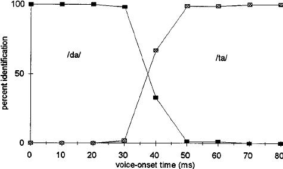

<style type="text/css">
  body{
  font-size: 12pt;
}
</style>

```{r setup, include=FALSE}
knitr::opts_chunk$set(message=FALSE,warning=FALSE, cache=TRUE)
options(repos = list(CRAN="http://cran.rstudio.com/"))
```

# Continuous to Categorical

The neural representations of speech that we've seen so far in either the temporal envelope tracking or the tone sweep frequency mapping in the STG are all "continuous" representations. That means that there is gradience in the actual neural activity on the cortex, i.e., there's lots of shades of grey.

But speech perception is ultimately a categorical phenomenon. If I ask 10 of you to say "pa" you will each have 10 different VOTs for the "p" but we will all perceive the utterance as a singular "pa", that is, there is one category of "p" that our brains represent. The question now becomes, how does the brain move from a continuous represenation to a categorical. 

<p align="center">
  
</p>

In the image above, imagine you're listening to a t/d-like syllable, with a particular VOT. Low VOTs are "categorically" identified as "da", notice that even though the VOT changes by 10ms increments, they're still all labeled as "da." Once the VOT gets longer than 30ms, however, we start identifying the sound as "ta", with a "crossover" at roughly 40ms. This is categorical identification. The stimuli are either da or ta, nothing in between! Our perceptual system (ultimately our brain) imposes this structure on the "continuous" acoustic signal. 

## Ganong effect

It turns out that our perceptual system which categorically imposes structure on the continuous acoustic signal is affected in a *top-down* fashion by the **lexicon** of the language. A famous example of this is the *Ganong effect*. In the example above, imaging that instead of hearing "da" and "ta", you're hearing "d/t-eed". So on the left end, the stimulus with the smallest VOT is "deed" and the right end the stimulus with the longest VOT is "teed". It turns out, that that middle stimulus with a VOT of 40ms (which is ambiguously either "d" or "t") is labelled more as "d" in this case. Why? Because it makes a *real word* in English, whereas "teed" is not a real word. So in this way, the lexicon is affecting the *low-level* perception!

# Phonemic receptive fields

Again, the question is what neural representation in the brain allows this sort of behaviour to happen? Mesgarani et al. (2014) did a study, again with patitents with electrodes implanted directly in the superior portion of the temporal lobe (this would capture STG, primary auditory cortex).[See the presentation and last lecture tab] Subjects listened to sentences that included a variety of English phonemes. They found that electrodes recorded activity in an "all or nothing" fashion according to phonological features, and these features were spatially distributed in the auditory cortex. So, there would be a different pattern of activation for "d" vs. "t", which would similar place of articulation activity, but differing voicing activity. In this way, the brain is representing these sounds phonemically. 

# The brain's sampling rate

The time scale of the chunks that the brain uses to process information is also important for our understanding of the transformation from continuous acoustic representation to phoneme-like representation. There is evidence that the sampling rate (or how fast the brain takes snapshots of the incoming signal) is at two times: fast (25-40ms) and less fast (200-300ms). Evidence for this comes from a neat (old) experiment [see presentation] by Saberi and Perrorr (1999). Different sections of continuous speech were reversed, but the windows of reversed speech were different lengths. 