<style type="text/css">
  body{
  font-size: 12pt;
}
</style>

```{r setup, include=FALSE}
knitr::opts_chunk$set(message=FALSE,warning=FALSE, cache=TRUE)
```

# Resonance

Now that we've spent some time discussing pure and complex periodic sounds, we can move into some real speech territory. The pure tones and (for the most part) the complex tones we synthesized in lab don't really exist in the real world, that is, natural sounds don't have acoustic characteristics like those we specified (like harmonics with equal amplitude for example). In reality we have sound sources (producing an incident wave with harmonic content) that exist within larger structures...think piano strings inside a box, but for our class, vocal cords inside a throat.

Object that are free to vibrate will do so at a specific rate. So when you tap on a wine glass, it will ring out at a specific fundamental frequency (and higher level harmonics). What you are actually hearing is the movement of the air contained in the glass, which is set into motion as a result of you striking it. 

<p align="center">
  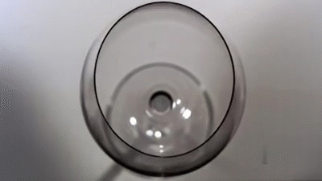
</p>
\

In the gif above the glass is vibrating at its *resonant frequency*, or the frequency at which the object naturally vibrates, along with higher level harmonics. In the gif, the glass is being "activated" by a pure tone from a loudspeaker with a frequency at or near the glass's resonant frequency. The vibration overcomes the elastic properties of the glass, eventually shattering it.  

## Helmholtz

Another example of the effect of an object's size and physical characteristics contributing to the acoustic resonance of the body of air within it is the **Helmholtz Resonator**. [Helmholtz](https://en.wikipedia.org/wiki/Hermann_von_Helmholtz) was a German physicist who characterized how a volume of air resonates in a container, generally shaped like a sphere with an open spout.

<p align="center">
  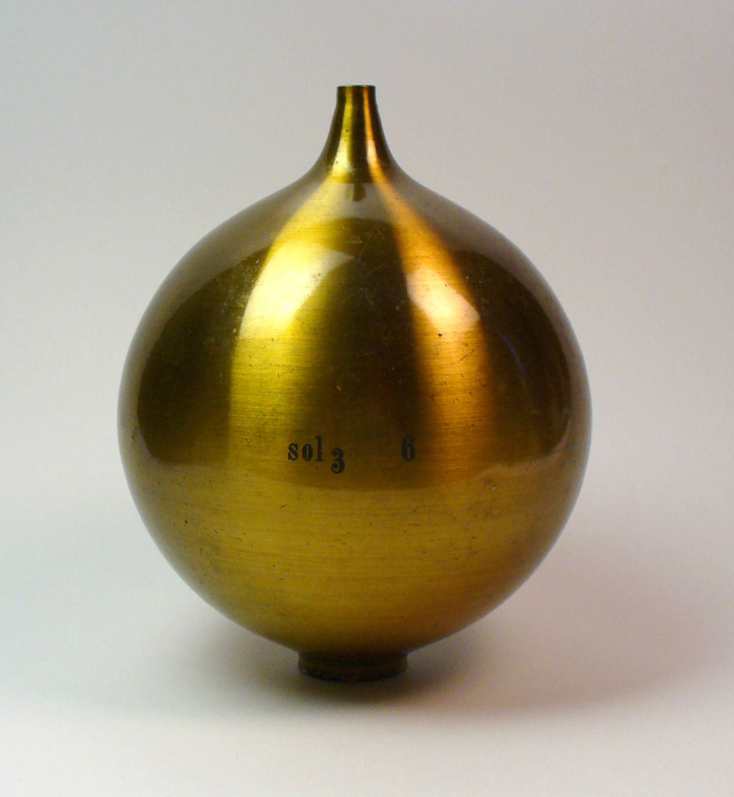
</p>
\

The Helmholtz resonator's spout can be placed at the entrance of your ear and if the incident sound (or *driving frequency*) is the same as the resonant frequency of the Helmholtz resonator, then the tone is amplified. This is a type of forced resonance. A good analogy to this would be pushing a kid on a swing. If you want them to get higher, you time your pushes precisely to coincide with the maximum amplitude of the swing. Similarly, Helmholtz used a series of spheres (each tuned to a specific frequency) to identify the component tones in a complex sound.

For our purposes, it's important to understand why we hear a tone when we blow air across the spout of the resonator. We've all done it before with a soda bottle, right? Blowing across and down the mouth of the bottle results in a tone being produced. 

<p align="center">
  
</p>
\
Here's a clip of me [blowing across](sounds/red_stripe.wav) the spout of an empty bottle of my favorite beer, [Red Stripe](images/red_stripe.jpeg). If we capture a spectrum (averaged across the entire duation of the clip), we see that the resonant frequency is around [232Hz.](sounds/232Hz.wav)

<p align="center">
  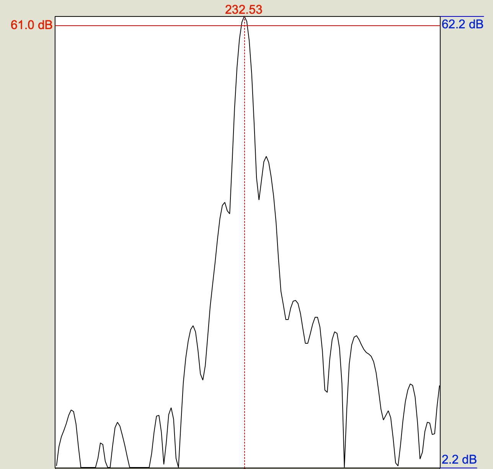
</p>
\

What this means is that the mass of air inside the beer bottle is oscillating at 232Hz. The air was set into motion by my blowing across the spout. The air within the neck of the bottle acts as a plug, which is displaced when I blow across it, thereby increasing the pressure in the larger container, which then is sucked back out the spout (it goes to the lower P~atm~), overshooting the equilibrium, thereby creating a low pressure in the neck, so air is sucked back in, so on and so forth, at a rate of 232 cycles per second! 

Suppose we want to know what the resonant frequency is of a bottle that's slightly larger than my bottle of Red Stripe. Its a 12oz bottle (0.000355 $m^3$), with a spout whose diameter is 2cm (0.02m), and a neck that is 8cm (0.08m) long. Well, the formula below tells you how to do it, keeping everything in meters:
$$
F_0 = \frac{c}{2\pi} \sqrt{\frac{a}{VL}}
$$
...where **c** is the speed of sound in air (343m/s), **a** = the cross-sectional area of the spout, **V** = the volume of the container in L, and **L** is the length of the neck. Remember the area of a circle is $\pi(r^2)$, so for our hypothetical example, the area(a)=$3.14 * (\frac{0.02}{2})^2$ = 0.000314$m^2$. So...
$$
F_0 = \frac{343m/s}{2\pi}\sqrt{\frac{0.000314m^2}{0.08m * 0.000355m^3}}
$$
$\frac{343}{2\pi} = 54.59$, so..
$$F_0=54.59 * 3.32$$ = **181.52 Hz**

So, all of this is to say that objects have resonance properties and containers with air have acoustic resonance properties that reflect the size and shape of the container.

## Tube resonance

We're now moving into the more speechy aspects of acoustic resonance, the tube model. The idea here is that the vocal tract is essentially a series of tubes that are connected, and just like the Helmholtz resonators above, they have resonant properties. The resonant properties of the tube are derived from whether tube is closed at one end or not, and its length. These characteristics give rise to resonant frequencies as a result of an incident wave (introduced into the tube) reflecting back and interfering with it, giving rise to areas of constructive and destructive interference. This results in a **standing wave**. A good visual representation of the a standing wave is a string tied at two ends (like on a stringed instrument). When plucked, the string oscillates back and forth, with different parts of the string moving at different frequencies. The lowest frequency contributes to the pitch of the sound, but there are higher-level harmonics which are also present, though they are increasingly lower in amplitude.

<p align="center">
<iframe width="560" height="315" src="https://www.youtube.com/embed/3lVSmW2raRM?start=69" title="YouTube video player" frameborder="0" allow="accelerometer; autoplay; clipboard-write; encrypted-media; gyroscope; picture-in-picture" allowfullscreen></iframe>
</p>

### Quarter-wave resonator

Back to tubes, imagine a tube open at one end and closed at the other, with air molecules arranged equally spaced along the length and width of the tube as in the picture below.

<p align="center">
  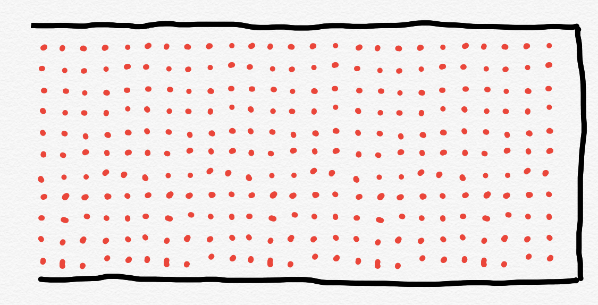
</p>
\

When an incident wave is applied to this tube, the column of air is displaced, and the displacement pattern is predictable. The solid grey line represents equilibrium. Along the length of the tube there is displacement of the air mass upwards and downwards. Maximum displacement occurs at the open end, and least displacement occurs at the closed end. The closed end of the tube is a displacement **node** and the open end a displacement **antinode**. The nodes and antinodes are always in the same location, resulting in the wave *standing still*. A good visual representation 

<p align="center">
  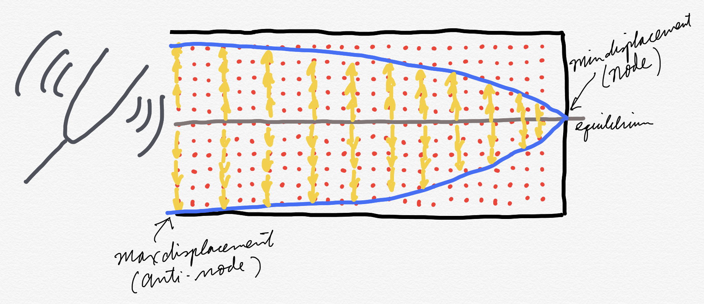
</p>
\

The pattern of nodes and antinodes are always evenly spaced along the length of the tube. If we look at the image below, the same tube, open at one end and close at the other, results in 1/4 of the wavelength being captured. So this type of tube is called a **quarter-wave resonator**. 

<p align="center">
  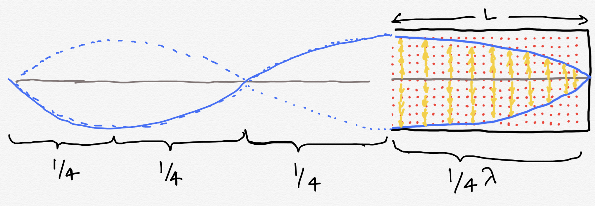
</p>
\

If $L$ is the length of the tube, then the wavelength of the standing wave is $4L$. We can calculate the frequency from wavelength, remember? "v" is the speed of sound in air, or 343 m/s.
$$
\lambda _1 = 4L;
F_1 = \frac{v}{4L}
$$

That quarter-wavelength resonance is also called the first harmonic (H1) or the *fundamental frequency* (F~0~) of the quarter-wave resonator. The next higher harmonic has 3/4 $\lambda$ because 3/4 of the wave is contained in the tube. Notice that the closed end is *always* a node and the open end is always an anti-node. This wave represents the second harmonic (H2) of the resonance.

<p align="center">
  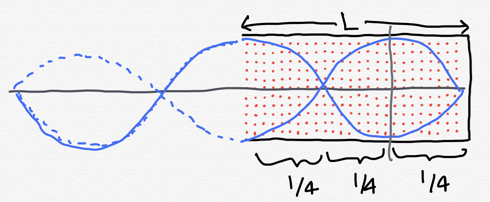
</p>
\
$$
\lambda _2 = \frac{4}{3}L;
F_2 = \frac{3v}{4L}
$$

The next higher harmonic has 1$\frac{1}{4} \lambda$:
<p align="center">
  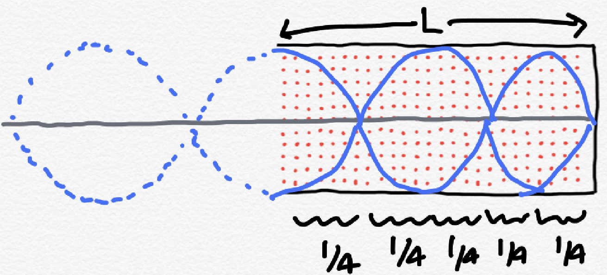
</p>
\
$$
\lambda _3 = \frac{4}{5}L;
F_3 = \frac{5v}{4L}
$$

So there's a pattern here for and open-closed tube. We can describe the frequency of the harmonics with:
$$
F_n =\frac{(2n-1)v}{4L}
$$

### Half-wave resonator

OK, now that you have a handle on the resonances of a tube open at one end and closed on the other, what about a tube that's open at both ends? This is called a **half-wave resonator**, why? You guessed it, because one half of a wavelength is contained in the tube. 

<p align="center">
  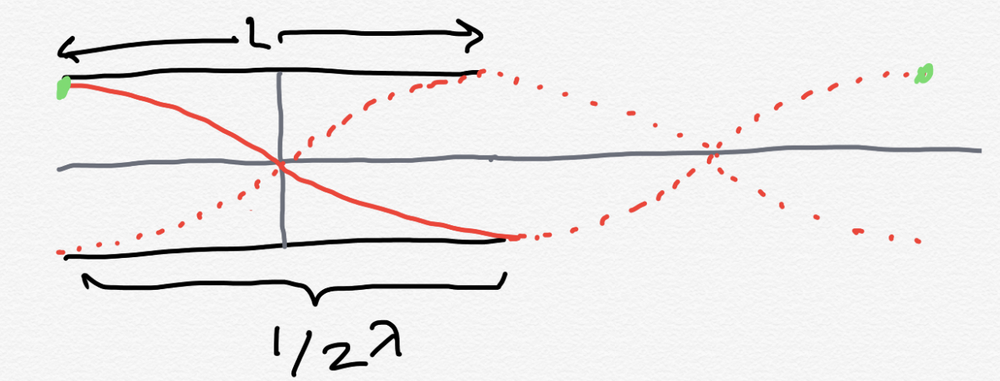
</p>
\

Notice with the half-wave resonator, there are anti-nodes at either end, with the node right in the middle of the tube. If this were a closed-closed tube, there would be nodes at either end. In either case (open-open or closed-closed) there is a standing wave is created with a wavelength that is 1/2$\lambda$. For either tube, we can describe the resonant frequencies with:
$$F_n = \frac{nv}{2L}$$

#### Practice problem

Suppose you have a tube that is open-closed and 0.17m long. What are the frequencies of the first three harmonics (F1-F3) rounded to the nearest hundered?

----

<!-- Answer options go here -->
<div class="radio">
  <label>
    <input type="radio" name="question01" id="opt1" value="300, 400, 500 Hz" onchange="check_answer()">
    300, 400, 500Hz 
  </label>
</div>
<div class="radio">
  <label>
    <input type="radio" name="question01" id="opt2" value="500, 1500, 2500Hz" onclick="check_answer()">
    500, 1500, 2500Hz
  </label>
</div>
<div class="radio">
  <label>
    <input type="radio" name="question01" id="opt3" value="200, 400, 800Hz" onclick="check_answer()">
    200, 400, 800Hz 
  </label>
</div>
<div class="radio">
  <label>
    <input type="radio" name="question01" id="opt3" value="300, 700, 1000Hz" onclick="check_answer()">
    333, 666, 999Hz 
  </label>
</div>
<!-- Check answer button -->
<div>
<button class="btn btn-primary" type="button" onclick="check_answer()" data-toggle="collapse" data-target="#collapseExample" aria-expanded="false" aria-controls="collapseExample">Show / Hide result</button>
</div>
<div class="collapse" id="collapseExample">
  <div class="card card-body" id="answerFeedback">
    The answer selected was ...
  </div>
</div>

<!-- Code to update answer feedback -->
<script type="text/javascript">
function check_answer()
{
    var radioButtons = document.getElementsByName("question01");
    document.getElementById("answerFeedback").innerHTML = "Try selecting an answer!!";
    for(var i = 0; i < radioButtons.length; i++)
    {
        if(radioButtons[i].checked == true)
        {
            var selectedAnswer = "Your selected answer was " + radioButtons[i].value;
            <!-- feedback for correct / incorrect response -->
            var feedback = "Not quite! Have another go." 
            if(radioButtons[i].value == "500, 1500, 2500Hz") {
              feedback = "Yup, good job!"
            }
            document.getElementById("answerFeedback").innerHTML = selectedAnswer + "<br>" + feedback;
            return true;
        }
    }
}
</script>
----

For a quarter-wave resonator, the first three resonances have frequencies of 343/(4 * 0.17), (3 * 343)/(4 * 0.17), and (5 * 343)/(4 * 0.17), which is 504, 1513, 2522 Hz. 

# Filters

Acoustic resonators are important for our understanding of speech as they model the relationship between the incident wave (the sound produced by the vocal folds vibrating) and the **filter** which is the vocal tract above the vocal folds modeled as a series of tubes. Frequencies from the incident wave are either amplified (constructive interference) or dampened (destructive interference) depending on the length and open-endedness of the vocal tract tube model. 

To demonstrate this, imagine a half-wave resonator (open-open) with a length of 1m. This means that F1 is 343/2 = 171.5Hz. If I had a 170Hz tuning fork and I struck it, introducing the sound to the open-open tube, I would expect the sound to be amplified because 170 is very close to the resonant frequency of the tube. The further away I get from the resonant frequency, the more dampening an effect it would have on the sound introduced into the tube. 

The resonant frequency of the tube is fairly "sharp" meaning that the tube is uniform in dimensions and target a specific frequency pretty well. Frequencies around the resonant frequency are also amplified, but not as much as the resonant frequency. This type of *uniform resonator* is said to be **narrowly tuned**. This is in contrast to an oddly shaped resonator, where there is a **broader** *band* of frequencies which can be amplified, though the overamplitude increase is small. 

<p align="center">
  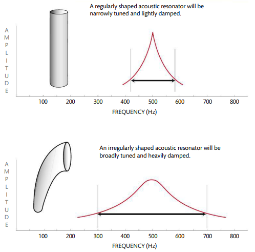
</p>
\

The vast majority of filters we'll encounter in the real world are oddly shaped and not like the perfectly symmetrical tube resonators described above. A further complication is that when we're dealing with speech, these resonating cavities change their shape over time. 

<p align="center">
  
</p>
\

In the MRI animation above, examine the changing shape of the vocal tract (the black areas because they're filled with air). This is essentially the state of our tube models $\rightarrow$ a good approximation, but not really what's going on in our mouths. 

## Bandwidth

The shape of the resonator determines the **bandwidth** of the frequencies which are amplified. So in the image above, the oddly shaped resonator has a wide bandwidth relative to the tube which has a narrower bandwidth, with a sharply tuned peak. How is bandwidth specified? There really isn't a strict definition of a resonator/filter's bandwidth. The further you get from the resonating frequency, the less efficiently those frequencies are passed through. When I say "pass through" you can really think of filtering as sort of like any other filter you're familiar with, like a shower head, which prevents some water from getting through, while allowing other parts of the water to freely pass. 

<p align="center">
  
</p>
\

We *can* define a bandwidth using the concept of **cutoff frequency**. In the image above of the oddly shaped resonator, the width is bounded at 300 and 700Hz. The cutoff frequency is defined as the frequency at which the incident wave is cut by half by the filter. So, if we were to introduce a complex wave to the odd shaped filter, the 300Hz and 700Hz components of the complex sound would be half as intense with the filter as without. 

## Types of filters

The resonator/filter results in certain frequencies of the incident sound being amplified and others dampened. This results in an overall shape, or **envelope**, of the filter. We can classify filters according to their envelope. Some filters let high frequencies pass through (**high pass**), some let low frequencies pass through (**low pass**), while others let through specific bands of frequencies (**band pass**) or block certain bands of frequencies (**band stop**). When you do speech processing these different types of filters may be useful for analyzing various components of your sound. For any of you who have seen or used a graphic equalizer on a stereo, you can think of filters in the same way.

<p align="center">
  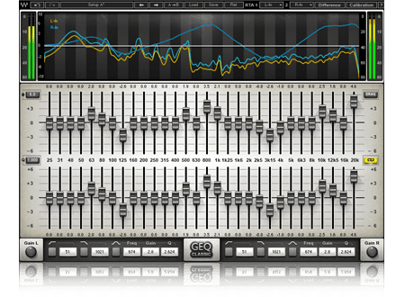
</p>
\
