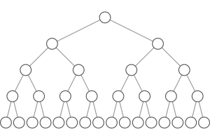

<style type="text/css">
  body{
  font-size: 12pt;
}
</style>

```{r setup, include=FALSE}
knitr::opts_chunk$set(message=FALSE,warning=FALSE, cache=TRUE)
options(repos = list(CRAN="http://cran.rstudio.com/"))
```


# Dual-stream model for speech perception

Hicock and Poppel's (2007) model of the brain regions/systems involved in speech perception is pretty important for us to understand. The brain can be engaged in varying types of activities when encountering the incoming speech stream: it can be listening or monitoring the fine structure of the speech (something you might do in a speech perception task like what's the difference between "pa" and "ba"), or it could be involved in gleaning meaning from the incoming speech.

These two purposes for speech perception find neurological evidence in Hicock and Poppel's model: the *ventral* stream and the *dorsal* stream. Information processed along the ventral stream will be passed on from pure acoustic processing to phonemic processing to lexical processing and ultimately semantics. Dorsal stream processing is engaged during lower level tasks that do not involve understanding the speech, such as imitation. This model is called the *dual-stream model* of speech perception. 

<p align="center">
  
</p>

<p align="center">
  
</p>

The two streams can be thought of like this:
*Understanding* --> Ventral
*Non-understanding* --> Dorsal

Language-processing necessarily involves the ventral stream, which will be the focus of this section on representation of speech as **phonemic**information. But, the book makes the point that the activation in the brain given a language (speech in this case) signal is dependent on what we are asking the subject to do with that stimulus. 

# Locating phonemes

Much like the Mesgarani stuff from [lecture 3](lecture3.html), work by Idsardi with the Turkish vowel system shows a spatial activation of the left STG according to the acoustic dimensions of the particular stimuli. Turkish has a famously regular vowel distribution along the features of frontness/backness, height, and roundness. The distribution of the activation (from an MEG study) is according to frontness/backness with front vowels lying on the inferior-superior plane of the STG, and back vowels along the anterior-posterior plane. But this is hardly the type of segregation between individual vowels we would want for them to be fully spatially specified in the brain. That is, ideally we would see one particular area associated with one particular phoneme, and adjacent phonemes represented in a way that is analog to the acoustic space. But that's not what they found. They found that when vowel pairs were presented they were spatially segregated according to feature and **not** acoustic distance. 

Brennan calls the spatial code for phonemic features *phonotopy*, comparable with the tonotopic activation of the STG when presented tone sweeps or the organization of the basialar membrane in the cochlea. <u>But again, it is not so simple as to say the STG is phonotopically organized.</u> Where as there is clear evidence for the frequency specific tuning of the cochlea, it's not same for the STG. Citing evidence from Mesgarani (again), the book notes that phonemes with similar features are not activating the STG in adjacent areas.

So do phonemes EXIST in the brain? The short answer (in my estimation) is *sortof*. We have evidence that clusters of neurons in the STG respond differentially to varying featural parameters of phonemes. But there is no "/b/" neuron (or bundle of neurons) or "/k/" neuron for example.  

# Organization of the neural representation

The ECoG experiment (where electrodes are implanted directly into the cortex) showed that activation of neurons was hierarchical (imagine an upside down tree). That is some sets of neurons were active as subsets of other sets of neurons. 

<p align="center">
  
</p>

One big question for those interested in the abstract representation of phonemes is whether or not we should analyze features according to articulatory or acoustic parameters. Think back to Phonology and the features you used to describe sounds like "anterior" or "voicing" or "coronal". These features include both articulatory and acoustic descriptions, but which ones does the brain use? It turns out that the lower level representations are articulatory and the higher levels are acoustic. Does this mean that acoustic information is more primary in our brains? Maybe, but making that sort of big generalized statement might be premature, but it's a good first pass.

# Default setting

The book discusses what we might call a "default" setting for phonemes in the brain. Here the point is to introduce a methodological paradigm while answering the question of whether or not the brain has neutral setting with respect to phonetic input. 

The MMR (mismatch response) is an effect whereby the brain responds to difference in a sequence of stimuli. In the EEG literature it's typically the "negative" going component in the ERP signature that occurs some number of ms after the presentation of the stimuli. But it can be any deviation in the signal in reponse to a mismatch with a standard stimuli or a sequence of stimuli that are taken as the standard.

Scharinger et al. (different paper from the Turkish vowel paper) tested the idea in phonology that certain classes of sounds are "underspecified" (essentially the default parameter). Typically phonologists consider the CORONAL place (t/d/n) as default or underspecified. When Scharinger presented a stimulus sequence where the standard (or most prevalent) sound was "ka" and the deviant was "ta" (ka ka ka ka ka...ta...ka ka, etc), there was a large MMR because authors argue that the change from VELAR to CORONAL is a strong mismatch. When the standard was "ta" and the deviant was "ka" the MMR was smaller because the change was from nothing (the underspecified) to VELAR. This is predicted by underspecification theory, that the MMR would be asymmetric. If all features were specified then we wouldn't see a difference from "ka"->"ta" and "ta"->"ka".