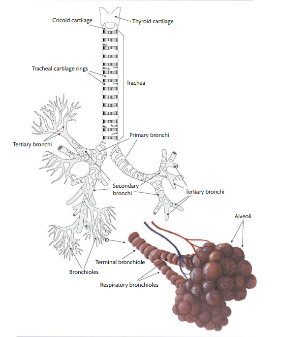
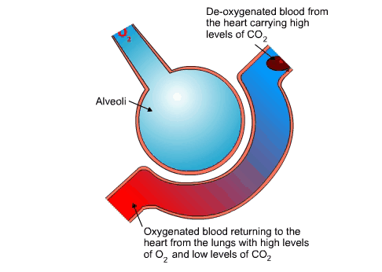
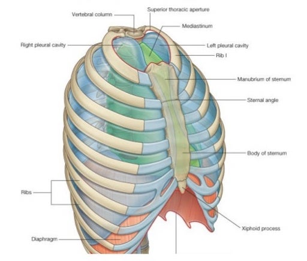
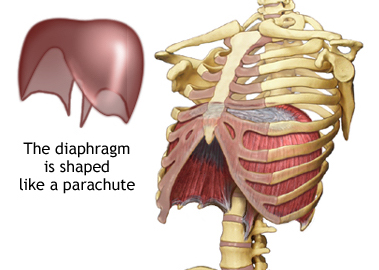
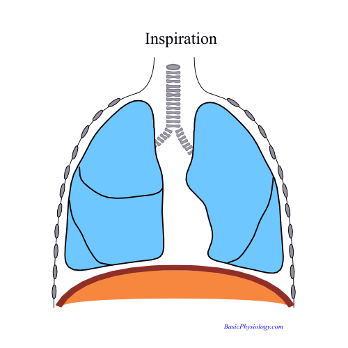

<style type="text/css">
  body{
  font-size: 12pt;
}
</style>

```{r setup, include=FALSE}
knitr::opts_chunk$set(message=FALSE,warning=FALSE, cache=TRUE)
```

Without properly functioning lungs, breathing in and out, (you'd be dead) you wouldn't be able to make audible speech sounds. Today's lecture introduces you to how the phenomenon of respiration is the source of speaking.

# Ventilation

The most basic function of breathing is **ventilation**, or the exchange of oxygen going into the lungs while carbon dioxide exits the lungs. But breathing is also critical for speech, though it's likely an evolutionary byproduct. The expelling of air from the lungs eventually sets into motion the vocal folds $\rightarrow$ source or incident introduced into the vocal tract. 

# Pulmonary airways

The exchange of oxygen for carbon dioxide happens in the lungs. The *pulmonary apparatus* is made up of:

1. The Bronchial tree
  + Trachea: the tube below the larynx up to the branching of the primary bronchi
  + Bronchi: branching structures
  + Bronchioles: terminal branches at the ends of bronchis
2. Lungs

<p align="center">
  
</p>
\

The tree consists of a branching system (like real trees) of hollow tubes that serve as conduits for air to and from the lungs. The trunk of the tree is the **trachea** which then differentiates to smaller (but still large) branches, or **bronchi**, and terminating in even smaller twigs, or **bronchioles**.

## Trachea

The trunk or trachea of the pulmonary system is a tube lined on the outside with rings of cartilage, which are closed in the front and open in the back. The trachea itself is made of muscle, cartilage, and a mucous membrane $\rightarrow$ flexible and supported by the cartilage. Remember the negative presure in the neck of the Helmholtz resonator? Well, a similar negative pressure is created in the trachea when there is high pressure down stream in the bronchioles. 

## Bronchi

The trachea splits into two main branches or **mainstem bronchi**: the right bronchus enters the right lung and the left enters the left lung. These mainstem bronchi, once in each lung, divides into secondary bronchi, which then further divide into tertiary bronchi into the smaller parts of the lungs. Bronchi are made up of similar structures as the trachea (muscle, cartilage).

## Bronchioles

The bronchi eventually branch into microscopic **bronchioles**, which no longer are made up of cartilage, but are composed of only muscle and mucous. The bronchioles begin as a *terminal bronchiole* and divide into *respiratory bronchioles*. 

## Alveoli

The respiratory bronchioles finally open into **alveolar ducts** leading to a singular **alveolus** (pl. alveoli). There are millions of alveoli, each with thin walls and filled with air. Alveoli are surrounded by a network of blood capillaries. The thin walls of the alveoli and capillaries allow for the exchange of gases between them. 

<p align="center">
  
</p>
\

# Chest wall

The pulmonary airways (trachea, bronchi, and lungs) are enclosed the chest wall, which is made up of the rib cage, abdominal wall, and diaphragm. 

## Thoracic cavity

The ribcage and the diaphragm together constitute the **thoracic cavity**, which houses the lungs. The thoracic cavity itself is bounded by the *sternum* (or breastbone) in the front and the rib cage to the sides. The entire thoracic cavity is airtight, with the only entry way for air being the bronchial tree. 

<p align="center">
  
</p>
\

The **diaphragm** or lower bound or floor of the thoracic cavity (also the roof of the abdominal cavity) is a large dome shaped muscle attached to the lower ribs, sternum, and the vertebral column. 

<p align="center">
  
</p>
\

The diaphragm is sensitive to stomach contents moving around! When it's at rest, it's shaped like a lima bean, with the middle portion extending upward. When the diaphragm contracts it flattens out $\rightarrow$ this is sort of counterintuitive as you'd think that a contracting muscle shrinks or balls upward. Rather, the contracting diaphragm extends downward while contracting. 

<p align="center">
  
</p>
\

<p align="center">
<video width="420" height="340" controls>
  <source src="images/lungs.mp4" type="video/mp4">
</video>
</p>
\
### Inspiration/Expiration 

We have a naive notion of what actions actually go into the phenomenon of breathing. We think about "breathing in" as sucking in air through our nose or mouth, and "breathing out" as blowing, when in fact, it's the diaphragm that's doing the contracting which leads to the lungs getting filled with air. Why? Remember Boyle's law?

> When the diaphragm contracts (extends downward), the volume of the thoracic cavity is increased. The increase in volume results in a decrease in pressure in the alveoli (P~alv~) relative to P~atm~. So air rushes into the lungs. This is called **inspiration**. During **expiration**, the diaphragm relaxes, causing the thorax and lungs to get smaller. P~alv~ > P~atm~, causing air to be forced out of the lungs. During forced exhalation, however, the intercostal and abdominal muscles may be involved in forcing air out of the lungs.

At the end of each inspiration and respiration P~alv~ = P~atm and for a brief moment air does not move either in or out of the system.

How fast do we breathe? When we begin life the average baby's breaths per minute is 40-70 when awake, which then decreases to around 15 in adulthood. The change reflects anatomical and physiological changes including alveoli increasing in size and number. 

## Speech breathing

The overall process of breathing for life and breathing for speech is the same. However, there are some differences in the control of respiration for isolated utterances like extending vowels or connected speech. When we sustain a vowel like "aaaaa..." a steady flow of air is required, but lung volume and pressures are constantly changing $\rightarrow$ how do we do this? It turns out that in this type of sustained vowel sound, lung volume decreases steadily, but P~alv~ stays pretty consistent throughout. The muscles surrounding the thoracic cavity are active thorugh the whole utterance in order to maintain the outflow of air for sustained vowel production.  
