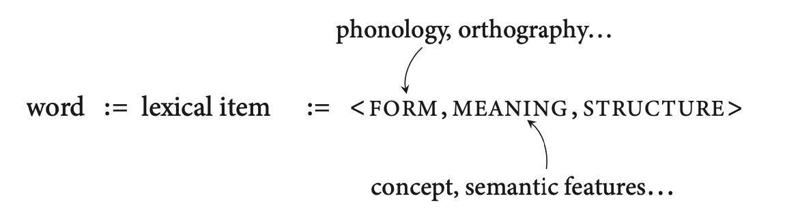
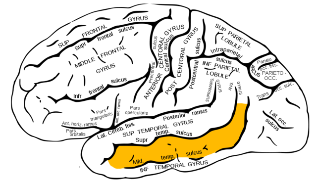
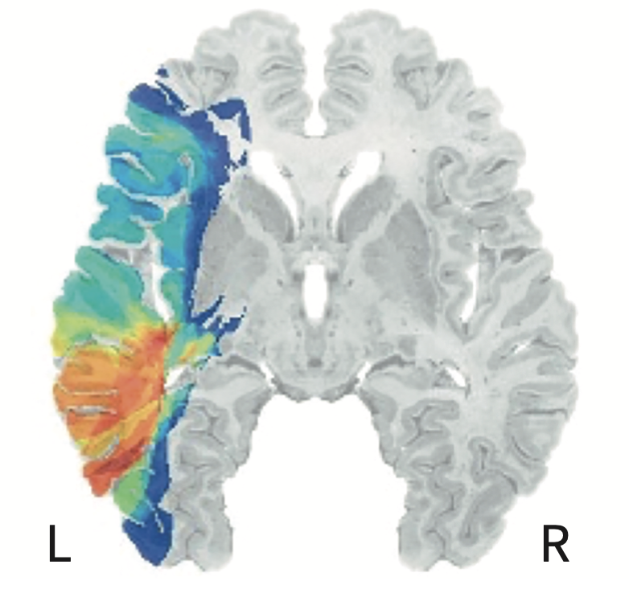
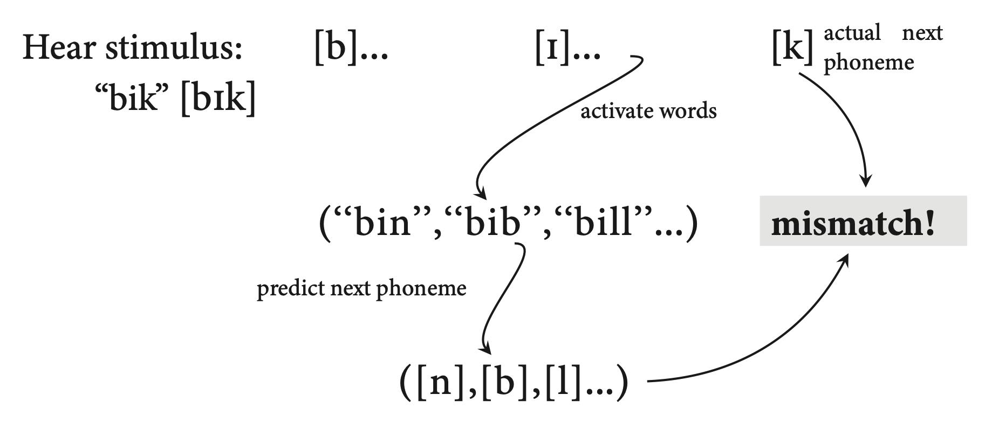

<style type="text/css">
  body{
  font-size: 12pt;
}
</style>

```{r setup, include=FALSE}
knitr::opts_chunk$set(message=FALSE,warning=FALSE, cache=TRUE)
options(repos = list(CRAN="http://cran.rstudio.com/"))
```

# Form, meaning, structure

The book defines a *word* as the "pairing of linguistic form with meaning and structure." This makes sense given our linguistics training where words serve as placeholders for ideas that have specific rules for how the ideas (which have a phonological form) operate in a sentence. These ideas, or "mental represenations" that are stored in our memory, are called *lexical items*. 

Lexical items have phonological form, that is there is an abstract representation of how they sound. Along with the phonological specification the lexical item also has meaning components which includes lots of associated concepts and semantic features. [The book also says that the form component of the lexical item includes both phonological and orthographic features.]

<p align="center">
  
</p>

## Are all morphemes lexical items?

So a word like "dog" might have the lexical representation:
</dag/; concepts associate with dog like "bark", four legs, wagging tail, canine teeth, etc; NOUN>

What about a morpheme like "-s"? This has a phonological form (/s/), conceptual features like "plurality", and a functional status like "adds to nouns" to make more than one of the noun.

Turns out that there is evidence for (and against) storing of both free and bound morphemes in the lexicon. This chapter will address this question (among other things about the nature of the lexicon).

# Where do words live? --> Wernicke's Area

Neurolinguistic studies suggest that the form and function of lexical items are combined in the *posterior middle temporal gyrus* (pMTG). The pMTG is where phonology and semantics might come together. Deficits to the posterior portion of the MTG have long been associated with detrimental effects in the semantic domain. Indeed we might call this region of the brain **Wernicke's Area**. People with *Wernicke's aphasia* might produce semantically inappropriate words (word salad) and have difficulty comprehending.

<p align="center">
  
</p>

In a study with over 100 aphasia patients, Bates and Dronkers (2003), examined *lesion overlap* among the patients. The looked to see which patients had lesions in particular voxels (remember this is sortof the analog to pixel in the volumetric representation of fMRIs) and correlated behavioural measures --> VLSM (voxel-based lesion system mapping).

<p align="center">
  
</p>

There was a strong correlation between lesions and difficulties in language understanding in picture-naming tasks. Patients had no difficulty articulating words so there is no deficit in phonological form, but rather the semantic network is affected. But is it a problem of retrieving the correct lexical item or is there some deeper problem with conceptual processing?

The way to test this is with *semantic priming*. Ask the subject whether a pair of words are real words or not. It turns out that people (without brain lesions) are faster when the words are related (conceptually) than unrelated words. For example, people are faster at saying that "dog, cat" are real words than "bell, car". This suggests that "dog" primes a conceptual network which includes "cat"--something like domesticated animals. Well, it turns out that patients with Wernicke's aphasia (also called "fluid aphasia") are generally bad at this task, BUT, they show an effect of semantic priming. They are about 200ms faster when the two words are related than when they are not.

# When are words recognized?

There is evidence suggesting that words are recognized *very* fast. [Thought question: Is activation in the brain the same as "recognition"?] In an MEG study, Marinkovic et al. (2003) recorded the time course of neural responses to spoken and written words (which they had to categorize as "big" or "small"). Predictably, the spoken words first light up the auditory cortex, then rapidly spreads to the STG area then posterior areas of the MTG. The auditory cortex is engaged within 50ms of presentation of the word! That's extremely fast. Similarly, written words first engage the occipital lobe. The 170ms after the word appears there is activation of the ventral region at the border between the temporal and occipital lobes of the left hemisphere (this is called the *visual word-form area). Higher levels of neural activity are engaged after 300ms of the visual word presentation, so it seems, from this paper at least, that spoken word recognition happens faster than visual word recognition in terms of neural activity in anterior temporal and frontal regions of the brain.

# Feed forward? Feed back? or both

How much does higher level organization or linguistic "knowledge" affect the processing of words? As the book puts it, how much back-and-forth activity/processing occurs between higher-level frontal and temporal regions and low-level sensory processing (auditory cortex)? MacGregor (2012) did an MEG study where listeners heard real words or psudeowords which ahdered to English phonotactics. There were differences in neural activity within 50ms of the *uniqueness point* (the point in where two words would differ in terms of their lexicality, e.g., blip vs. blim the uniqueness point would be the onset of the final consonant).So, distinguishing real from fake words happens almost instantaneously! Why might this happen? A likely reason is that the brain is primed for lexicality. That is, there is a prediction that happens as the word unfolds, and the prediction is based on the words that are already stored in the lexicon. This is called the "cohort effect" in the psycholinguistics literature. This also interacts with word frequency, the idea being that more frequent words that are used or encountered have a higher resting activation and so any word that partially conforms to the high-frequency word that then diverges in phonological form from that high frequency word will quickly be rejected. 

<p align="center">
  
</p>

# Units of lexical representation

What is stored in the mental lexicon? Individual morphemes or word units that might be made up of several morphemes? This has to do with lexical *grain size*. The book addresses two theories of what is stored in the lexicon when encountering a word. 

## Full decomposition

The full decomposition theory of lexical access presumes that the consituent parts of words are held in the lexicon separately and then recombined according to the language's grammar. So a word like "dogs" is represented as "dog" and "-s", each with it's own phonological and conceptual forms in the lexicon. But what about irregular forms like "deer" (pl)? "Deer" (pl) would be "deer" (n.) and "0"(plural affix).

## Partial decomposition

Partial decomposition is a little more forgiving and perhaps believable. It allows for transparent morphology to be uniquely specified like the "dogs" example in full decomposition, but makes exceptions for these irregular words like "deer" or "geese", etc., which are stored without any decomposition. 

Pinker and Ullman (2002) did did a study with two patients with differing aphasias: JLU had *anomia*, which leads to a tip-of-the-tongue phenomenon; and FCL who had *agrammaticism* which leads to difficulty with function words and words that provide syntactic information. FCL performed poorly when generating past-tense words, which needed -ed morphology, but performed better when producing irregular verbs like "held" and "ate." Again we have a case of double dissociation between FCL and JLU with regular and irregular verbs, suggesting that they can be differentially affected and therefore must be processed differently by the brain. 