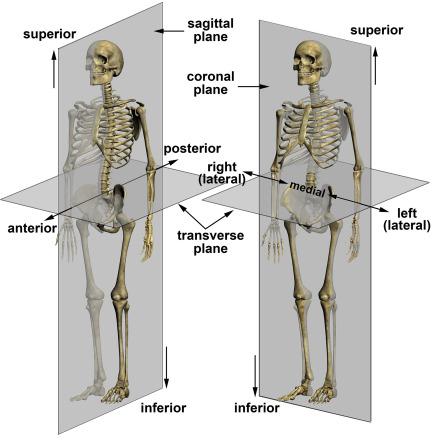
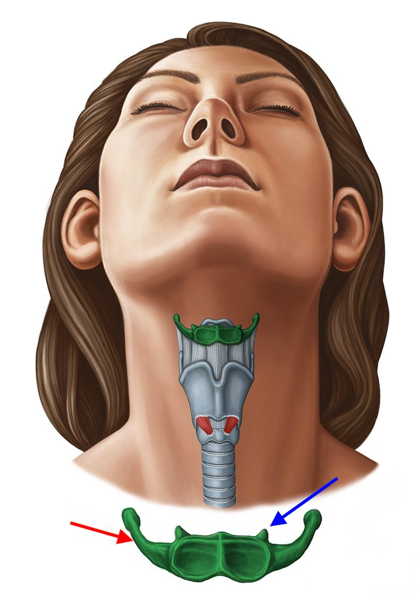
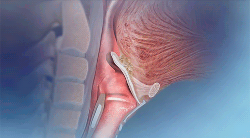
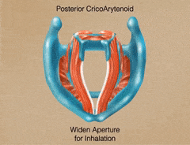
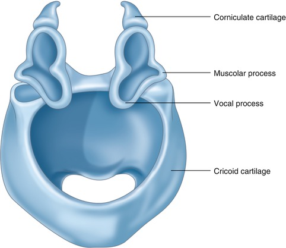
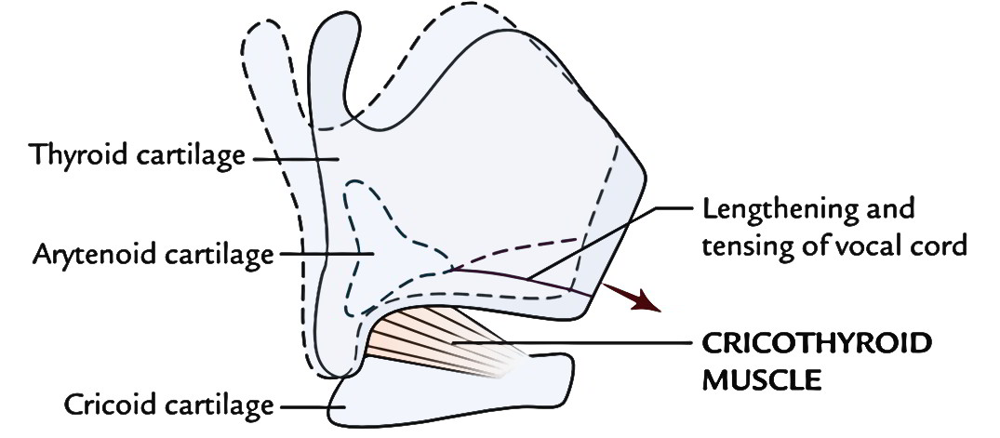
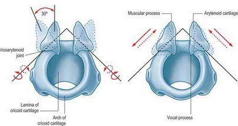
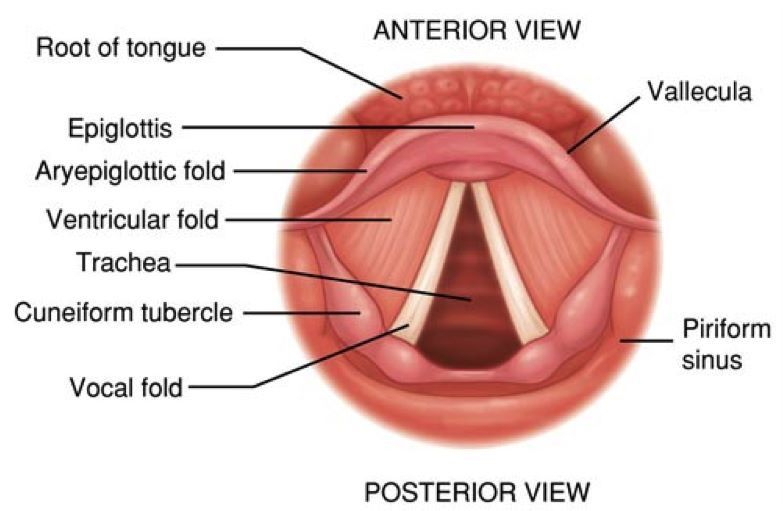

<style type="text/css">
  body{
  font-size: 12pt;
}
</style>

```{r setup, include=FALSE}
knitr::opts_chunk$set(message=FALSE,warning=FALSE, cache=TRUE)
```

Today's lecture introduces you to the bones and the muscles of the larynx, structures and supports that important in affecting vocalizations. The material is mostly memorization, but it's important that you understand how the entire apparatus contributes to the vocalization process. It's in the larynx that air energy is converted into sound by way of the vocal cords/folds. 

----

# Laryngeal skeleton

Before we start, orient (no pun intended) yourselves with the terminology of anatomical relational directions:

<p align="center">
  
</p>
\

We'll use these directions to refer to structures of the laryngeal skeleton. (Note that the noun is "larynx" and the adjective is "laryngeal.") The laryngeal skeleton is made up of:

1. One bone $\rightarrow$ Hyoid
2. Nine cartilages $\rightarrow$ 3 unpaired, 6 paired
  + Unpaired: Thyroid, Cricoid, Epiglottis
  + Paired: Arytenoids, corniculates, cuneiforms

## Bones, Cartilages

### Hyoid bone and thyroid membrane

The hyoid is a horseshoe-shaped bone that is superior the thryroid cartilage (or the "Adam's apple") at the curve of the under jaw where it meets with your neck. The bone has two **major horns** which form the wing-like protrusions of the U-shape (the red arrow in the picture). 

<p align="center">
  
</p>
\

If you look closely at the picture above, there are two teeth like protrusions along the superior edge of the hyoid, called **minor horns** (blue arrow). The hyoid holds up the entire laryngeal structure with a membrane (**thyroid membrane)** that attaches to the major horns.

### Unpaired cartilages

#### Thyroid cartilage

Inferior the hyoid is the **thyroid cartilage**, which is the largest structure of the laryngeal skeleton. The thyroid cartilage is made up of two plate-like structures (*laminae*) that are joined in the front at the *thyroid angle* (the "Adam's apple"). The superior portion of the angle is v-shaped, and called the **thyroid notch**. The outer flanks (left and right laterals) of the thyroid have horn-like extensions called the **superior cornus**, which extend in a superior fashion, and the **inferior cornus** extending downwards, hence the name. The posterior portion of the thyroid is open, housing the vocal folds, which are attached to the inside of the thyroid, below the notch.

#### Cricoid cartilage

The **cricoid cartilage** is just inferior the thyroid cartilage and superior the first **tracheal ring**. The cricoid cartilage is shaped like a ring with a diameter simila to the trachea. There are several landmarks on the cricoid. The low, anterior cricoid arch provides a clearance for vocal folds that pass over that point. On the lateral surfaces of the cricoid are *articulator facets* which are the point of articulation for the inferior horns of the thyroid cartilage $\rightarrow$ the **cricothyroid joint**, which is the pivot point allowing rotation of the two structures. In between the thyroid and cricoid cartilages is the **cricothyroid membrane**, and similarly the **cricothracheal membrane** connects the cricoid to the first tracheal ring. For the most part, the names of the membranes are fairly transparent, as they are made up of the two structures being connected. 

All of these structures are pretty small! The cricoid cartilage is roughly the size of a loose ring around your little finger, and the trachea is between a 1/2" to 1" in diameter!

Check out this nice model of the [laryngeal skeleton](https://sketchfab.com/models/d777f9a0a29c4d588c2eba607e068a0a).

#### Epiglottis

The last unpaired cartilage is the **epiglottis**. This leaflike structure arises from the inner surface of the angle of the thyroid cartilage, just below the notch, attached by the *thyroepiglottic ligament*. The sides of the epiglottis are joined to the [**arytenoid cartilages**](Arytenoid cartilages) via the aryepiglottic folds. 

The epiglottis projects up beyond the larynx and above the hyoid bone and is attached to the root of the tongue. The epiglottis is attached to the hyoid bone via the hyoeppiglottic ligament. The epiglottis is covered with a mucous membrane and underneath are branches of the laryngeal nerve that conducts sensory information from the larynx.\

<p align="center">
  
</p>
\

In rest position the epiglottis is upright, allowing air to enter the larynx. In the animation above, notice how the epiglottis folds down during swallowing, guiding food into the esophagus and not the trachea (choke).

### Paired cartilages

Three sets of cartilages come in pairs: the arytenoid, corniculates, and cuneiform cartilages. These are vitally important for phonation, as we will see. 

#### Arytenoid and corniculate cartilages

The **arytenoid cartilages** are perhaps the most important of the paired cartilages, located on the superior surface of the cricoid cartilage. They provide the mechanical structure allowing the onset and offset of vocal fold oscillation. It's easy to think of the arytenoids as being pyramidal in shape, each with four surfaces and two "processes" or extension/protrusions. 

The apex is the superior portion of the pyramid, on which rest the **corniculate cartilages**. So the corniculates sit on top of the arytenoids. The inferior surface of the arytenoids rests on the cricoid cartilage. Two processes are at opposite sides of arytenoids: the **vocal process** and the **muscular process**. The names tell you what their function is.

1. Vocal process: projects anteriorly toward the thyroid notch. The posterior portion of the vocal folds attach to the vocal process.
2. Muscular process: the point of attachment for muscles that adduct (pull in) and abduct (pull apart) the vocal folds

<p align="center">
  
</p>
\

<p align="center">
  
</p>
\

## Joints

The **cricothyroid joint** is the inflection point between the arytenoid and the superior portion of the cricoid. It lies between the inferior horns of the thyroid and the lateral aspect of the cricoid. These joints allow the thyroid cartilage to tilt downward toward the cricoid cartilage, or the cricoid cartilage to tilt up towards the thyroid cartilage. When the vocal fold elongate, through articulation via the cicothyroid, F~0~ is regulated. 

<p align="center">
  
</p>
\

The **cricoartytenoid joint** is between the base of the arytenoids and the superior surface of the posterior superior surface of the cricoid cartilage. The joint is involved in adduction and abduction of the vocal folds.

<p align="center">
  
</p>
\

## Valves

There are three sets of valves or openings in the larynx that regulate airflow in and out. The valves are all called folds, which are made of bundles of connective tissues and muscle fibers.

### Aryepiglottic folds

The **aryepiglottic folds** is the most superior valve in the larynx. They run from the sides of the epiglottis to the apex or superior portion of each arytenoid cartilage. They act as a sphincter (imagine a closing and widening in diameter inside a tube), contracting in a circular fashion pulling the epiglottis backwards and to close the entrance of the larynx during swallowing. 

<p align="center">
  
</p>
\

### Ventricular folds

The **ventricular folds** are also called the *false vocal folds* and lie inferior the aryepiglottic folds and just above the true vocal folds. They close during swallowing and during effortful activities like lifting weights or childbirth. Between the false and true vocal folds is a gap called the **laryngeal ventricle** where mucous is secreted to keep the layrnx lubricated. The ventricular folds decrease the impedance and increase the amplitude of air escaping through the larynx. They (obviously) remain open during phonation (oscillation of true vocal folds).

### True vocal folds

When we refer to "vocal folds" we're actually talking about the **true vocal folds**, the terms are interchangeable. The tru nature of the vocal folds are very complex and beyond the scope of this course. They're made of many layers of muscle, and mucous membranes. The **thyroarytenoid muscle** forms the main mass of the vocal folds. The structure and biomechanics of the true vocal folds arise from the the activation of the various joints they are connected to as well as the layers of varying stiffnes of the folds themselves. All of these variables combine to give rise to an individual's unique "voice." 

<p align="center">
<iframe width="560" height="315" src="https://www.youtube.com/watch?v=v9Wdf-RwLcs" title="YouTube video player" frameborder="0" allow="accelerometer; autoplay; clipboard-write; encrypted-media; gyroscope; picture-in-picture" allowfullscreen></iframe>
</p>
