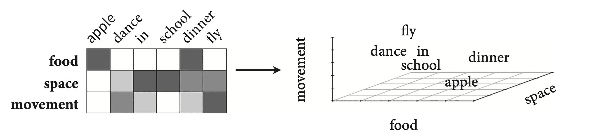

<style type="text/css">
  body{
  font-size: 12pt;
}
</style>

```{r setup, include=FALSE}
knitr::opts_chunk$set(message=FALSE,warning=FALSE, cache=TRUE)
options(repos = list(CRAN="http://cran.rstudio.com/"))
```

# Distributed vs. non-distributed conceptual representations

Meaning is a highly complex web of concepts that draws up on memory and experience as well as physical (or abstract) properties might uniquely classify the lexical item. The question addressed in this chapter is what is the nature of the neural representation of this web. Is it singularly located in a particular region of the brain or is it more distributed, like what we saw with the relationship between acoustic representation and phonological featural form?

## Distributed representations

A distributed representation of conceptual meaning suggests that the complexity of lexical semantics arises from neural activation in different parts of the brain. There is a lot of evidence that indeed conceptual meaning is distributed across different cortical systems. *Category-specific agnosia* is a pattern of deficits that results in patients having difficulty with certain classes of objects. For example, one patient, SBY, was able to identify pictures of household items both when the item names were spoken or written down, but was unable to identify any living thing. But this agnosia did not affect SBY's knowledge of the concepts relating to the categories of household items or living things. 

Apparently category-specific agnosia has been documented in "many patients" leading to the idea that categories can be affected differentially in the brain, that is, they may exist in different areas of the brain. A meta-analysis of 120 studies (Binder et al., 2009) implicated the temporal-parietal border regions as being active in different ways with different semantic consequences. 

### Word embeddings

Words occupy multiple conceptual realms. For example, "car" might convey concepts of "movement", "weight", "transportation," etc. Such a distribution of concepts for a particular word is reflected in **word embeddings**, which is a multidimensional semantic "space".

<p align="center">
  
</p>

Words that are closer together in semantic space might be more likely to **prime** each other in psycholinguistic tasks like lexical decision. Gallant et al. (2016) correlated these semantic spaces to fMRI images when subjects listened to words, resulting in a "semantic atlas" of the brain. Activation in certain voxels were correlated with certain dimensions in semantic space, showing that concepts are widely distributed in the cortex, that is, concepts don't "live" in any one particular region. 

### Distributed-plus-hub theory

While these concepts don't live in any one particular area, they nonetheless need to be assembled or bound together with the lexical item. It looks like this binding occurs in a particular part of the brain, namely the anterior temporal lobe. Evidence for this semantic *hub* comes from progressive aphasias associated with dementia. Studies show that Alzheimer's patients with degeneration of neurons in the anterior temporal lobe show a progressive (changes over time) lack of ability to identify objects, slowly reverting to broad categories instead. This sort of thing would not be predicted by the more basic distributed theory. 

Pobric et al (2007) used TMS to to disrupt left anterior temporal lobe (hub) and parietal lobe adjacent the motor cortex. Subjects had to make semantic judgements about high/low action pictures (thought to be associated with motor cortex), and living/non-living objects. When parietal (motor cortex) was disabled--> slow at making action picture decisions but not living/non-living decisions; when hub was disabled--> slow at making both types of decisions. The authors conclude that the anterior temporal lobe is responsible for category-general semantics. 

# Embodiment 

The idea of *embodiment* is that concepts are associated with sensory and action experiences. So the concept of "walk" for example requires activatinve the same motor representations used when walking. Contrast this with *grounded symbolic concepts*, which also acknowledges that concepts are built from sensory and action experiences, but that activation in the sensory and motor systems are NOT necessary for the representation of the concept once the concept is formed. [Does this suggest a developmental trajectory?] There is evidence for both hypotheses, but the grounded symbolism seems to have more evidence.

We have already seen evidence where when the motor cotext is disrupted, so too are semantic decisions about action words (Pobric). Pulvermüller et al (2005) used rTMS (repeated transcranial magnetic stimulation) in a way that enhances (rather than disrupts) the cortext being focussed. Using a single magnetic pulse the arm-area and leg-area of the motor cortex were enhanced. Subjects were faster at making lexical decisions about arm and foot related words than when not stimulated. BUT, these effects are very small, on the order of milliseconds. Severe disruption to the motor cortex (from stroke, etc.) don't have equally severe consequences (contra the embodied concepts view), but rather consistent with the grounded symbolism view. 

More evidence for the grounded symbolic concepts view comes from clinical studies with apraxics (difficulty performing actions as a result of of brain damage). Rumiati et al. (2001) had two subjects with damage to the mator cortex who were not able to imitate actions, but were able to organize cards that depicted the sequence of an action. This sort of double dissociation suggests that the semantic concepts related to actions are not necessarily centralized in the motor cortex, thereby providing evidence for the grounded symbolic concepts hypothesis. 