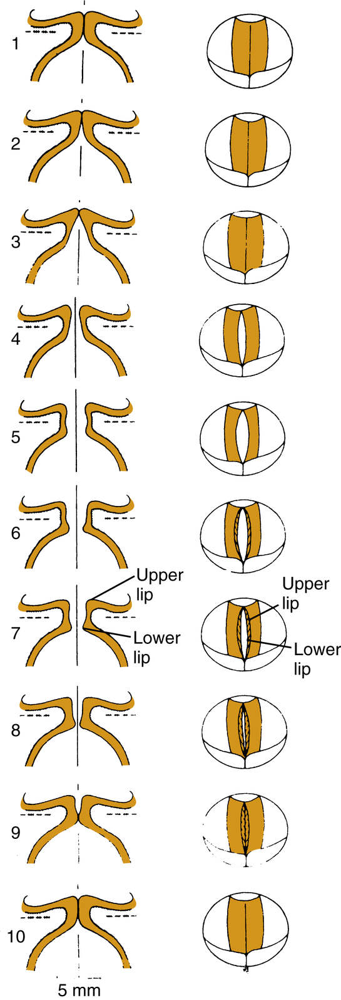
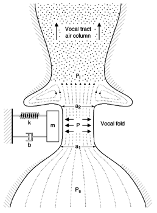
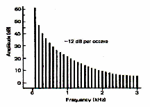
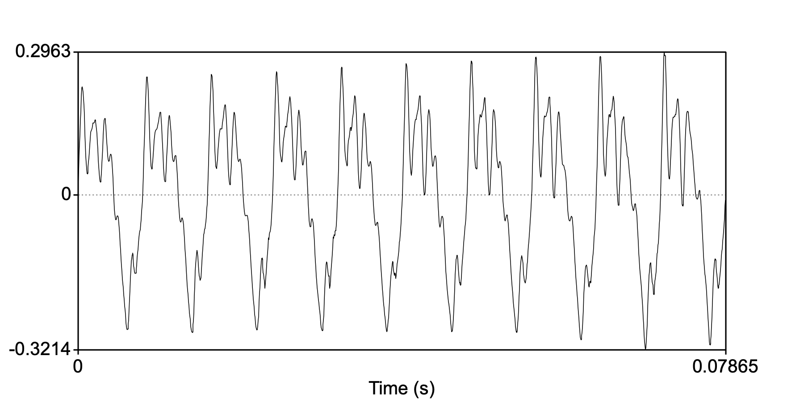
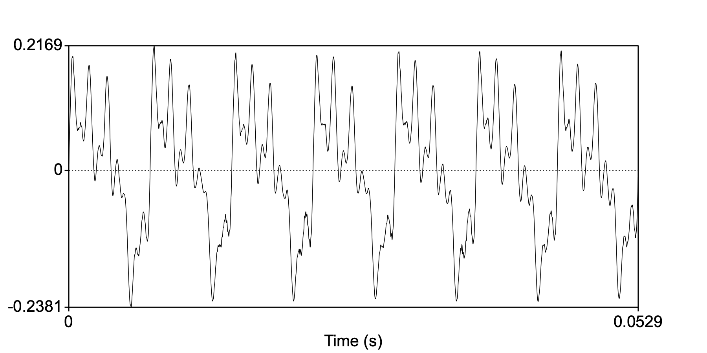

<style type="text/css">
  body{
  font-size: 12pt;
}
</style>

```{r setup, include=FALSE}
knitr::opts_chunk$set(message=FALSE,warning=FALSE, cache=TRUE)
```

----
Today's mini-lecture (the second half of the lecture is dedicated to reviewing the old lectures in prep for the Midterm) deals with *phonation*, or the vibration of the vocal folds providing the *source* sound to the upstream cavities resulting in vowel-like sounds. 
----

#  The myoelastic/aerodynamic theory of phonation

In our last lecture we noted the complexities involved in the movement of [vocal folds](https://www.youtube.com/watch?v=yn12x2SJrNM) given the highly variable nature of their composition as well as their elongation and position governed by muscular control of the arytenoids and associated muscles. 
The most widely accepted theory explaining the nature of vocal fold vibration or oscillation is called the **myoelastic** theory, which explains oscillation as the interaction between muscle forces (*myo-*), tissue elasticity, and air pressure flow. 

The myoelastic/aerodynamic theory of phonation was first described by the Dutch speech scientist [van den Berg](https://en.wikipedia.org/wiki/Janwillem_van_den_Berg) in 1958. It basically states that vocal folds open up due to sub-glottal pressure and close due to elastic and aerodynamic pressures. But that's too simplistic. Here are the specific steps:

1. Musicular activity causes the arytenoids so that the vocal processes come together thereby positioning the vocal folds close together (adduction)

2. Sub-glottal pressure (air pressure below the vocal folds) increases until the vocal folds are forced apart.

3. With narrow opening of the vocal folds (being pushed apart by the sub-glottal air pressure) escaping air travels fast (this is called the *Venturi tube effect*). The fast moving air through the narrow passage causes a momentary decrease in air pressure across the opening (this is called the **Bernoulli effect**)

<p align="center">
  
</p>
\

4. The decrease in pressure across the folds causes the folds to be sucked together (this is part of the Bernoulli effect you might be familiar with, it's the reason why when you're in the shower the curtain might be sucked in toward you or *lift* of airplane wings)

5. The Bernoulli effect AND the myoelastic recoil forces of the vocal folds themselves cause adduction

6. When fully adducted the process begins all over again with an increases in sub-glottal pressure. The process repeats resulting in phonation!

In the image below, notice that inferior ("lower lip" in the picture) and superior ("upper lip") aspects of the vocal folds adduct at different times. Initially the inferior aspect abducts and ultimately the superior aspect. Similarly, during abduction, the inferior aspect closes before the superior aspect. 

<p align="center">
  
</p>
\

# One-mass model

The **One-mass model of phonation** extends the basics of the myoelastics theory of phonation but considering each vocal fold as a single mass that moves in a uniform manner. The real difference between the myoelastic model and the one-mass model is that the one-mass model says that the fast moving air above the vocal folds continues to move fast as it gets further from the glottis due to *intertia*. The fast moving air in the oral cavity leaves and area of low pressure just above the glottis. The high pressure air from the lungs forces the walls of the closure further apart because there is a mass of low pressure above it.

So basically, the elastic and Bernoulli forces drive the vocal folds together, and both subglottal high pressure and supra-glottal low pressure drive the vocal folds apart.

<p align="center">
  
</p>
\

These models are good but probably pale in comparison to the actual dynamics of the vocal fold separation, especially with respect to the different aspects of the vocal folds moving at different times. People who *reall* study vocal fold dynamics often use 16-mass models to describe its movement!

## Phonation Threshold

Just how much sub-glottal pressure is required to pop open the adducted vocal folds? The minimum pressure required is called the **phonation threshold pressure** (PTP). The PTP varies proportionally with F~0~. With increasing F~0~ so is PTP. For example, for low F~0~s PTP can be around 3cm H~2~0 and up to around 6cm H~2~0 at higher F~0~s.  

# Spectrum

Phonation is the oscillation of the vocal folds back and forth, in a roughly periodic fashion. Like all of our discussion of complex periodic waves (like the complex wave resulting from plucking a string or blowing into a flute), there is a fundamental oscillation, and an infinite number of harmonics at frequencies systematically related to the fundamental. The resulting **spectrum**, in idealized form, would look like the line spectra seen in earlier lectures. 

The spectrum of harmonics produced by the oscillating vocal folds is called the **glottal spectrum**, which is unique for how the amplitude characteristics diminish with increasing frequency. This diminishing of amplitude is called the **spectral slope**. 

<p align="center">
  
</p>
\

The glottal spectrum has to be inferred from the sound coming out of a mouth, that is, we never get to hear exactly the sound of the vocal folds oscillating. When we synthesize the source spectrum, it often sounds like [blowing rasberries](sounds/sourcespec.wav), that is, it lacks the "shape" of a vowel sound, which is the filtered glottal spectrum through the oral and nasal cavities. The harmonic content of the glottal spectrum theoretically decreases by **12dB per octave**. What's an *octave*? The name reveals that it has to do with '8', or the eight musical notes that occupy the interval between a particular frequency and twice that frequency. So an octave higher than 220Hz will be 440Hz, and likewise, an octave below would be 110Hz. So, for the glottal spectrum, the harmonic that is twice the fundamental will have an amplitude 12dB less than the fundamental. 

If the first harmonic (F0) is 200Hz with an amplitude of 36dB, the harmonic at 400Hz (H2) will have an amplitude of 24dB. The harmonic with 800Hz (H4) will have an amplitude of 12dB, the harmonic at 1600Hz (H8) will have an amplitude of 0dB.

Do you want to synthesize a glottal spectrum in Praat? Here is a good [tutorial](https://www.fon.hum.uva.nl/praat/manual/Source-filter_synthesis_1__Creating_a_source_from_pitch.html).

## Harmonic spacing

When the vocal folds elongate, via tilting the thyroid cartilage, so too does the **harmonic spacing** of the spectrum. Remember that the harmonics of a complex periodic wave are whole number multiples of the fundamental. So a 100Hz fundamental will have tighter spaced harmonics (100Hz), than a 200Hz fundamental. The spacing of the harmonics contribute to the timbre of the sound. This explains why kids sound different from adults, and not just higher pitched. 
 
# Periodicity in the human voice

The vocal folds do not vibrate in a completely periodic manner (like our pure tones generated in Praat), rather there are always small fluctuations in their movement resulting in shifting frequency and amplitudes. Even if you tried very hard, it would be impossible to maintain a steady F0 when sustaining a sung note. Try it out. Record yourself singing "aaaahhh" in Praat and examine the F0. Here's [mine](sounds/aaah.wav). Below are the waveforms from the 1st half of the sustained vowel:

<p align="center">
  
</p>
\

And the 2nd half of the vowel:

<p align="center">
  
</p>
\

Can you calculate the difference in F0?

## Variability in F0

Because the vocal fold oscillation is close to being periodic, but not quite, we have come up with ways to describe variation in F0. If there is variability in the *timing* between cycles of oscillation it is called *jitter*. If there is variability in the *amplitude* of the cycles, it is called *shimmer*. Jitter and shimmer reveal a lot about the speaker. They are called "indexical" characteristics of the speaker and help the listener identify who is speaking because we all have inherent variability in our F0.