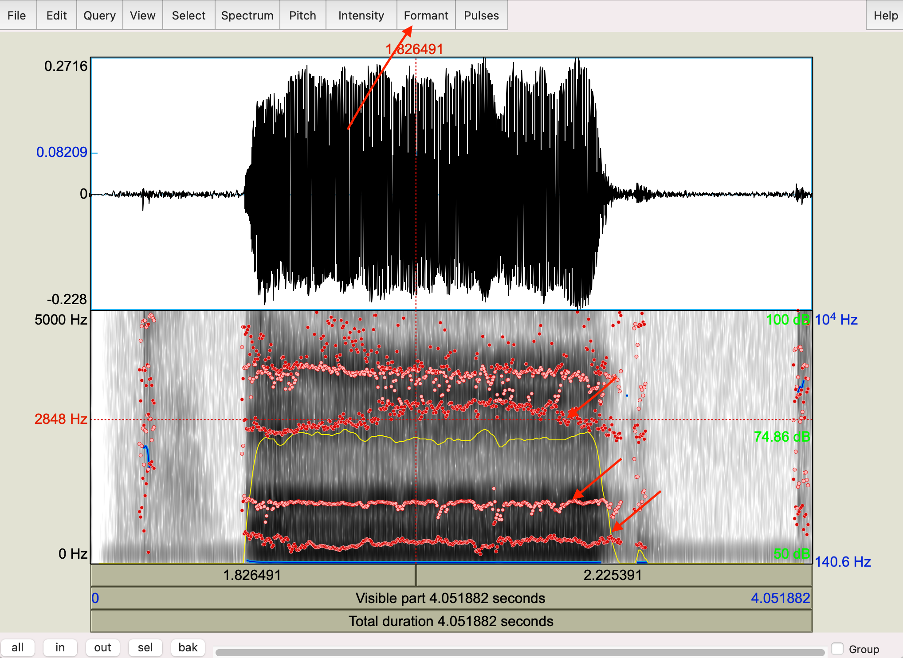
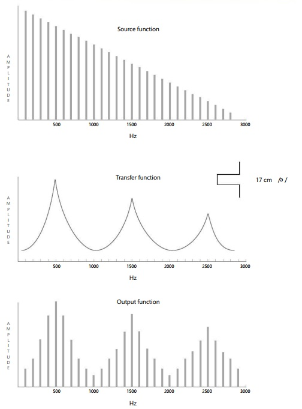
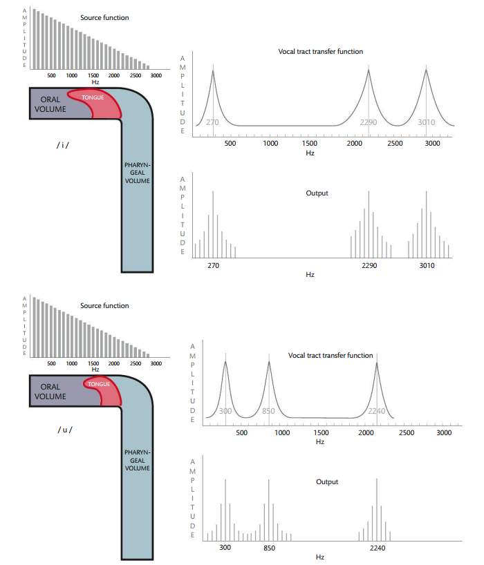

<style type="text/css">
  body{
  font-size: 12pt;
}
</style>

```{r setup, include=FALSE}
knitr::opts_chunk$set(message=FALSE,warning=FALSE, cache=TRUE)
```

----
Now that we have a basic understanding of how and why phonation happens, as well as the resonant properties of tubes, we can put them all together into a theory of what happens to the glottal spectrum as the sound excites the air in your mouth.
----

## Vocal tract resonance

The human vocal tract is really well suited for producing a wide variety of sounds. The length of the vocal tract as well as the coupling of various tube-like structures (like the oral cavity, the pharynx, the nasal cavity) all contribute to [filter](lecture5.html) shapes that amplify many different frequency bands when in different configurations. 

At some point in the course of evolution, the larynx began to sit lower in the neck relative to our nearest human-like primate ancestors ([Homo Neanderthalensis](https://humanorigins.si.edu/evidence/human-fossils/species/homo-neanderthalensis)). Neanderthals had a larynx higher in the neck, resulting in a shorter vocal tract.

<p align="center">
  
</p>
\

The vocal tract is a **resonator**, just like we saw in the tube and Helmholtz discussion. The resonator is a filter that "let's through" some frequencies from the glottal spectrum, and attenuates (or "turns down") other frequencies. There are four important characteristics of the resonator:

1. The tube is closed at one end (open-closed) $\rightarrow$ quarter-wave resonator with lowest resonance with a wavelength of 4x the length of the tube. Higher resonances are odd multiples of the lowest resonance. Remember:
$$
F_1 = \frac{v}{4L}; 
F_2 = 3(\frac{v}{4L});
F_3 = 5(\frac{v}{4L});
F_4 = 7(\frac{v}{4L})...
$$
2. The vocal tract can be considered a series of containers (a sequence of attached tubes). Each tube has its own resonant frequency (RF), with each cavity acting as a bandpass filter (amplifying certain frequencies and attenuating others)

3. The vocal tract is a *broadly tuned* resonator, letting though a wide bandwidth of frequencies

4. The vocal tract is a *variable resonator* that is, the tubes are not of uniform dimension. The cross-sectional areas and length of the tubes are constantly changing. Take a look at the video below and see how quickly the shape of the oral and pharygeal (the area above the larynx) changes. Consequently the frequency response of the connected tubes are constantly changing. 

<p align="center">
<video width="420" height="340" controls>
  <source src="images/mri_chris.mp4" type="video/mp4">
  </video>
</p>
  
# Formants

**Formants** are what we call the lowest resonant frequencies of the vocal tract resonator. So if we think about the vocal tract like a filter, it will have resonances at various frequencies (given in the equations if we model the vocal tract like an open-closed tube). These resonances are also called *prominences* or areas in the frequency spectrum where the glottal sound is amplified. 

When we talk specifically about formants, we're dealing with speech. That is, we don't talk about the harmonic resonances of tubes as *formants*, which is reserved for vocal tract resonances. The lowest frequency is the **first formant** abbreviated as **F1**. Higher formants are odd multiples of F1 for a basic, uniform length open-closed tube. This is comparable to a basic vowel sound called **schwa** which is written as **ə**.

## Schwa and vocal tract length

The average male ə has an F1=500Hz, F2=1500Hz, F3=2500Hz, and F4=3500Hz. Can we calculate the length of the average male vocal tract based on these formants? Well, we know that:
$$F_1 = \frac{v}{4L}$$
If we take $v$ = 340m/s, we need to convert it to cm, because vocal tracts are much smaller than a meter, so $v$ = 34000cm/s.
So we have:
$$ 
500Hz = \frac{34000cm/s}{4L}
$$
$$
4L = \frac{34000}{500}; L = \frac{68}{4} = 17cm
$$
Here is a nice image that describes the vocal tract resonances when your mouth is in the configuration for schwa. This will take you back to the tube resonances [lecture](https://saplabyork.github.io/Courses/lecture5.html#Tube_resonance). Notice schwa is modeled as a quarter-wave resonator, with the closed end (node) being at the glottis and the open end (antinode) at the lips.

<p align="center">
  
</p>
\

### Measuring your vocal tract

1. Use Praat to figure out the length of your vocal tract!

2. Record your voice saying the sound "[uuuuuuhhhhhh](sounds/uhh.wav)" for at least 2 seconds. The main vowel in this utterance is schwa.

3. New > Record mono sound > *record the word the "save to list" 

4. View and Edit your sound

5. Highlight the vowel (the loudest portion of the waveform) then Formant > "Show formants". Your waveform should look like it does below, with dots highlighting the formants in the vowel. Remember, these are the loudest part of the spectrum.

<p align="center">
  
</p>
\

6. Next go to Formant > Get first formant. Write the number down. From this number you can calculate your vocal tract length! My F1 is 419Hz, so my vocal tract is 20.2cm or thereabouts. Can you calculate yours?

## Source-filter model

The formal model of vowel production is called the **source-filter model** and was developed by [Gunnar Fant](https://en.wikipedia.org/wiki/Gunnar_Fant). At its core, the source-filter model is quite simple. Now that you know that the vocal folds produce a spectrum of frequencies when oscillating (or the **source**), the vocal tract acts as a **filter** for that source, so what we hear when someone speaks is the output of this process. 

There are three components to the source-filter model:

1. The glottal source spectrum

2. The **transfer function** of the vocal tract: the acoustic prominences in the frequency spectrum, often visualized as a spectral *envelope* or shape of the filter

3. The output spectrum which we actaully hear

In the schematic picture below, the source spectrum has a F~0~ of 100Hz and likely has the typical 12dB/octave roll-off. That spectrum is fed into the vocal tract transfer function (notice the shape of the envelope). The output function has a shape similar to the transfer function, with certain frequencies amplified and others dampened, so the vocal tract makes an imprint on the output sound. 

<p align="center">
  
</p>
\

Again, the model above is an idealized model of a relatively open-closed tube giving rise to schwa. Of course languages use many many more vowels sounds than the idealized schwa. The envelope of the transfer function for all other vowels reflect the relationship between the oral (the mouth) and pharyngeal (space above the larynx) cavities. The changing shape of the two connected cavities is affected by the tongue and the lips. You can make the oral cavity larger by articulating a vowel further back in the mouth (like /u/ "ooo") and moving it more forward to make the cavity smaller (like in /i/ "eee").

The volumes of the two cavities affect their resonances, with smaller volumes generally having resonances at higher frequencies and larger volumes at lower frequencies. 

> The first formant (F1) is related to the size of the pharyngeal cavity (and the tightness of the constriction).
> F2 is related to the length of the oral cavity

F1 and F2 are used to acoustically classify vowel sounds. Let's take a look at oral and pharyngeal tract shapes and how they affect F1 and F2 in common vowels. 

## /i/ and /a/

The /i/ vowel is in words like "keep" or "eel". It's produced with the tonge blade (a technical term we'll come back to) forward in the mouth towards the palate, which results in a large cavity behind the construction, essentially makig pharyngeal cavity large. As a result, F1 is lowered. The cavity in front of the tongue is small and short, resulting a high F2.

The /a/ vowel is the one in word like "father" (though there's lots of variation, this is roughly in the right neighborhood). The tongue configuration here is smoewhat the opposite of the configuration for /i/, with a small pharyngeal cavity (high F1) and a large oral cavity (low F2).

We can also extend (and shorten) the length of the oral cavity by manipulating the lips. By rounding your lips, you're essentially extending the length of the oral cavity because they end up being protrouded. Likewise when you spread your lips, you shorten the oral cavity relative to a neutral position. In the picture below, you'll see models of /i/ and /u/ (where the lips are rounded). Notice that the tongue is in roughly the same position, with similar pharyngeal volumes. The oral cavity for /u/ is longer and as a result F2 is lower than in /i/.

<p align="center">
  
</p>
\

## Vowel formants

As mentioned above, vowels are generally characterized by F1, F2, and sometimes F3. How can we change F1 and F2? We can change length of the vocal tract and we can also change how tightly we articulate or the degree of the constriction. When the tongue is moved to a particular position we have control over how close to palate the tongue is. If it is making contact with the palate then the air is stopped behind the constriction (which is what we do with consonants or stops). For vowels, the tongue must approach the palate but not make contact. The closer the constriction in the vocal tract (or the tighter the articulation), the lower the F1. If there is a constriction with the back of the tongue, F2 is lowered. If the front of the tongue is constricted, F2 will raise, and F1 will lower (as the constriction is in the vocal tract).

<p align="center">
  
</p>
\

