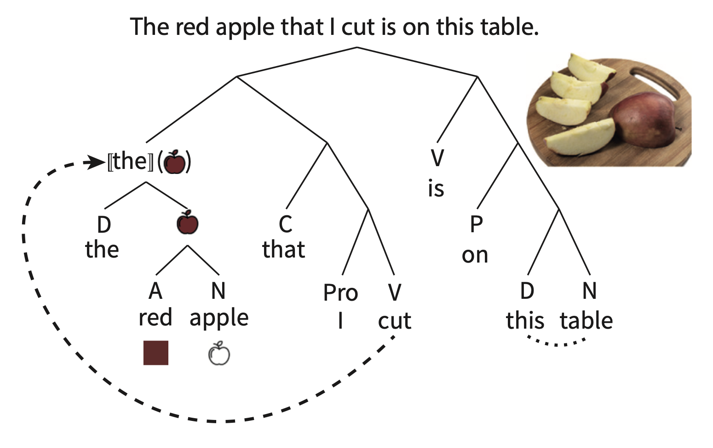
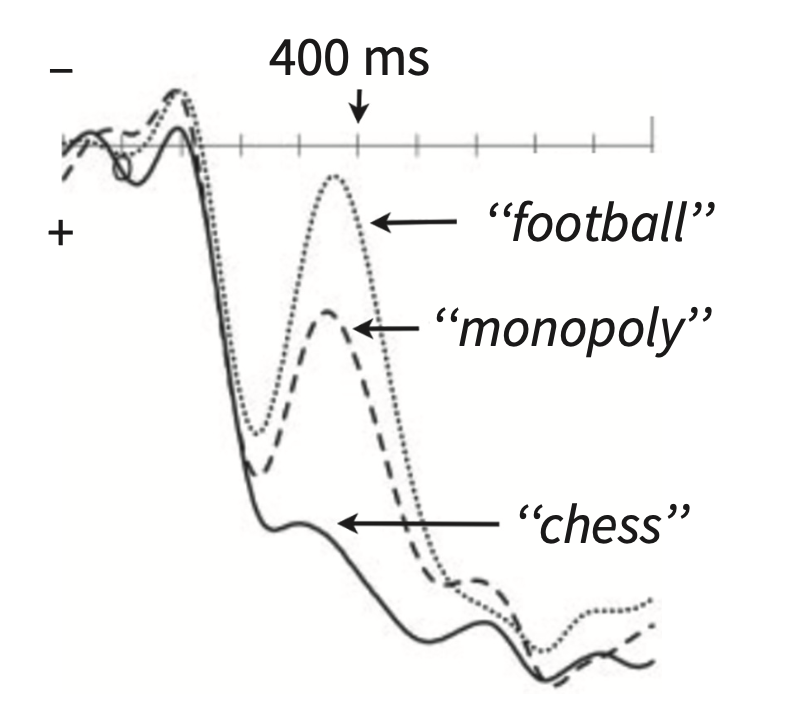
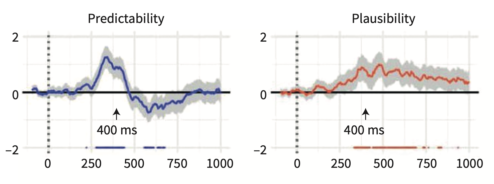
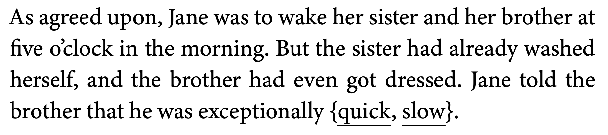

<style type="text/css">
  body{
  font-size: 12pt;
}
</style>

```{r setup, include=FALSE}
knitr::opts_chunk$set(message=FALSE,warning=FALSE, cache=TRUE)
options(repos = list(CRAN="http://cran.rstudio.com/"))
```

# Language processing as prediction

The field has moved into understanding language processing (in all linguistic domains like speech perception, word recognition, semantics, and sentence structure) as a reflection of our ability to predict. Prediction as it relates to learning has a very long history in cognitive science and we now start our journey into how these concepts might apply to our understanding of syntax. 

But before we talk about the details of the predictive mechanisms underlying processing, we need to understand the language composition process. 

# Sentence structure

At this point you should all be familiar with the basics of the lingusitic study of syntax. Regardless of the language, sentence structure utilizes three key phenomenon: Constituency, Dependency, and Compositionality. 

## Constituency

Constituency (also called *phrase structure*) refers to the hierarchical groupings of words that occur in a  particular order.

<p align="center">
  
</p>

Rules for constituency are based on the words' syntactic category, which will tell you what sorts of words will form constituents. 

## Dependency

Dependency refers to how particular words are to to be combined with other words, even words that are not "local" or adjacent to each other. In the example above, the dashed arrow indicates a long-distance dependency between [the red apple] constituent and the verb *cut*. *Agreement* is also another type of dependency. In English, agreement generally occurs with number, while in other languages it occurs with features like grammatical gender. 

### Compositionality

Finally, the constituency and dependency, when combined with the semantics of the word itself results in the meaning of the sentence. The whole process reflects the *compositionality* of language generation and processing. In the example above, the little pictures next to the word reflect the semantics of individual words and then the semantics of the the phrases/constituents. NB "[[x]]" refers to the semantics of grammatical words like articles. 

Knowledge of the compositional structure (as it relates to phrase structure and dependency) of a language is essentially knowledge of the language. When someone asks you "what does it mean to know English" (above and beyond memorizing the dictionary), you would answer that you know the *grammar* of the language, which itself means knowledge of the language's compositionality. 

# From grammar to prediction

Knowledge of a language's grammar necessarily allows us to predict the types of structures that are not immediately present. Remember that language, as reflected in speech, unfolds over time (different from the written word), and as such we do not get the whole structure of the utterance from the get-go (like in the red apple example above). What is the neural signature of this sort of prediction? How do we know that our processing of online language information is predicting what comes next? We know this because when we throw at it something that does not fit the theoretical structure we've assigned to the language processing unit (i.e., syntax), the system hiccups. Behaviourally this would be a surprisal response or a delayed reaction in a particular task. But how does it look neurally? 

## N400

The N400 is an EEG signature that registers a mismatch between the prediction (given some language input) and the stimulus. The mismatch is registered as a negatively going component (remember negative is generally in the "up" direction in this literature) that peaks around 400ms after the onset of the stimulus. For example, if presented the sentence, "Mary ate her spaghetti with a shirt," a negative peak would appear in the EEG readout 400ms after the presentation of "shirt." The N400 is an **ERP** or "event-related potential," with the event being the stimulus mismatch.

There are two ways that psycholinguists have understood the N400, and they both relate to prediction. 

### Semantic-memory theory

With semantic-memory theory, the N400 is seen as an index of the Cloze probability of the mismatched *word* within the context of the sentence. Based on the semantics of the sentence we make predictions as to the most appropriate word that fits the context. But words that are unexpected but still semantically related to the expected word *also* elicit an N400 but the magnitude is not as strong as a semantically unrelated word.  

<p align="center">
  
</p>

In the picture above, the subject is primed with:
"Checkmate" Rosalind announced with glee. She was getting to be really good at...

The unexpected word, "football" elicits the largest amplitude N400, while the expected word "chess" does not elicit the N400. "Monopoly" *does* elicit the N400 but not as strong as "football." The semantic-memory theory suggests that we expect "chess," which becomes *pre-activated* as we receive more and more information in the sentence. The pre-activation of "chess" also activates semantically related words. 

### Semantic-integration theory

Another way to understand the N400 is that it reflects the *plausibility* of the meaning that results when a new word is integrated with the previous context. The semantic-integration theory links the N400 with the compositional process which builds up the meaning of the sentence rather than individual word meanings. In a sentence like "John drank a glass of...prune juice," while "prune juice" might not be the most popular completion of that sentence, it is certainly a plausible noun phrase. Even though the probability is extremely low, the brain registers it plausibility as acceptable, but not likely. It turns out that unlike the N400 which registers the predictability of the completion, with more/less predictable being indexed by more/less negative going components after the stimulus, the sentence plausibility is indexed about 100 **later** than the N400 and in a different area than the N400, namely the posterior region of the scalp. 

<p align="center">
  
</p>

So the time course of processing on a word-by-word basis is: words are preactivated according to context; lexical access occurs about 400ms after the word is encountered; the meaning of the sentence is wrapped up at around 500ms after the end of the sentence. 

### Discourse-dependent N400

The brain uses any and all types of evidence (linguistic or otherwise) to make predictions about what comes next in a sentence (but there are some caveats). For example, we use contextual information beyond the scope of the immediate/local sentential context to make predictions (this is a good thing otherwise things like narratives would be impossible to comprehend). Van Berkum et al. (2003) showed that we use **discourse context** to make predictions and that an N400 is elicited even when a word is perfectly matched to the sentence which it concludes.  

<p align="center">
  
</p>

In the example above, both "quick" and "slow" are equal in terms of their predictability and plausibility in the final sentence (it's a weird setup, I know). But "slow" does not fit the larger discourse context (i.e., the story before) so it elicits an N400. So, the brain keeps track of non-local information in making predictions about what comes next [But you might ask yourself, how "non-local" is enough or not enough? That is, is an N400 elicited when the mismatch occurs due to information presented many sentences or paragraphs or minutes before? Is this a memory problem or a linguistic problem?]

In the next lecture we will see cases where non-linguistic information, namely who is saying what, affects the nature of the prediction. I might also introduce some work showing that indexical information (exactly who is talking) affects the types of words we expect to hear.

