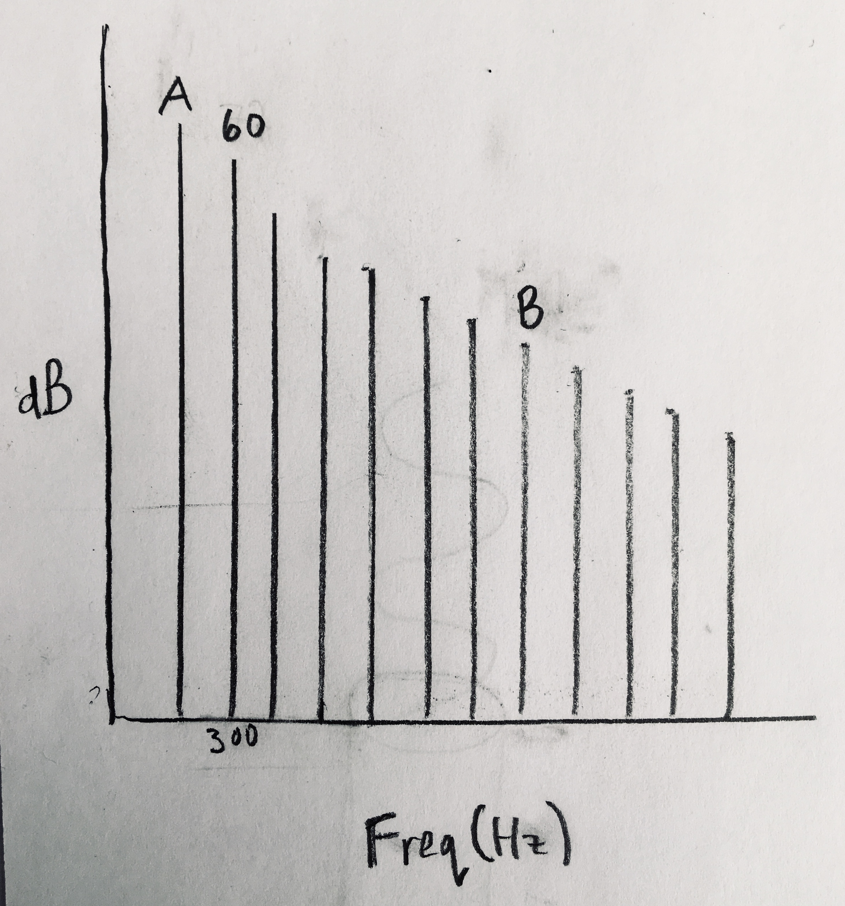
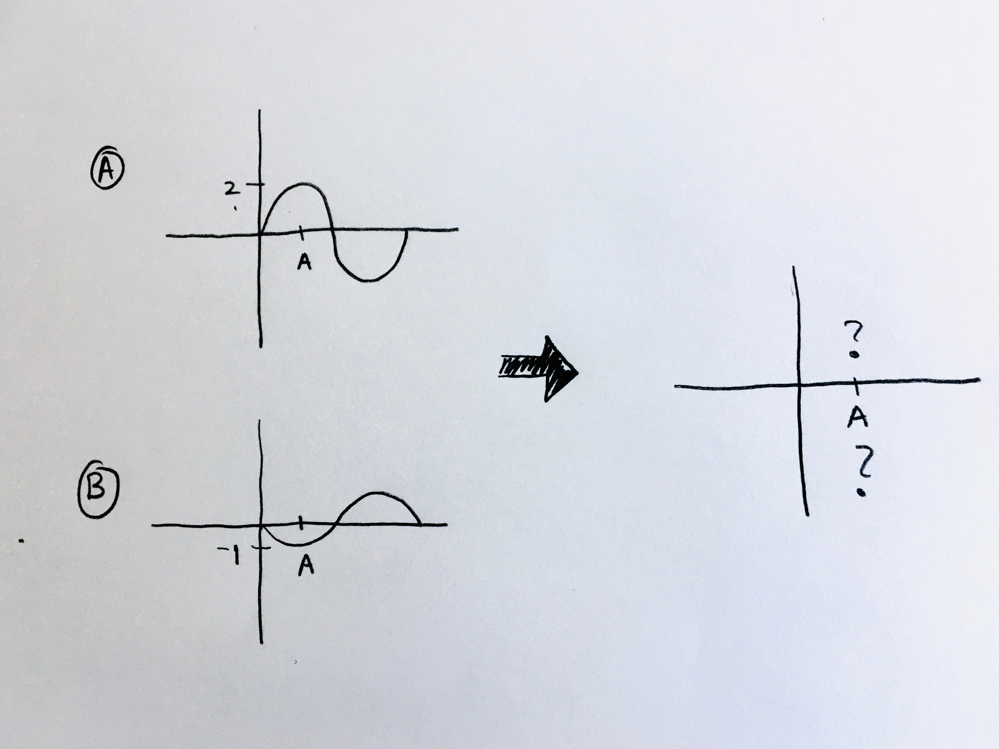
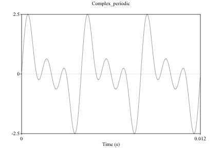
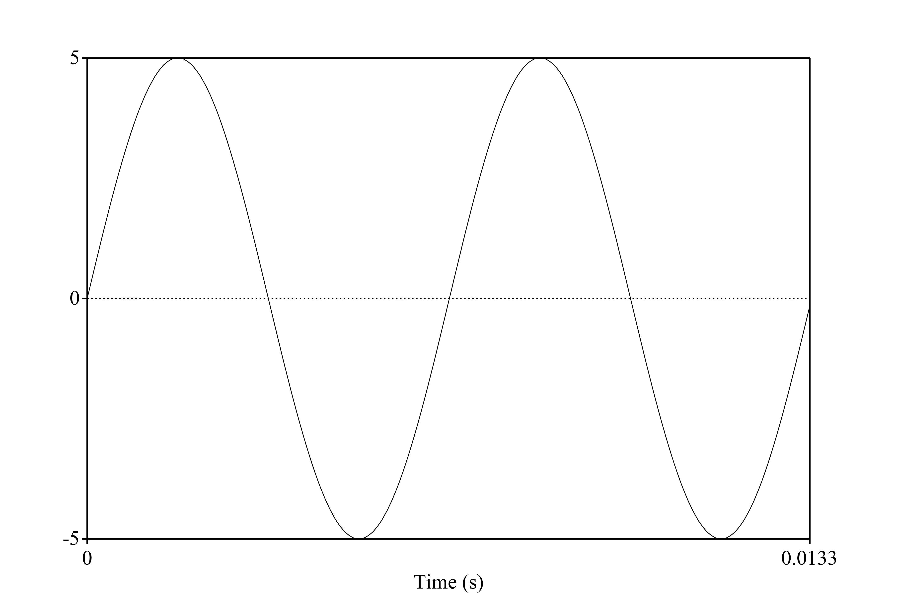

```{r setup, include=FALSE}
knitr::opts_chunk$set(echo = TRUE)
```

## MT Practice problem answers

1. Suppose you have a tube that's closed at one end. The frequency of the 5th resonance is 0.05kHz. Assuming that the speed of sound is 330m/s, what is the length of the tube in cm? [Answer](images/prac_1.pdf)

2. What is the dB reading for a sound with an intensity of 0.01 W/m2 [Answer](images/prac_2.pdf)

3. A gas that has a volume of 5 ml at 3 atm at sea level will have a what volume at the top of Mt. Everest, where the pressure drops by 0.3 atm? [Answer](images/prac_3.pdf)

 (5ml)(3atm) =x(2.7atm)
 x=15/2.7=5.56ml
 
 
## MT questions and images:
 
 1. In the glottal spectrum below, what are A and B?
<p align="center">
  
</p>
\

2. In the picture below, when Wave A is added to Wave B, what is the amplitude of the resulting wave a point A? [There are no units]
<p align="center">
  
</p>
\

3. The waveform above represents a complex periodic sound with three components. What is the frequency of third harmonic in Hz? [Don't include units in answer]
<p align="center">
  
</p>
\

4. What is the wavelength of the pure tone below? Assume the speed of sound is 343 m/s. Round your answer to two decimal places and use proper units.
<p align="center">
  
</p>
\

5. The waveform above represents a complex periodic sound with three components. What is the fundamental frequency (f0/H1) in Hz? [Do not use units in the answer]
<p align="center">
  
</p>
\

6. What is the RMS amplitude of the pure tone below? Round your answer to two decimal places. Units don't matter for this question.
<p align="center">
  
</p>
\


 